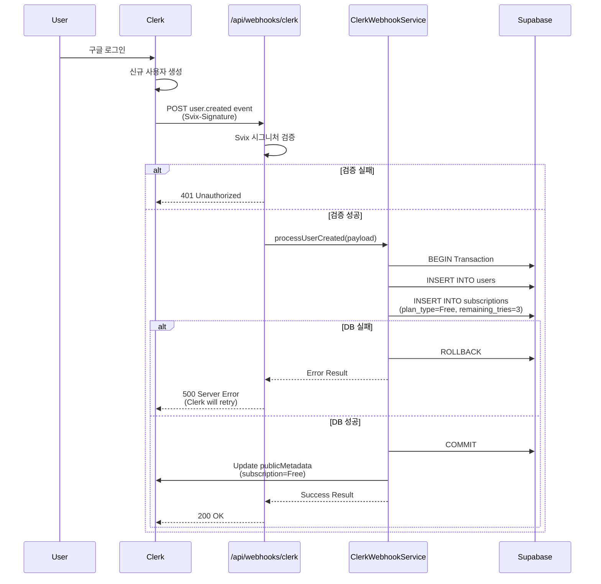
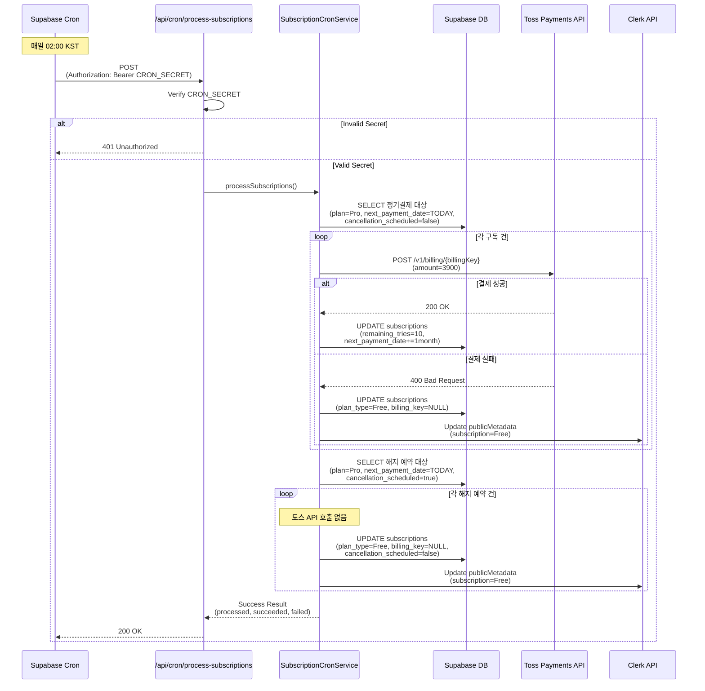
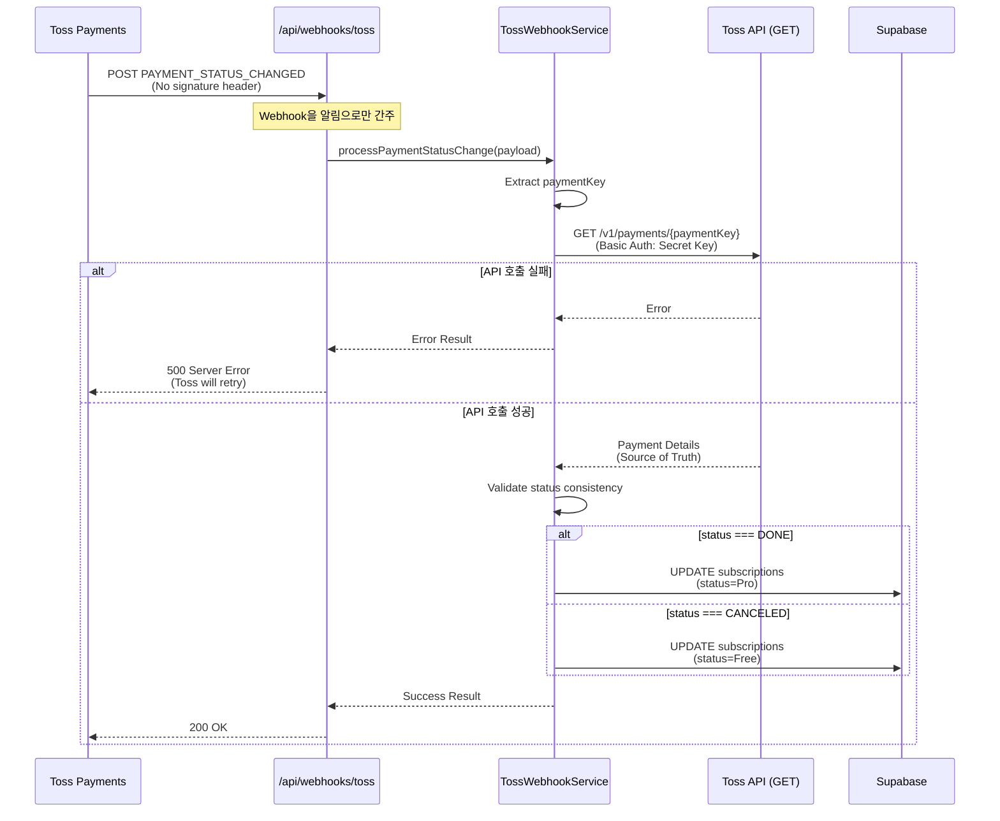

# Backend Services Implementation Plan

## 1. Overview

이 문서는 백엔드 서비스(Webhooks, Cron Jobs)의 구현 계획을 다룹니다. 주요 구성 요소는 다음과 같습니다:

### 1.1 핵심 기능

1. **Clerk Webhook Handler** (`/api/webhooks/clerk`)
   - 사용자 생성 이벤트(`user.created`) 처리
   - Supabase DB에 사용자 및 구독 정보 동기화
   - Svix 시그니처 검증

2. **Cron Job Handler** (`/api/cron/process-subscriptions`)
   - 정기 결제 처리 (Pro 구독자)
   - 해지 예약 자동 처리
   - Cron Secret 인증

3. **Toss Webhook Handler** (`/api/webhooks/toss`) - 선택사항
   - 결제 상태 변경 이벤트 처리
   - Source of Truth 패턴 적용 (결제 조회 API 재검증)

### 1.2 모듈 구조

```
src/
├── backend/
│   ├── lib/
│   │   ├── external/
│   │   │   ├── clerk-client.ts       # Clerk API 클라이언트
│   │   │   ├── toss-client.ts        # Toss Payments API 클라이언트
│   │   │   └── webhook-validator.ts  # Webhook 시그니처 검증 유틸
│   │   └── cron/
│   │       └── scheduler.ts          # Cron Job 헬퍼 함수
│   └── middleware/
│       └── webhook-auth.ts           # Webhook 전용 인증 미들웨어
│
├── features/
│   ├── webhooks/
│   │   ├── clerk/
│   │   │   ├── backend/
│   │   │   │   ├── route.ts          # Clerk Webhook 라우터
│   │   │   │   ├── service.ts        # 사용자 동기화 비즈니스 로직
│   │   │   │   ├── schema.ts         # Clerk Webhook 스키마
│   │   │   │   └── error.ts          # Clerk Webhook 에러 코드
│   │   │   └── lib/
│   │   │       └── dto.ts            # DTO 재노출
│   │   │
│   │   └── toss/
│   │       ├── backend/
│   │       │   ├── route.ts          # Toss Webhook 라우터
│   │       │   ├── service.ts        # 결제 검증 비즈니스 로직
│   │       │   ├── schema.ts         # Toss Webhook 스키마
│   │       │   └── error.ts          # Toss Webhook 에러 코드
│   │       └── lib/
│   │           └── dto.ts
│   │
│   └── cron/
│       ├── subscriptions/
│       │   ├── backend/
│       │   │   ├── route.ts          # Cron Job 라우터
│       │   │   ├── service.ts        # 정기결제/해지 비즈니스 로직
│       │   │   ├── schema.ts         # Cron Job 스키마
│       │   │   └── error.ts          # Cron Job 에러 코드
│       │   └── lib/
│       │       └── dto.ts
│       └── lib/
│           └── date-utils.ts         # 날짜 계산 유틸 (다음 결제일 등)
```

### 1.3 외부 서비스 연동

| 서비스 | 용도 | 인증 방식 | 상세 문서 |
|--------|------|----------|----------|
| Clerk | 사용자 인증 및 Webhook | Svix Signature | `/docs/external/clerk.md` |
| Toss Payments | 결제 처리 및 Webhook | Basic Auth (Secret Key) | `/docs/external/toss.md` |
| Supabase Cron | 스케줄링 | Custom Secret (Bearer Token) | N/A |

---

## 2. Architecture Diagram

### 2.1 Clerk Webhook Flow



### 2.2 Cron Job Flow



### 2.3 Toss Webhook Flow (Optional)



---

## 3. Implementation Plan

### 3.1 Phase 1: 공통 모듈 및 인프라

#### 3.1.1 외부 서비스 클라이언트

**파일: `src/backend/lib/external/clerk-client.ts`**

```typescript
// Clerk API 클라이언트
// - 사용자 메타데이터 업데이트 (publicMetadata.subscription)
// - 인증 헤더: Bearer CLERK_SECRET_KEY
// - 에러 처리 및 재시도 로직 포함
// - 타임아웃: 10초
```

**구현 요구사항:**
- [ ] Clerk API 기본 클라이언트 클래스 생성
- [ ] `updateUserMetadata(userId: string, metadata: object)` 메서드 구현
- [ ] 환경 변수 `CLERK_SECRET_KEY` 관리
- [ ] 3회 재시도 로직 (지수 백오프)
- [ ] 타임아웃 10초 설정
- [ ] 에러 타입 정의 (`ClerkClientError`)

**파일: `src/backend/lib/external/toss-client.ts`**

```typescript
// Toss Payments API 클라이언트
// - 빌링키로 결제 실행: POST /v1/billing/{billingKey}
// - 결제 조회: GET /v1/payments/{paymentKey}
// - 인증 헤더: Basic Auth (Base64(TOSS_SECRET_KEY:))
// - 에러 처리 및 재시도 로직 포함
// - 타임아웃: 30초
```

**구현 요구사항:**
- [ ] Toss Payments API 기본 클라이언트 클래스 생성
- [ ] `chargeBilling(params)` 메서드 구현 (정기 결제)
- [ ] `getPaymentDetails(paymentKey)` 메서드 구현 (결제 조회)
- [ ] 환경 변수 `TOSS_SECRET_KEY` 관리
- [ ] Basic Auth 헤더 생성 유틸
- [ ] 3회 재시도 로직 (지수 백오프)
- [ ] 타임아웃 30초 설정
- [ ] 에러 타입 정의 (`TossClientError`)
- [ ] Rate Limiting 대응 (429 에러 시 1초 대기 후 재시도)

**파일: `src/backend/lib/external/webhook-validator.ts`**

```typescript
// Webhook 시그니처 검증 유틸
// - Clerk: Svix 라이브러리 사용
// - Toss: 시그니처 미지원 (알림으로만 간주)
```

**구현 요구사항:**
- [ ] `validateClerkWebhook(headers, body, secret)` 함수 구현
- [ ] Svix 라이브러리 설치 및 래핑
- [ ] 검증 실패 시 명확한 에러 메시지 반환
- [ ] 타임스탬프 검증 (5분 이내)

#### 3.1.2 Cron Job 헬퍼

**파일: `src/backend/lib/cron/scheduler.ts`**

```typescript
// Cron Job 공통 헬퍼 함수
// - Cron Secret 검증
// - 날짜 계산 (다음 결제일 등)
```

**구현 요구사항:**
- [ ] `verifyCronSecret(authHeader: string)` 함수 구현
- [ ] 환경 변수 `CRON_SECRET` 관리
- [ ] Bearer Token 파싱 로직

**파일: `src/features/cron/lib/date-utils.ts`**

```typescript
// 날짜 계산 유틸
// - 다음 결제일 계산 (현재 날짜 + 1개월)
// - 말일 처리 로직 (예: 1/31 -> 2/28)
// - KST 타임존 처리
```

**구현 요구사항:**
- [ ] `addMonths(date: Date, months: number)` 함수 구현 (date-fns 활용)
- [ ] 말일 처리 로직 (해당 월의 마지막 날로 조정)
- [ ] KST 변환 유틸 함수
- [ ] 단위 테스트 작성 (엣지 케이스 포함)

#### 3.1.3 Middleware

**파일: `src/backend/middleware/webhook-auth.ts`**

```typescript
// Webhook 전용 인증 미들웨어
// - Clerk Webhook: Svix 시그니처 검증
// - Toss Webhook: 시그니처 미지원 (검증 skip)
// - Cron Job: Bearer Token 검증
```

**구현 요구사항:**
- [ ] `withClerkWebhookAuth()` 미들웨어 함수 구현
- [ ] `withCronAuth()` 미들웨어 함수 구현
- [ ] 검증 실패 시 401 응답 반환
- [ ] 로깅 추가 (보안 이벤트)

---

### 3.2 Phase 2: Clerk Webhook Handler

#### 3.2.1 Schema 정의

**파일: `src/features/webhooks/clerk/backend/schema.ts`**

```typescript
// Clerk Webhook 스키마
// - ClerkWebhookEventSchema: user.created 이벤트 페이로드
// - UserSyncRequestSchema: 사용자 동기화 요청
// - UserSyncResponseSchema: 응답
```

**구현 요구사항:**
- [ ] `ClerkWebhookEventSchema` 정의 (zod)
  - `type`: literal('user.created')
  - `data.id`: string (Clerk user_id)
  - `data.email_addresses`: array
  - `data.first_name`, `data.last_name`, `data.image_url`: string | null
- [ ] `UserSyncResponseSchema` 정의
  - `success`: boolean
  - `message`: string
- [ ] TypeScript 타입 추론

#### 3.2.2 Error Codes

**파일: `src/features/webhooks/clerk/backend/error.ts`**

```typescript
export const clerkWebhookErrorCodes = {
  invalidWebhook: 'INVALID_WEBHOOK',
  unauthorizedWebhook: 'UNAUTHORIZED_WEBHOOK',
  databaseError: 'DATABASE_ERROR',
  clerkApiError: 'CLERK_API_ERROR',
  duplicateUser: 'DUPLICATE_USER',
} as const;
```

#### 3.2.3 Service Layer

**파일: `src/features/webhooks/clerk/backend/service.ts`**

```typescript
// processUserCreated(client, payload)
// 1. users 테이블 삽입 (id=user_id, email, first_name, last_name, image_url)
// 2. subscriptions 테이블 삽입 (user_id, plan_type=Free, remaining_tries=3)
// 3. Clerk publicMetadata 업데이트 (subscription=Free)
// 4. 트랜잭션 처리 (1, 2는 원자적으로)
// 5. ON CONFLICT DO NOTHING (중복 방지)
```

**구현 요구사항:**
- [ ] `processUserCreated()` 함수 구현
- [ ] Supabase 트랜잭션 래핑
- [ ] 에러 핸들링 (DB 실패 시 500, 중복 시 200)
- [ ] Clerk API 호출 (메타데이터 업데이트)
- [ ] 로깅 추가 (INFO: 성공, ERROR: 실패)

#### 3.2.4 Route Handler

**파일: `src/features/webhooks/clerk/backend/route.ts`**

```typescript
// POST /api/webhooks/clerk
// 1. Svix 시그니처 검증 (withClerkWebhookAuth 미들웨어)
// 2. 요청 본문 파싱 및 스키마 검증
// 3. processUserCreated() 호출
// 4. 응답 반환 (200 OK / 401 / 500)
```

**구현 요구사항:**
- [ ] Hono 라우터 등록
- [ ] 미들웨어 적용 (`withClerkWebhookAuth`)
- [ ] 스키마 검증 (`ClerkWebhookEventSchema.safeParse`)
- [ ] Service 호출 및 응답 처리
- [ ] 에러 로깅

#### 3.2.5 Integration

**파일: `src/backend/hono/app.ts` 수정**

```typescript
// registerClerkWebhookRoutes(app) 추가
import { registerClerkWebhookRoutes } from '@/features/webhooks/clerk/backend/route';

app.use('/api/webhooks/clerk', withClerkWebhookAuth());
registerClerkWebhookRoutes(app);
```

---

### 3.3 Phase 3: Cron Job Handler

#### 3.3.1 Schema 정의

**파일: `src/features/cron/subscriptions/backend/schema.ts`**

```typescript
// Cron Job 스키마
// - CronRequestSchema: 요청 (빈 객체 또는 job_type)
// - SubscriptionQuerySchema: DB 조회 결과
// - CronResponseSchema: 응답 (processed, succeeded, failed)
```

**구현 요구사항:**
- [ ] `SubscriptionQuerySchema` 정의
  - `id`, `user_id`, `billing_key`, `next_payment_date`, `cancellation_scheduled`
- [ ] `CronResponseSchema` 정의
  - `success`: boolean
  - `result.total_processed`, `result.regular_payments`, `result.scheduled_cancellations`
  - `result.errors`: array

#### 3.3.2 Error Codes

**파일: `src/features/cron/subscriptions/backend/error.ts`**

```typescript
export const cronErrorCodes = {
  unauthorized: 'UNAUTHORIZED',
  databaseError: 'DATABASE_ERROR',
  paymentFailure: 'PAYMENT_FAILURE',
  tossApiError: 'TOSS_API_ERROR',
  clerkApiError: 'CLERK_API_ERROR',
} as const;
```

#### 3.3.3 Service Layer

**파일: `src/features/cron/subscriptions/backend/service.ts`**

```typescript
// processSubscriptions(client)
// 1. processRegularPayments(client)
//    - 정기결제 대상 조회 (plan=Pro, next_payment_date=TODAY, cancellation_scheduled=false)
//    - 각 구독 건마다 토스 API 호출 (빌링키로 결제)
//    - 성공 시: remaining_tries=10, next_payment_date+=1month
//    - 실패 시: plan_type=Free, billing_key=NULL, Clerk 메타데이터 업데이트
// 2. processScheduledCancellations(client)
//    - 해지 예약 대상 조회 (plan=Pro, next_payment_date=TODAY, cancellation_scheduled=true)
//    - 각 구독 건마다 Free로 전환 (토스 API 호출 없음)
// 3. 결과 집계 및 반환
```

**구현 요구사항:**
- [ ] `processRegularPayments()` 함수 구현
  - DB 조회 (복합 인덱스 활용)
  - Loop: 각 구독에 대해 토스 API 호출
  - 성공/실패 분기 처리
  - 에러 발생 시 해당 건만 스킵 (부분 성공 허용)
  - 로깅 추가 (각 결제 시도)
- [ ] `processScheduledCancellations()` 함수 구��
  - DB 조회
  - Loop: Free로 전환
  - Clerk 메타데이터 업데이트
- [ ] `processSubscriptions()` 오케스트레이션 함수
  - 1, 2 순차 실행
  - 결과 집계
  - 에러 배열 반환
- [ ] orderId 생성 규칙: `subscription_{user_id}_{next_payment_date}`
- [ ] 멱등성 보장 (동일 orderId 중복 방지)

#### 3.3.4 Route Handler

**파일: `src/features/cron/subscriptions/backend/route.ts`**

```typescript
// POST /api/cron/process-subscriptions
// 1. Cron Secret 검증 (withCronAuth 미들웨어)
// 2. processSubscriptions() 호출
// 3. 응답 반환 (200 OK / 401 / 500)
```

**구현 요구사항:**
- [ ] Hono 라우터 등록
- [ ] 미들웨어 적용 (`withCronAuth`)
- [ ] Service 호출 및 응답 처리
- [ ] 에러 로깅 (Critical: DB 연결 실패)

#### 3.3.5 Integration

**파일: `src/backend/hono/app.ts` 수정**

```typescript
// registerCronRoutes(app) 추가
import { registerCronRoutes } from '@/features/cron/subscriptions/backend/route';

app.use('/api/cron/*', withCronAuth());
registerCronRoutes(app);
```

---

### 3.4 Phase 4: Toss Webhook Handler (Optional)

#### 3.4.1 Schema 정의

**파일: `src/features/webhooks/toss/backend/schema.ts`**

```typescript
// Toss Webhook 스키마
// - TossWebhookEventSchema: PAYMENT_STATUS_CHANGED 이벤트
// - PaymentDetailsSchema: 결제 조회 API 응답
```

**구현 요구사항:**
- [ ] `TossWebhookEventSchema` 정의
  - `eventType`: literal('PAYMENT_STATUS_CHANGED')
  - `data.paymentKey`, `data.orderId`, `data.status`
- [ ] `PaymentDetailsSchema` 정의 (토스 API 응답)

#### 3.4.2 Error Codes

**파일: `src/features/webhooks/toss/backend/error.ts`**

```typescript
export const tossWebhookErrorCodes = {
  invalidEvent: 'INVALID_EVENT',
  verificationFailed: 'VERIFICATION_FAILED',
  databaseError: 'DATABASE_ERROR',
} as const;
```

#### 3.4.3 Service Layer

**파일: `src/features/webhooks/toss/backend/service.ts`**

```typescript
// processPaymentStatusChange(client, payload)
// 1. paymentKey 추출
// 2. 토스 결제 조회 API 호출 (Source of Truth)
// 3. status 검증 (웹훅 status vs API status)
// 4. DB 업데이트 (status에 따라 분기)
```

**구현 요구사항:**
- [ ] `processPaymentStatusChange()` 함수 구현
- [ ] 토스 클라이언트 호출 (`getPaymentDetails`)
- [ ] status 일치 여부 검증
- [ ] DB 업데이트 로직 (status별 분기)
- [ ] 에러 핸들링

#### 3.4.4 Route Handler

**파일: `src/features/webhooks/toss/backend/route.ts`**

```typescript
// POST /api/webhooks/toss
// 1. 요청 본문 파싱
// 2. processPaymentStatusChange() 호출
// 3. 응답 반환 (200 OK / 500)
```

**구현 요구사항:**
- [ ] Hono 라우터 등록
- [ ] 스키마 검증
- [ ] Service 호출 및 응답 처리
- [ ] 에러 로깅

#### 3.4.5 Integration

**파일: `src/backend/hono/app.ts` 수정**

```typescript
// registerTossWebhookRoutes(app) 추가
import { registerTossWebhookRoutes } from '@/features/webhooks/toss/backend/route';

registerTossWebhookRoutes(app);
```

---

### 3.5 Phase 5: Environment Variables

**파일: `.env.local` (로컬 개발용)**

```env
# Clerk
CLERK_SECRET_KEY=sk_test_...
CLERK_WEBHOOK_SIGNING_SECRET=whsec_...

# Toss Payments
TOSS_SECRET_KEY=test_sk_...

# Cron Job
CRON_SECRET=your-random-secret-string

# Supabase (기존)
NEXT_PUBLIC_SUPABASE_URL=...
SUPABASE_SERVICE_ROLE_KEY=...
```

**파일: `src/backend/config/index.ts` 수정**

```typescript
// 환경 변수 스키마에 추가
// - CLERK_SECRET_KEY: string
// - CLERK_WEBHOOK_SIGNING_SECRET: string
// - TOSS_SECRET_KEY: string
// - CRON_SECRET: string
```

**구현 요구사항:**
- [ ] zod 스키마에 새 환경 변수 추가
- [ ] 검증 로직 (빌드 시 필수 체크)
- [ ] 타입 안전성 보장

---

### 3.6 Phase 6: Supabase Cron Setup

**파일: `supabase/migrations/YYYYMMDDHHMMSS_setup_cron_job.sql`**

```sql
-- Supabase pg_cron extension 활성화
CREATE EXTENSION IF NOT EXISTS pg_cron;

-- Cron Job 등록 (매일 02:00 KST = 17:00 UTC 전날)
SELECT cron.schedule(
  'process-daily-subscriptions',
  '0 17 * * *',  -- 매일 17:00 UTC (= 02:00 KST 다음날)
  $$
  SELECT
    net.http_post(
      url := 'https://your-domain.com/api/cron/process-subscriptions',
      headers := jsonb_build_object(
        'Content-Type', 'application/json',
        'Authorization', 'Bearer YOUR_CRON_SECRET'
      ),
      body := '{}'::jsonb
    ) as request_id;
  $$
);
```

**구현 요구사항:**
- [ ] Migration 파일 생성
- [ ] Cron 스케줄 설정 (KST 타임존 고려)
- [ ] 환경별 URL 관리 (개발/프로덕션)
- [ ] 롤백 스크립트 작성

---

## 4. Testing Plan

### 4.1 Unit Tests

#### 4.1.1 External Clients

**파일: `src/backend/lib/external/__tests__/clerk-client.test.ts`**

```typescript
// Clerk API 클라이언트 테스트
// - updateUserMetadata 성공 케이스
// - updateUserMetadata 실패 케이스 (401, 404, 500)
// - 재시도 로직 검증
// - 타임아웃 검증
```

**파일: `src/backend/lib/external/__tests__/toss-client.test.ts`**

```typescript
// Toss Payments API 클라이언트 테스트
// - chargeBilling 성공 케이스
// - chargeBilling 실패 케이스 (잔액 부족, 카드 정지 등)
// - getPaymentDetails 성공/실패 케이스
// - 재시도 로직 검증
// - Rate Limiting 대응 검증
```

#### 4.1.2 Date Utils

**파일: `src/features/cron/lib/__tests__/date-utils.test.ts`**

```typescript
// 날짜 계산 테스트
// - addMonths 일반 케이스 (2025-01-15 + 1개월 = 2025-02-15)
// - addMonths 말일 케이스 (2025-01-31 + 1개월 = 2025-02-28)
// - addMonths 윤년 케이스 (2024-01-31 + 1개월 = 2024-02-29)
```

#### 4.1.3 Webhook Validator

**파일: `src/backend/lib/external/__tests__/webhook-validator.test.ts`**

```typescript
// Webhook 시그니처 검증 테스트
// - Clerk Webhook 유효한 시그니처
// - Clerk Webhook 무효한 시그니처
// - Clerk Webhook 타임스탬프 만료 (5분 초과)
```

### 4.2 Integration Tests

#### 4.2.1 Clerk Webhook

**파일: `src/features/webhooks/clerk/backend/__tests__/route.integration.test.ts`**

```typescript
// Clerk Webhook 통합 테스트
// - user.created 이벤트 정상 처리
// - users + subscriptions 테이블 동시 삽입 검증
// - Clerk publicMetadata 업데이트 검증
// - Svix 시그니처 검증 실패 시 401 응답
// - DB 트랜잭션 실패 시 롤백 검증
// - 중복 요청 시 중복 삽입 방지 검증
```

#### 4.2.2 Cron Job

**파일: `src/features/cron/subscriptions/backend/__tests__/route.integration.test.ts`**

```typescript
// Cron Job 통합 테스트
// - Cron Secret 검증 성공/실패
// - 정기결제 성공 케이스 (횟수 리셋, 다음 결제일 갱신)
// - 정기결제 실패 케이스 (Free 전환, 빌링키 삭제)
// - 해지 예약 처리 (Free 전환, 토스 API 호출 없음)
// - 빈 대상 조회 시 200 OK 응답
// - 부분 성공 케이스 (일부 결제 실패)
```

#### 4.2.3 Toss Webhook

**파일: `src/features/webhooks/toss/backend/__tests__/route.integration.test.ts`**

```typescript
// Toss Webhook 통합 테스트
// - PAYMENT_STATUS_CHANGED 이벤트 정상 처리
// - Source of Truth 패턴 검증 (API 재조회)
// - status 불일치 시 DB 업데이트 스킵
// - 결제 조회 API 실패 시 500 응답
```

### 4.3 E2E Tests

**파일: `tests/e2e/webhooks-and-cron.spec.ts`**

```typescript
// E2E 테스트 시나리오
// 1. 사용자 가입 → Clerk Webhook → DB 확인
// 2. Pro 구독 신청 → 빌링키 저장 → Cron Job → 정기결제 성공 → DB 확인
// 3. 구독 해지 예약 → Cron Job → Free 전환 → DB 확인
```

---

## 5. Error Handling Strategy

### 5.1 에러 분류

| 에러 유형 | HTTP 상태 | 재시도 여부 | 로그 레벨 | 예시 |
|----------|-----------|------------|----------|------|
| **인증 실패** | 401 | No | WARN | Invalid Cron Secret, Svix 검증 실패 |
| **요청 검증 실패** | 400 | No | INFO | 잘못된 스키마, 누락된 필드 |
| **비즈니스 로직 에러** | 400/403/404 | No | INFO | 사용자 없음, 구독 없음 |
| **외부 API 에러** | 502/503 | Yes | ERROR | 토스 API 타임아웃, Clerk API 500 |
| **데이터베이스 에러** | 500 | Yes | CRITICAL | DB 연결 실패, 트랜잭션 실패 |
| **예기치 않은 에러** | 500 | No | CRITICAL | Uncaught exception |

### 5.2 재시도 정책

- **외부 API 호출**: 3회 재시도, 지수 백오프 (1초, 2초, 4초)
- **데이터베이스 쿼리**: 재시도 없음 (트랜잭션 롤백)
- **Webhook 수신**: Clerk/Toss가 자동 재시도 (최대 24시간)

### 5.3 로깅 전략

```typescript
// 성공 로그 (INFO)
logger.info('User synchronized successfully', { userId, email });

// 경고 로그 (WARN)
logger.warn('Webhook signature verification failed', { svixId });

// 에러 로그 (ERROR)
logger.error('Payment failed', { userId, billingKey, reason });

// 치명적 에러 로그 (CRITICAL)
logger.critical('Database connection failed', { error });
```

---

## 6. Security Considerations

### 6.1 Webhook 보안

| 서비스 | 검증 방법 | 비고 |
|--------|----------|------|
| **Clerk** | Svix Signature | 필수, 타임스탬프 검증 포함 |
| **Toss** | 없음 | Source of Truth 패턴으로 보완 |

### 6.2 Cron Job 보안

- **인증**: Bearer Token (`CRON_SECRET`)
- **IP 화이트리스트**: Supabase IP 범위 (선택사항)
- **Rate Limiting**: 1시간당 최대 1회 호출 (Supabase Cron 제한)

### 6.3 환경 변수 보안

- **민감 정보**: `.env.local` (로컬), Vercel 환경 변수 (프로덕션)
- **Git 제외**: `.gitignore`에 `.env*` 추가
- **검증**: 빌드 시 zod 스키마로 필수 변수 체크

### 6.4 데이터 보안

- **빌링키 암호화**: Supabase 저장 시 AES-256 암호화 (선택사항)
- **PII 보호**: 로그에 이메일, 카드번호 등 민감 정보 제외
- **HTTPS 필수**: 모든 Webhook/API 엔드포인트

---

## 7. Performance Optimization

### 7.1 Database Indexing

```sql
-- 정기결제 조회 최적화
CREATE INDEX idx_subscriptions_payment_date
ON subscriptions (plan_type, next_payment_date, cancellation_scheduled)
WHERE plan_type = 'Pro';

-- 해지 예약 조회 최적화
CREATE INDEX idx_subscriptions_cancellation
ON subscriptions (next_payment_date, cancellation_scheduled)
WHERE cancellation_scheduled = true;
```

### 7.2 Batch Processing

- **Cron Job**: 100건씩 배치 처리
- **각 배치 간 1초 delay** (토스 API Rate Limit 대응)
- **타임아웃**: Cron Job 전체 10분 제한

### 7.3 Caching

- **Clerk 메타데이터**: JWT에 포함 (매번 DB 조회 불필요)
- **Toss 결제 조회**: 캐싱 없음 (실시간 정합성 중요)

---

## 8. Monitoring & Alerting

### 8.1 메트릭 수집

| 메트릭 | 설명 | 알림 조건 |
|--------|------|----------|
| `webhook.clerk.received` | Clerk Webhook 수신 건수 | N/A |
| `webhook.clerk.failed` | Clerk Webhook 실패 건수 | > 0 |
| `cron.subscriptions.processed` | Cron Job 처리 건수 | N/A |
| `cron.subscriptions.payment_success` | 정기결제 성공 건수 | N/A |
| `cron.subscriptions.payment_failed` | 정기결제 실패 건수 | > 10% |
| `cron.subscriptions.execution_time` | Cron Job 실행 시간 | > 5분 |

### 8.2 알림 설정

- **Critical**: DB 연결 실패, Cron Job 실패
- **Warning**: 정기결제 실패율 > 10%, 토스 API 타임아웃 > 3건
- **Info**: Cron Job 실행 완료 (일일 요약)

### 8.3 로그 보관

- **기간**: 90일
- **위치**: Vercel Logs (프로덕션), Console (로컬)
- **포맷**: JSON structured logging

---

## 9. Deployment Checklist

### 9.1 배포 전 확인사항

- [ ] 모든 환경 변수 설정 (Vercel)
- [ ] Supabase Migration 실행 (Cron Job 등록)
- [ ] Clerk Webhook URL 등록 (`https://your-domain.com/api/webhooks/clerk`)
- [ ] Toss Webhook URL 등록 (`https://your-domain.com/api/webhooks/toss`)
- [ ] Middleware 설정 (`publicRoutes`에 Webhook 경로 추가)
- [ ] 단위 테스트 통과 (`npm run test`)
- [ ] 통합 테스트 통과 (`npm run test:integration`)
- [ ] TypeScript 컴파일 에러 없음 (`npm run build`)

### 9.2 배포 후 검증

- [ ] Clerk Webhook 테스트 (신규 사용자 가입)
- [ ] Cron Job 수동 실행 테스트 (Postman/curl)
- [ ] 로그 확인 (Vercel Logs)
- [ ] 메트릭 대시보드 확인
- [ ] 알림 테스트 (실패 케이스 강제 발생)

---

## 10. Rollback Plan

### 10.1 롤백 트리거

- **즉시 롤백**: 치명적 에러 (DB 손상, 무한 루프)
- **모니터링 후 롤백**: 에러율 > 50%, 응답 시간 > 30초

### 10.2 롤백 절차

1. Vercel 배포 되돌리기 (이전 버전으로)
2. Clerk Webhook URL 비활성화 (임시)
3. Supabase Cron Job 비활성화
4. 문제 분석 및 핫픽스 배포
5. Webhook/Cron 재활성화

---

## 11. Future Enhancements

### 11.1 Phase 7: 이메일 알림 (선택사항)

- 결제 성공/실패 알림 (Resend/SendGrid)
- 해지 완료 안내
- 구독 갱신 리마인더

### 11.2 Phase 8: 관리자 대시보드

- Cron Job 실행 이력 조회
- 결제 실패 사유 통계
- 수동 재시도 기능

### 11.3 Phase 9: 성능 개선

- Redis 캐싱 (Clerk 메타데이터 동기화)
- 배치 처리 병렬화 (Promise.all)
- DB 읽기 복제본 활용

---

## 12. References

- **PRD**: `/docs/prd.md`
- **Userflow**: `/docs/userflow.md` (Flow 1, 9, 10)
- **Usecases**:
  - `/docs/usecases/001/spec.md` (Clerk Webhook)
  - `/docs/usecases/009/spec.md` (정기 결제 Cron)
  - `/docs/usecases/010/spec.md` (해지 처리 Cron)
- **Database**: `/docs/database.md`
- **External Services**:
  - `/docs/external/clerk.md`
  - `/docs/external/toss.md`
- **Backend Architecture**: `src/backend/README.md` (작성 필요)

---

## 13. Conclusion

이 구현 계획은 백엔드 서비스(Webhooks, Cron Jobs)의 전체 개발 로드맵을 제시합니다. 모든 단계는 기존 코드베이스 구조(`src/backend`, `src/features`)를 준수하며, 외부 서비스 연동, 에러 처리, 보안, 성능 최적화를 포괄적으로 다룹니다.

**다음 단계**:
1. Phase 1부터 순차적으로 구현
2. 각 Phase 완료 시 단위/통합 테스트 작성
3. Phase 6까지 완료 후 E2E 테스트 및 배포
4. 모니터링 데이터 기반으로 Phase 7~9 우선순위 결정
