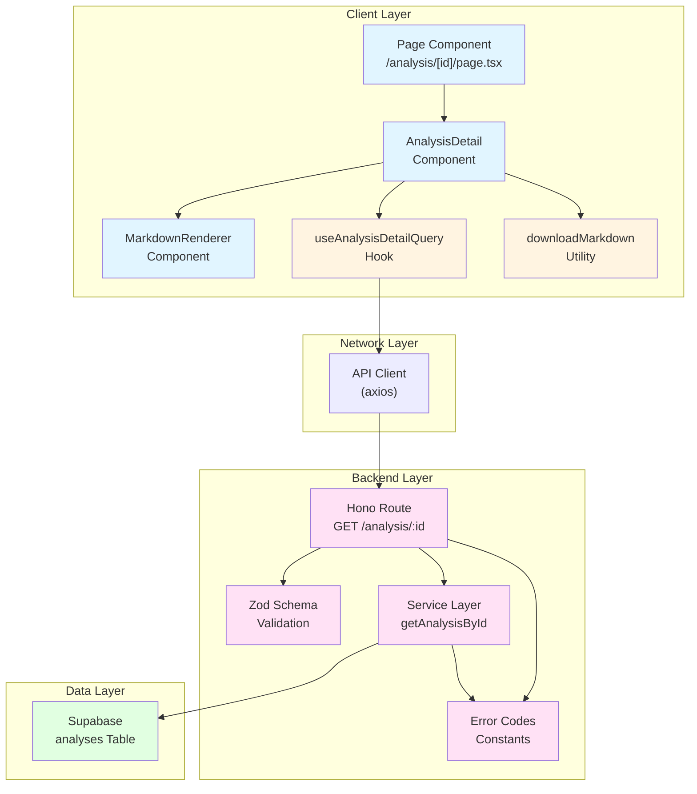

# 분석 상세보기 페이지 구현 계획

## 1. 개요

### 1.1 페이지 정보
- **경로**: `/analysis/[analysisId]`
- **인증**: 필수 (Clerk 미들웨어를 통한 인증 확인)
- **주요 기능**:
  1. 분석 결과 상세 내용 조회 및 표시 (마크다운 렌더링)
  2. 마크다운 파일 다운로드 (클라이언트 사이드)
  3. 본인 데이터만 접근 가능 (백엔드 보안 검증)
  4. 로딩/에러 상태 처리

### 1.2 구현 모듈 목록

#### Frontend Modules
| 모듈명 | 위치 | 설명 |
|--------|------|------|
| **Page Component** | `src/app/(protected)/analysis/[analysisId]/page.tsx` | 분석 상세보기 메인 페이지 |
| **Analysis Detail Component** | `src/features/analysis/components/analysis-detail.tsx` | 분석 결과 표시 및 다운로드 UI |
| **Markdown Renderer Component** | `src/features/analysis/components/markdown-renderer.tsx` | 마크다운 렌더링 컴포넌트 |
| **Analysis Query Hook** | `src/features/analysis/hooks/useAnalysisDetailQuery.ts` | 분석 상세 조회 React Query 훅 |
| **Download Utility** | `src/features/analysis/lib/download-markdown.ts` | MD 파일 다운로드 로직 |
| **DTO** | `src/features/analysis/lib/dto.ts` | 프론트엔드용 스키마 재노출 |

#### Backend Modules
| 모듈명 | 위치 | 설명 |
|--------|------|------|
| **Route Handler** | `src/features/analysis/backend/route.ts` | Hono 라우터 정의 (GET `/analysis/:analysisId`) |
| **Service Layer** | `src/features/analysis/backend/service.ts` | Supabase 조회 및 비즈니스 로직 |
| **Schema Definitions** | `src/features/analysis/backend/schema.ts` | Zod 스키마 정의 (요청/응답) |
| **Error Codes** | `src/features/analysis/backend/error.ts` | 에러 코드 상수 정의 |

#### Shared Modules
| 모듈명 | 위치 | 설명 |
|--------|------|------|
| **API Client** | `src/lib/remote/api-client.ts` | 기존 axios 클라이언트 재사용 |
| **Response Helpers** | `src/backend/http/response.ts` | 기존 success/failure 패턴 재사용 |

---

## 2. 시스템 아키텍처 다이어그램



---

## 3. Implementation Plan

### 3.1 Backend Layer

#### 3.1.1 Error Codes (`src/features/analysis/backend/error.ts`)

**목적**: 분석 조회 관련 에러 코드 정의

**구현 내용**:
```typescript
export const analysisErrorCodes = {
  notFound: 'ANALYSIS_NOT_FOUND',
  fetchError: 'ANALYSIS_FETCH_ERROR',
  validationError: 'ANALYSIS_VALIDATION_ERROR',
  unauthorized: 'ANALYSIS_UNAUTHORIZED',
} as const;

type AnalysisErrorValue = (typeof analysisErrorCodes)[keyof typeof analysisErrorCodes];

export type AnalysisServiceError = AnalysisErrorValue;
```

**Unit Tests**:
- ✅ 에러 코드 상수가 올바르게 정의되어 있는지 확인
- ✅ AnalysisServiceError 타입이 모든 에러 코드를 포함하는지 확인

---

#### 3.1.2 Schema Definitions (`src/features/analysis/backend/schema.ts`)

**목적**: 요청 파라미터 및 응답 데이터의 Zod 스키마 정의

**구현 내용**:
```typescript
import { z } from 'zod';

// Path Parameter Schema
export const AnalysisParamsSchema = z.object({
  analysisId: z.string().uuid({ message: 'Analysis ID must be a valid UUID.' }),
});

export type AnalysisParams = z.infer<typeof AnalysisParamsSchema>;

// Database Row Schema (snake_case)
export const AnalysisTableRowSchema = z.object({
  id: z.string().uuid(),
  user_id: z.string(),
  name: z.string(),
  birth_date: z.string(),
  birth_time: z.string().nullable(),
  is_lunar: z.boolean(),
  model_type: z.enum(['flash', 'pro']),
  summary: z.string().nullable(),
  detail: z.string(),
  created_at: z.string(),
});

export type AnalysisRow = z.infer<typeof AnalysisTableRowSchema>;

// Response Schema (camelCase)
export const AnalysisDetailResponseSchema = z.object({
  id: z.string().uuid(),
  name: z.string(),
  birthDate: z.string(),
  birthTime: z.string().nullable(),
  isLunar: z.boolean(),
  modelType: z.enum(['flash', 'pro']),
  summary: z.string().nullable(),
  detail: z.string(),
  createdAt: z.string(),
});

export type AnalysisDetailResponse = z.infer<typeof AnalysisDetailResponseSchema>;
```

**Unit Tests**:
- ✅ AnalysisParamsSchema가 유효한 UUID를 파싱하는지 확인
- ✅ AnalysisParamsSchema가 잘못된 UUID를 거부하는지 확인
- ✅ AnalysisTableRowSchema가 DB 레코드를 정확히 파싱하는지 확인
- ✅ AnalysisDetailResponseSchema가 camelCase 응답을 정확히 파싱하는지 확인
- ✅ model_type 필드가 'flash', 'pro' 외의 값을 거부하는지 확인

---

#### 3.1.3 Service Layer (`src/features/analysis/backend/service.ts`)

**목적**: Supabase에서 분석 데이터 조회 및 변환

**구현 내용**:
```typescript
import type { SupabaseClient } from '@supabase/supabase-js';
import {
  failure,
  success,
  type HandlerResult,
} from '@/backend/http/response';
import {
  AnalysisDetailResponseSchema,
  AnalysisTableRowSchema,
  type AnalysisDetailResponse,
  type AnalysisRow,
} from '@/features/analysis/backend/schema';
import {
  analysisErrorCodes,
  type AnalysisServiceError,
} from '@/features/analysis/backend/error';

const ANALYSES_TABLE = 'analyses';

export const getAnalysisById = async (
  client: SupabaseClient,
  analysisId: string,
  userId: string,
): Promise<HandlerResult<AnalysisDetailResponse, AnalysisServiceError, unknown>> => {
  // DB 조회 (본인 데이터만)
  const { data, error } = await client
    .from(ANALYSES_TABLE)
    .select('id, user_id, name, birth_date, birth_time, is_lunar, model_type, summary, detail, created_at')
    .eq('id', analysisId)
    .eq('user_id', userId) // 보안: 본인 데이터만 조회
    .maybeSingle<AnalysisRow>();

  if (error) {
    return failure(500, analysisErrorCodes.fetchError, error.message);
  }

  if (!data) {
    return failure(404, analysisErrorCodes.notFound, '분석 내역을 찾을 수 없습니다.');
  }

  // DB Row 검증
  const rowParse = AnalysisTableRowSchema.safeParse(data);

  if (!rowParse.success) {
    return failure(
      500,
      analysisErrorCodes.validationError,
      'Analysis row failed validation.',
      rowParse.error.format(),
    );
  }

  // snake_case → camelCase 변환
  const mapped = {
    id: rowParse.data.id,
    name: rowParse.data.name,
    birthDate: rowParse.data.birth_date,
    birthTime: rowParse.data.birth_time,
    isLunar: rowParse.data.is_lunar,
    modelType: rowParse.data.model_type,
    summary: rowParse.data.summary,
    detail: rowParse.data.detail,
    createdAt: rowParse.data.created_at,
  } satisfies AnalysisDetailResponse;

  // 응답 검증
  const parsed = AnalysisDetailResponseSchema.safeParse(mapped);

  if (!parsed.success) {
    return failure(
      500,
      analysisErrorCodes.validationError,
      'Analysis response failed validation.',
      parsed.error.format(),
    );
  }

  return success(parsed.data);
};
```

**Unit Tests**:
- ✅ 유효한 analysisId와 userId로 조회 시 성공 응답 반환
- ✅ 존재하지 않는 analysisId 조회 시 404 ANALYSIS_NOT_FOUND 반환
- ✅ 다른 사용자의 analysisId 조회 시 404 반환 (보안)
- ✅ DB 조회 실패 시 500 ANALYSIS_FETCH_ERROR 반환
- ✅ DB 레코드가 스키마와 맞지 않을 때 500 ANALYSIS_VALIDATION_ERROR 반환
- ✅ snake_case → camelCase 변환이 정확히 이루어지는지 확인

---

#### 3.1.4 Route Handler (`src/features/analysis/backend/route.ts`)

**목적**: Hono 라우터에서 GET `/analysis/:analysisId` 엔드포인트 처리

**구현 내용**:
```typescript
import type { Hono } from 'hono';
import {
  failure,
  respond,
  type ErrorResult,
} from '@/backend/http/response';
import {
  getLogger,
  getSupabase,
  type AppEnv,
} from '@/backend/hono/context';
import { AnalysisParamsSchema } from '@/features/analysis/backend/schema';
import { getAnalysisById } from './service';
import {
  analysisErrorCodes,
  type AnalysisServiceError,
} from './error';
import { getAuth } from '@clerk/nextjs/server'; // Clerk 인증

export const registerAnalysisRoutes = (app: Hono<AppEnv>) => {
  app.get('/analysis/:analysisId', async (c) => {
    // 1. Clerk 인증 확인 (미들웨어에서 이미 처리되었지만 userId 추출)
    const auth = getAuth(c.req.raw);
    const userId = auth.userId;

    if (!userId) {
      return respond(
        c,
        failure(401, analysisErrorCodes.unauthorized, '인증이 필요합니다.'),
      );
    }

    // 2. Path Parameter 검증
    const parsedParams = AnalysisParamsSchema.safeParse({
      analysisId: c.req.param('analysisId'),
    });

    if (!parsedParams.success) {
      return respond(
        c,
        failure(
          400,
          'INVALID_ANALYSIS_PARAMS',
          'The provided analysis ID is invalid.',
          parsedParams.error.format(),
        ),
      );
    }

    // 3. Service 호출
    const supabase = getSupabase(c);
    const logger = getLogger(c);

    const result = await getAnalysisById(
      supabase,
      parsedParams.data.analysisId,
      userId, // 보안: 본인 데이터만 조회
    );

    // 4. 에러 처리
    if (!result.ok) {
      const errorResult = result as ErrorResult<AnalysisServiceError, unknown>;

      if (errorResult.error.code === analysisErrorCodes.fetchError) {
        logger.error('Failed to fetch analysis', errorResult.error.message);
      }

      return respond(c, result);
    }

    // 5. 성공 응답
    return respond(c, result);
  });
};
```

**QA Sheet**:

| 시나리오 | 입력 | 예상 출력 | 통과 여부 |
|---------|------|----------|----------|
| 정상 조회 (본인 데이터) | `GET /analysis/{valid-uuid}` + 본인 userId | 200 OK + AnalysisDetailResponse | ⬜ |
| 존재하지 않는 ID | `GET /analysis/{invalid-uuid}` | 404 NOT_FOUND | ⬜ |
| 타인 데이터 접근 시도 | `GET /analysis/{타인-uuid}` + 본인 userId | 404 NOT_FOUND (보안) | ⬜ |
| 잘못된 UUID 형식 | `GET /analysis/not-a-uuid` | 400 INVALID_PARAMS | ⬜ |
| 인증되지 않은 요청 | `GET /analysis/{uuid}` (userId 없음) | 401 UNAUTHORIZED | ⬜ |
| DB 조회 실패 | Supabase 연결 오류 상황 | 500 FETCH_ERROR | ⬜ |

**Hono 앱 등록**:
- `src/backend/hono/app.ts`에 `registerAnalysisRoutes(app);` 추가 필요

---

### 3.2 Frontend Layer

#### 3.2.1 DTO (`src/features/analysis/lib/dto.ts`)

**목적**: 백엔드 스키마를 프론트엔드에서 재사용

**구현 내용**:
```typescript
export {
  AnalysisParamsSchema,
  AnalysisDetailResponseSchema,
  type AnalysisParams,
  type AnalysisDetailResponse,
} from '@/features/analysis/backend/schema';
```

---

#### 3.2.2 Download Utility (`src/features/analysis/lib/download-markdown.ts`)

**목적**: 마크다운 파일 다운로드 로직 (클라이언트 사이드)

**구현 내용**:
```typescript
import { format } from 'date-fns';
import { ko } from 'date-fns/locale';

type DownloadMarkdownParams = {
  name: string;
  birthDate: string;
  birthTime: string | null;
  isLunar: boolean;
  modelType: 'flash' | 'pro';
  detail: string;
  createdAt: string;
};

/**
 * 특수문자를 파일명에 안전한 문자로 치환
 */
const sanitizeFilename = (filename: string): string => {
  return filename.replace(/[/\\:*?"<>|]/g, '_');
};

/**
 * 마크다운 메타데이터 헤더 생성
 */
const generateMarkdownHeader = (params: DownloadMarkdownParams): string => {
  const {
    name,
    birthDate,
    birthTime,
    isLunar,
    modelType,
    createdAt,
  } = params;

  const lunarText = isLunar ? '음력' : '양력';
  const timeText = birthTime ?? '시간 정보 없음';
  const modelText = modelType === 'pro' ? 'Gemini 2.5 Pro' : 'Gemini 2.5 Flash';
  const analysisDate = format(new Date(createdAt), 'yyyy년 M월 d일 a h:mm', { locale: ko });

  return `---
분석 대상: ${name}
생년월일: ${birthDate} (${lunarText})
태어난 시간: ${timeText}
분석 일자: ${analysisDate}
사용 모델: ${modelText}
---

`;
};

/**
 * 마크다운 파일 다운로드
 */
export const downloadMarkdown = (params: DownloadMarkdownParams): void => {
  const header = generateMarkdownHeader(params);
  const fullContent = header + params.detail;

  // Blob 생성
  const blob = new Blob([fullContent], { type: 'text/markdown; charset=utf-8' });

  // Object URL 생성
  const url = URL.createObjectURL(blob);

  // 파일명 생성
  const dateStr = format(new Date(params.createdAt), 'yyyy-MM-dd');
  const sanitizedName = sanitizeFilename(params.name);
  const filename = `사주분석_${sanitizedName}_${dateStr}.md`;

  // 다운로드 트리거
  const link = document.createElement('a');
  link.href = url;
  link.download = filename;
  document.body.appendChild(link);
  link.click();
  document.body.removeChild(link);

  // 메모리 해제
  URL.revokeObjectURL(url);
};
```

**Unit Tests**:
- ✅ sanitizeFilename이 특수문자를 올바르게 치환하는지 확인
- ✅ generateMarkdownHeader가 올바른 형식의 헤더를 생성하는지 확인
- ✅ downloadMarkdown이 Blob을 생성하고 다운로드를 트리거하는지 확인 (모킹)

---

#### 3.2.3 Analysis Query Hook (`src/features/analysis/hooks/useAnalysisDetailQuery.ts`)

**목적**: React Query를 사용한 분석 상세 조회

**구현 내용**:
```typescript
'use client';

import { useQuery } from '@tanstack/react-query';
import { apiClient, extractApiErrorMessage } from '@/lib/remote/api-client';
import { AnalysisDetailResponseSchema } from '@/features/analysis/lib/dto';

const fetchAnalysisDetail = async (analysisId: string) => {
  try {
    const { data } = await apiClient.get(`/api/analysis/${analysisId}`);
    return AnalysisDetailResponseSchema.parse(data);
  } catch (error) {
    const message = extractApiErrorMessage(error, '분석 내역을 불러오는 데 실패했습니다.');
    throw new Error(message);
  }
};

export const useAnalysisDetailQuery = (analysisId: string) =>
  useQuery({
    queryKey: ['analysis', analysisId],
    queryFn: () => fetchAnalysisDetail(analysisId),
    enabled: Boolean(analysisId),
    staleTime: 5 * 60 * 1000, // 5분
    retry: 1,
  });
```

**QA Sheet**:

| 시나리오 | 입력 | 예상 동작 | 통과 여부 |
|---------|------|----------|----------|
| 정상 조회 | 유효한 analysisId | data에 AnalysisDetailResponse 반환 | ⬜ |
| 존재하지 않는 ID | 잘못된 analysisId | error에 에러 메시지 포함 | ⬜ |
| 인증 실패 | 인증되지 않은 상태 | 401 에러 반환 | ⬜ |
| 네트워크 오류 | API 서버 다운 | error에 fallback 메시지 포함 | ⬜ |
| 캐싱 동작 | 동일 ID 재조회 | staleTime 내에는 캐시 사용 | ⬜ |

---

#### 3.2.4 Markdown Renderer Component (`src/features/analysis/components/markdown-renderer.tsx`)

**목적**: 마크다운 텍스트를 HTML로 렌더링

**구현 내용**:
```typescript
'use client';

import React from 'react';
import ReactMarkdown from 'react-markdown';
import remarkGfm from 'remark-gfm';
import { cn } from '@/lib/utils';

type MarkdownRendererProps = {
  content: string;
  className?: string;
};

export const MarkdownRenderer: React.FC<MarkdownRendererProps> = ({
  content,
  className,
}) => {
  return (
    <div
      className={cn(
        'prose prose-slate dark:prose-invert max-w-none',
        'prose-headings:font-bold prose-h1:text-3xl prose-h2:text-2xl prose-h3:text-xl',
        'prose-p:text-base prose-p:leading-7',
        'prose-a:text-blue-600 hover:prose-a:text-blue-800',
        'prose-strong:font-semibold',
        'prose-ul:list-disc prose-ol:list-decimal',
        className,
      )}
    >
      <ReactMarkdown remarkPlugins={[remarkGfm]}>{content}</ReactMarkdown>
    </div>
  );
};
```

**필수 라이브러리 설치**:
```bash
npm install react-markdown remark-gfm
```

**QA Sheet**:

| 시나리오 | 입력 | 예상 출력 | 통과 여부 |
|---------|------|----------|----------|
| 일반 텍스트 | "안녕하세요" | `<p>안녕하세요</p>` | ⬜ |
| 헤딩 | "# 제목" | `<h1>제목</h1>` (스타일 적용) | ⬜ |
| 링크 | "[링크](url)" | `<a href="url">링크</a>` | ⬜ |
| 리스트 | "- 항목1\n- 항목2" | `<ul><li>항목1</li>...</ul>` | ⬜ |
| 테이블 (GFM) | 마크다운 테이블 | `<table>` 렌더링 | ⬜ |

---

#### 3.2.5 Analysis Detail Component (`src/features/analysis/components/analysis-detail.tsx`)

**목적**: 분석 결과 표시 및 다운로드 버튼 UI

**구현 내용**:
```typescript
'use client';

import React from 'react';
import { format } from 'date-fns';
import { ko } from 'date-fns/locale';
import { Download, Calendar, User, Clock, Sparkles } from 'lucide-react';
import { Button } from '@/components/ui/button';
import { Card, CardContent, CardHeader, CardTitle } from '@/components/ui/card';
import { Badge } from '@/components/ui/badge';
import { Separator } from '@/components/ui/separator';
import { MarkdownRenderer } from './markdown-renderer';
import { downloadMarkdown } from '../lib/download-markdown';
import type { AnalysisDetailResponse } from '../lib/dto';

type AnalysisDetailProps = {
  analysis: AnalysisDetailResponse;
};

export const AnalysisDetail: React.FC<AnalysisDetailProps> = ({ analysis }) => {
  const handleDownload = () => {
    downloadMarkdown({
      name: analysis.name,
      birthDate: analysis.birthDate,
      birthTime: analysis.birthTime,
      isLunar: analysis.isLunar,
      modelType: analysis.modelType,
      detail: analysis.detail,
      createdAt: analysis.createdAt,
    });
  };

  const formattedDate = format(new Date(analysis.createdAt), 'yyyy년 M월 d일 a h:mm', {
    locale: ko,
  });

  const lunarText = analysis.isLunar ? '음력' : '양력';
  const modelText = analysis.modelType === 'pro' ? 'Gemini 2.5 Pro' : 'Gemini 2.5 Flash';

  return (
    <div className="container max-w-4xl py-8 space-y-6">
      {/* 헤더 섹션 */}
      <Card>
        <CardHeader>
          <div className="flex items-start justify-between">
            <div className="space-y-1">
              <CardTitle className="text-2xl">사주 분석 결과</CardTitle>
              <p className="text-sm text-muted-foreground">
                {analysis.name}님의 사주 분석 상세 내용
              </p>
            </div>
            <Button onClick={handleDownload} variant="outline" size="sm">
              <Download className="mr-2 h-4 w-4" />
              MD 다운로드
            </Button>
          </div>
        </CardHeader>
        <CardContent>
          <div className="grid grid-cols-1 md:grid-cols-2 gap-4">
            <div className="flex items-center gap-2">
              <User className="h-4 w-4 text-muted-foreground" />
              <span className="text-sm font-medium">이름:</span>
              <span className="text-sm">{analysis.name}</span>
            </div>
            <div className="flex items-center gap-2">
              <Calendar className="h-4 w-4 text-muted-foreground" />
              <span className="text-sm font-medium">생년월일:</span>
              <span className="text-sm">
                {analysis.birthDate} ({lunarText})
              </span>
            </div>
            <div className="flex items-center gap-2">
              <Clock className="h-4 w-4 text-muted-foreground" />
              <span className="text-sm font-medium">태어난 시간:</span>
              <span className="text-sm">{analysis.birthTime ?? '시간 정보 없음'}</span>
            </div>
            <div className="flex items-center gap-2">
              <Sparkles className="h-4 w-4 text-muted-foreground" />
              <span className="text-sm font-medium">사용 모델:</span>
              <Badge variant="secondary">{modelText}</Badge>
            </div>
          </div>
          <Separator className="my-4" />
          <div className="text-xs text-muted-foreground">
            분석 일시: {formattedDate}
          </div>
        </CardContent>
      </Card>

      {/* 상세 분석 내용 */}
      <Card>
        <CardHeader>
          <CardTitle>상세 분석</CardTitle>
        </CardHeader>
        <CardContent>
          <MarkdownRenderer content={analysis.detail} />
        </CardContent>
      </Card>
    </div>
  );
};
```

**QA Sheet**:

| 시나리오 | 입력 | 예상 출력 | 통과 여부 |
|---------|------|----------|----------|
| 정상 렌더링 | 유효한 AnalysisDetailResponse | 모든 필드가 정확히 표시됨 | ⬜ |
| 시간 정보 없음 | birthTime: null | "시간 정보 없음" 표시 | ⬜ |
| 음력/양력 표시 | isLunar: true/false | "음력" 또는 "양력" 표시 | ⬜ |
| 모델 타입 표시 | modelType: 'pro'/'flash' | 적절한 뱃지 표시 | ⬜ |
| 다운로드 버튼 클릭 | 버튼 클릭 | downloadMarkdown 함수 호출 | ⬜ |
| 마크다운 렌더링 | detail 필드 | MarkdownRenderer 컴포넌트 호출 | ⬜ |

---

#### 3.2.6 Page Component (`src/app/(protected)/analysis/[analysisId]/page.tsx`)

**목적**: 메인 페이지 컴포넌트 (서버 컴포넌트 + 클라이언트 컴포넌트)

**구현 내용**:
```typescript
'use client';

import React from 'react';
import { useParams, useRouter } from 'next/navigation';
import { Loader2, AlertCircle } from 'lucide-react';
import { Button } from '@/components/ui/button';
import { Card, CardContent } from '@/components/ui/card';
import { useAnalysisDetailQuery } from '@/features/analysis/hooks/useAnalysisDetailQuery';
import { AnalysisDetail } from '@/features/analysis/components/analysis-detail';

export default function AnalysisDetailPage() {
  const params = useParams();
  const router = useRouter();
  const analysisId = params.analysisId as string;

  const { data, isLoading, error } = useAnalysisDetailQuery(analysisId);

  // 로딩 상태
  if (isLoading) {
    return (
      <div className="container max-w-4xl py-16 flex flex-col items-center justify-center space-y-4">
        <Loader2 className="h-12 w-12 animate-spin text-primary" />
        <p className="text-muted-foreground">분석 내역을 불러오는 중...</p>
      </div>
    );
  }

  // 에러 상태
  if (error) {
    return (
      <div className="container max-w-4xl py-16">
        <Card className="border-destructive">
          <CardContent className="pt-6 flex flex-col items-center space-y-4">
            <AlertCircle className="h-12 w-12 text-destructive" />
            <div className="text-center space-y-2">
              <h2 className="text-xl font-semibold">분석 내역을 찾을 수 없습니다</h2>
              <p className="text-sm text-muted-foreground">
                {error.message || '일시적인 오류가 발생했습니다. 잠시 후 다시 시도해주세요.'}
              </p>
            </div>
            <div className="flex gap-2">
              <Button onClick={() => router.push('/dashboard')} variant="default">
                대시보드로 돌아가기
              </Button>
              <Button onClick={() => window.location.reload()} variant="outline">
                다시 시도
              </Button>
            </div>
          </CardContent>
        </Card>
      </div>
    );
  }

  // 성공 상태
  if (!data) {
    return null;
  }

  return <AnalysisDetail analysis={data} />;
}
```

**QA Sheet**:

| 시나리오 | 상태 | 예상 UI | 통과 여부 |
|---------|------|---------|----------|
| 로딩 중 | isLoading: true | 로딩 스피너 + "불러오는 중..." 메시지 | ⬜ |
| 조회 성공 | data 존재 | AnalysisDetail 컴포넌트 렌더링 | ⬜ |
| 분석 없음 | 404 에러 | "찾을 수 없습니다" 에러 메시지 | ⬜ |
| 인증 실패 | 401 에러 | 에러 메시지 표시 | ⬜ |
| 네트워크 오류 | 500 에러 | "일시적인 오류" 메시지 + 재시도 버튼 | ⬜ |
| 대시보드 이동 | 버튼 클릭 | `/dashboard`로 라우팅 | ⬜ |
| 새로고침 | "다시 시도" 클릭 | 페이지 새로고침 | ⬜ |

---

## 4. 구현 순서 및 체크리스트

### Phase 1: Backend 구현
- [ ] `src/features/analysis/backend/error.ts` 작성
- [ ] `src/features/analysis/backend/schema.ts` 작성 및 단위 테스트
- [ ] `src/features/analysis/backend/service.ts` 작성 및 단위 테스트
- [ ] `src/features/analysis/backend/route.ts` 작성 및 QA
- [ ] `src/backend/hono/app.ts`에 `registerAnalysisRoutes(app)` 추가
- [ ] Postman/Thunder Client로 API 엔드포인트 수동 테스트

### Phase 2: Frontend Utilities
- [ ] `src/features/analysis/lib/dto.ts` 작성
- [ ] `src/features/analysis/lib/download-markdown.ts` 작성 및 단위 테스트
- [ ] `react-markdown`, `remark-gfm` 라이브러리 설치

### Phase 3: Frontend Components
- [ ] `src/features/analysis/hooks/useAnalysisDetailQuery.ts` 작성 및 QA
- [ ] `src/features/analysis/components/markdown-renderer.tsx` 작성 및 QA
- [ ] `src/features/analysis/components/analysis-detail.tsx` 작성 및 QA
- [ ] `src/app/(protected)/analysis/[analysisId]/page.tsx` 작성 및 QA

### Phase 4: Integration Testing
- [ ] 전체 플로우 테스트 (대시보드 → 상세보기 → 다운로드)
- [ ] 보안 테스트 (타인 데이터 접근 시도)
- [ ] 에러 케이스 테스트 (404, 401, 500)
- [ ] 다양한 마크다운 형식 렌더링 테스트
- [ ] 다운로드 파일 내용 검증 (메타데이터 헤더 포함 여부)

### Phase 5: UI/UX 폴리싱
- [ ] 로딩 상태 UX 개선
- [ ] 에러 메시지 한국어 통일
- [ ] 반응형 디자인 확인 (모바일/태블릿)
- [ ] 다크모드 호환성 확인
- [ ] 접근성 (a11y) 검토

---

## 5. 외부 서비스 연동 확인

### 5.1 Clerk 인증
- **연동 방식**: Next.js 미들웨어 + `getAuth()`
- **필수 환경 변수**:
  - `NEXT_PUBLIC_CLERK_PUBLISHABLE_KEY`
  - `CLERK_SECRET_KEY`
- **보안 정책**:
  - 백엔드 라우터에서 `getAuth(c.req.raw).userId` 추출
  - `userId`가 없으면 401 Unauthorized 반환
  - Supabase 조회 시 `eq('user_id', userId)` 조건 필수

### 5.2 Supabase
- **테이블**: `analyses`
- **필수 컬럼**: `id`, `user_id`, `name`, `birth_date`, `birth_time`, `is_lunar`, `model_type`, `summary`, `detail`, `created_at`
- **인덱스**: `(user_id, created_at DESC)` - 이미 마이그레이션에 포함됨
- **RLS**: 비활성화 (백엔드 API에서 접근 제어)

---

## 6. 보안 고려사항

### 6.1 데이터 소유권 검증
- ✅ **백엔드 서비스 레이어**에서 반드시 `user_id` 일치 여부 확인
- ✅ SQL 쿼리에 `.eq('user_id', userId)` 조건 포함
- ✅ 타인의 `analysisId` 접근 시 404 반환 (403 대신 404로 정보 노출 최소화)

### 6.2 입력 검증
- ✅ Path Parameter `analysisId`는 UUID 형식 검증 (Zod)
- ✅ DB 조회 결과는 스키마 검증 후 사용

### 6.3 에러 메시지
- ✅ 내부 에러 상세 정보 노출 금지 (프론트엔드에는 사용자 친화적 메시지만)
- ✅ 백엔드 로그에만 상세 에러 기록

---

## 7. 성능 최적화

### 7.1 캐싱 전략
- React Query `staleTime`: 5분 (분석 결과는 변하지 않으므로 긴 캐시 유지 가능)
- React Query `retry`: 1회 (404는 재시도 불필요)

### 7.2 번들 사이즈
- `react-markdown`는 필수 기능이므로 코드 스플리팅 불필요
- 마크다운 렌더링 컴포넌트는 이미 클라이언트 컴포넌트로 분리

### 7.3 DB 쿼리 최적화
- 인덱스 활용: `idx_analyses_user_created` (user_id, created_at DESC)
- 필요한 컬럼만 SELECT (이미 구현됨)

---

## 8. 테스트 커버리지 목표

### Backend
- [ ] Service Layer 단위 테스트: 100% 커버리지
- [ ] Schema 검증 테스트: 모든 엣지케이스 포함
- [ ] Route Handler 통합 테스트: 모든 HTTP 상태 코드

### Frontend
- [ ] Utility 함수 단위 테스트: 100% 커버리지
- [ ] Component 렌더링 테스트: 주요 시나리오
- [ ] Hook 테스트: React Query 동작 검증

---

## 9. 마일스톤 및 예상 소요 시간

| Phase | 예상 시간 | 완료 여부 |
|-------|----------|----------|
| Phase 1: Backend 구현 | 3시간 | ⬜ |
| Phase 2: Frontend Utilities | 1시간 | ⬜ |
| Phase 3: Frontend Components | 3시간 | ⬜ |
| Phase 4: Integration Testing | 2시간 | ⬜ |
| Phase 5: UI/UX 폴리싱 | 1시간 | ⬜ |
| **Total** | **10시간** | ⬜ |

---

## 10. 참고 문서

- PRD: `/docs/prd.md`
- Userflow 12: `/docs/userflow.md`
- Usecase 012: `/docs/usecases/012/spec.md`
- Database Schema: `/docs/database.md`
- Clerk 연동: `/docs/external/clerk.md`
- 코드베이스 구조: `/CLAUDE.md`, `/AGENTS.md`

---

## 11. 후속 작업

이 페이지 구현 완료 후 다음 작업 진행:
- [ ] 대시보드 페이지에서 상세보기 링크 연결 구현 확인
- [ ] 새 분석 완료 후 모달의 '상세보기' 버튼 구현 확인
- [ ] 분석 삭제 기능 (선택적)
- [ ] 분석 내역 공유 기능 (선택적)
