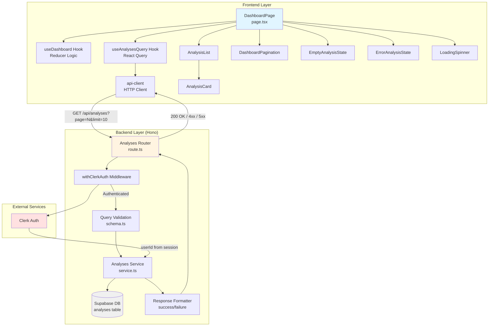

# 대시보드 페이지 구현 계획

## 1. 개요 (Overview)

대시보드 페이지(`/dashboard`)는 사용자의 과거 사주 분석 내역을 페이지네이션 방식으로 표시하는 페이지입니다. 이 문서는 프론트엔드(페이지 컴포넌트) 및 백엔드(Hono API) 모듈의 전체 구현 계획을 정의합니다.

### 1.1 참조 문서
- `/docs/prd.md` - 제품 요구사항 정의서
- `/docs/userflow.md` - 사용자 플로우 11번 (분석 내역 조회)
- `/docs/usecases/011/spec.md` - 분석 내역 조회 유스케이스 상세 명세
- `/docs/pages/dashboard/state_management.md` - 상태 관리 설계 (Flux 패턴)
- `/docs/database.md` - analyses 테이블 스키마

### 1.2 주요 기능
- 사용자의 분석 내역 목록 표시 (최신순 정렬)
- 페이지네이션 (페이지당 10개 항목)
- 로딩/에러 상태 처리
- 빈 상태 처리 (분석 내역 0건)
- 각 항목 클릭 시 상세보기 페이지로 이동
- CTA 버튼 (새 분석하기, 구독 관리)

### 1.3 구현 모듈 목록

#### Frontend 모듈
| 모듈 | 위치 | 설명 |
|------|------|------|
| **DashboardPage** | `src/app/(protected)/dashboard/page.tsx` | 메인 페이지 컴포넌트 (useReducer 기반 상태 관리) |
| **useDashboard** | `src/features/analyses/hooks/useDashboard.ts` | Reducer 및 상태 관리 로직 |
| **useAnalysesQuery** | `src/features/analyses/hooks/useAnalysesQuery.ts` | React Query를 활용한 API 호출 훅 |
| **AnalysisList** | `src/features/analyses/components/AnalysisList.tsx` | 분석 내역 목록 컴포넌트 |
| **AnalysisCard** | `src/features/analyses/components/AnalysisCard.tsx` | 개별 분석 카드 컴포넌트 |
| **DashboardPagination** | `src/features/analyses/components/DashboardPagination.tsx` | 페이지네이션 UI 컴포넌트 |
| **EmptyAnalysisState** | `src/features/analyses/components/EmptyAnalysisState.tsx` | 빈 상태 컴포넌트 |
| **ErrorAnalysisState** | `src/features/analyses/components/ErrorAnalysisState.tsx` | 에러 상태 컴포넌트 |
| **LoadingSpinner** | `src/components/ui/spinner.tsx` | 로딩 스피너 (공통 컴포넌트) |
| **DTO Export** | `src/features/analyses/lib/dto.ts` | 백엔드 스키마를 프론트엔드에서 재사용 |

#### Backend 모듈
| 모듈 | 위치 | 설명 |
|------|------|------|
| **route.ts** | `src/features/analyses/backend/route.ts` | Hono 라우터 정의 (GET /api/analyses) |
| **service.ts** | `src/features/analyses/backend/service.ts` | Supabase 쿼리 및 비즈니스 로직 |
| **schema.ts** | `src/features/analyses/backend/schema.ts` | Zod 스키마 정의 (요청/응답 검증) |
| **error.ts** | `src/features/analyses/backend/error.ts` | 에러 코드 정의 |
| **types.ts** | `src/features/analyses/types.ts` | 공통 타입 정의 |

#### 공통 모듈 (Shared)
| 모듈 | 위치 | 설명 |
|------|------|------|
| **api-client** | `src/lib/remote/api-client.ts` | HTTP 클라이언트 (모든 API 호출은 이를 통해 라우팅) |
| **response helpers** | `src/backend/http/response.ts` | success/failure/respond 패턴 (기존 모듈 재사용) |
| **Clerk 인증** | `middleware.ts` | Clerk 미들웨어를 통한 인증 가드 (기존 설정 활용) |

---

## 2. 아키텍처 다이어그램 (Mermaid Diagram)



---

## 3. 구현 계획 (Implementation Plan)

### 3.1 Backend 모듈 구현

#### 3.1.1 `src/features/analyses/types.ts`

**목적:** 프론트엔드와 백엔드에서 공통으로 사용할 타입 정의

**구현 내용:**
```typescript
export interface Analysis {
  id: string;              // UUID
  name: string;            // 분석 대상 이름
  birth_date: string;      // 생년월일 (YYYY-MM-DD)
  birth_time: string | null; // 태어난 시간 (HH:MM) 또는 null
  is_lunar: boolean;       // 음력 여부
  model_type: 'flash' | 'pro'; // 사용된 모델
  created_at: string;      // 분석 수행 시각 (ISO 8601)
}

export interface PaginationInfo {
  total_count: number;
  total_pages: number;
  current_page: number;
  per_page: number;
  has_next: boolean;
  has_prev: boolean;
}

export interface AnalysesListResponse {
  items: Analysis[];
  pagination: PaginationInfo;
}
```

**Unit Tests:**
- N/A (타입 정의만 포함)

---

#### 3.1.2 `src/features/analyses/backend/error.ts`

**목적:** 분석 내역 조회 관련 에러 코드 정의

**구현 내용:**
```typescript
export const analysesErrorCodes = {
  invalidQueryParams: 'INVALID_QUERY_PARAMS',
  unauthorized: 'UNAUTHORIZED',
  databaseError: 'DATABASE_ERROR',
  validationError: 'VALIDATION_ERROR',
} as const;

type AnalysesErrorValue = (typeof analysesErrorCodes)[keyof typeof analysesErrorCodes];

export type AnalysesServiceError = AnalysesErrorValue;
```

**Unit Tests:**
```typescript
describe('analysesErrorCodes', () => {
  it('should contain all required error codes', () => {
    expect(analysesErrorCodes.invalidQueryParams).toBe('INVALID_QUERY_PARAMS');
    expect(analysesErrorCodes.unauthorized).toBe('UNAUTHORIZED');
    expect(analysesErrorCodes.databaseError).toBe('DATABASE_ERROR');
    expect(analysesErrorCodes.validationError).toBe('VALIDATION_ERROR');
  });
});
```

---

#### 3.1.3 `src/features/analyses/backend/schema.ts`

**목적:** 요청/응답 데이터의 Zod 스키마 정의 및 검증

**구현 내용:**
```typescript
import { z } from 'zod';

// Query Parameters Schema
export const AnalysesQuerySchema = z.object({
  page: z.coerce.number().int().positive().default(1),
  limit: z.coerce.number().int().positive().max(100).default(10),
});

export type AnalysesQuery = z.infer<typeof AnalysesQuerySchema>;

// Database Row Schema (analyses 테이블)
export const AnalysisRowSchema = z.object({
  id: z.string().uuid(),
  user_id: z.string(),
  name: z.string(),
  birth_date: z.string(),
  birth_time: z.string().nullable(),
  is_lunar: z.boolean(),
  model_type: z.enum(['flash', 'pro']),
  created_at: z.string(),
});

export type AnalysisRow = z.infer<typeof AnalysisRowSchema>;

// Response Item Schema
export const AnalysisItemSchema = z.object({
  id: z.string().uuid(),
  name: z.string(),
  birth_date: z.string(),
  birth_time: z.string().nullable(),
  is_lunar: z.boolean(),
  model_type: z.enum(['flash', 'pro']),
  created_at: z.string(),
});

export type AnalysisItem = z.infer<typeof AnalysisItemSchema>;

// Pagination Schema
export const PaginationSchema = z.object({
  total_count: z.number().int().nonnegative(),
  total_pages: z.number().int().nonnegative(),
  current_page: z.number().int().positive(),
  per_page: z.number().int().positive(),
  has_next: z.boolean(),
  has_prev: z.boolean(),
});

export type Pagination = z.infer<typeof PaginationSchema>;

// List Response Schema
export const AnalysesListResponseSchema = z.object({
  items: z.array(AnalysisItemSchema),
  pagination: PaginationSchema,
});

export type AnalysesListResponse = z.infer<typeof AnalysesListResponseSchema>;
```

**Unit Tests:**
```typescript
describe('AnalysesQuerySchema', () => {
  it('should parse valid query parameters', () => {
    const result = AnalysesQuerySchema.parse({ page: '2', limit: '10' });
    expect(result.page).toBe(2);
    expect(result.limit).toBe(10);
  });

  it('should use default values for missing parameters', () => {
    const result = AnalysesQuerySchema.parse({});
    expect(result.page).toBe(1);
    expect(result.limit).toBe(10);
  });

  it('should reject invalid page number', () => {
    expect(() => AnalysesQuerySchema.parse({ page: '0' })).toThrow();
    expect(() => AnalysesQuerySchema.parse({ page: '-1' })).toThrow();
    expect(() => AnalysesQuerySchema.parse({ page: 'abc' })).toThrow();
  });

  it('should reject limit exceeding max value', () => {
    expect(() => AnalysesQuerySchema.parse({ limit: '101' })).toThrow();
  });
});

describe('AnalysisItemSchema', () => {
  it('should validate correct analysis item', () => {
    const item = {
      id: '550e8400-e29b-41d4-a716-446655440000',
      name: '김철수',
      birth_date: '1990-05-15',
      birth_time: '14:30',
      is_lunar: false,
      model_type: 'flash' as const,
      created_at: '2025-10-24T15:30:00Z',
    };
    expect(() => AnalysisItemSchema.parse(item)).not.toThrow();
  });

  it('should allow null birth_time', () => {
    const item = {
      id: '550e8400-e29b-41d4-a716-446655440000',
      name: '김철수',
      birth_date: '1990-05-15',
      birth_time: null,
      is_lunar: false,
      model_type: 'flash' as const,
      created_at: '2025-10-24T15:30:00Z',
    };
    expect(() => AnalysisItemSchema.parse(item)).not.toThrow();
  });

  it('should reject invalid model_type', () => {
    const item = {
      id: '550e8400-e29b-41d4-a716-446655440000',
      name: '김철수',
      birth_date: '1990-05-15',
      birth_time: '14:30',
      is_lunar: false,
      model_type: 'invalid',
      created_at: '2025-10-24T15:30:00Z',
    };
    expect(() => AnalysisItemSchema.parse(item)).toThrow();
  });
});
```

---

#### 3.1.4 `src/features/analyses/backend/service.ts`

**목적:** Supabase 데이터베이스 쿼리 및 비즈니스 로직 처리

**구현 내용:**
```typescript
import type { SupabaseClient } from '@supabase/supabase-js';
import {
  failure,
  success,
  type HandlerResult,
} from '@/backend/http/response';
import {
  AnalysisRowSchema,
  AnalysisItemSchema,
  type AnalysesListResponse,
  type AnalysesQuery,
} from './schema';
import {
  analysesErrorCodes,
  type AnalysesServiceError,
} from './error';

const ANALYSES_TABLE = 'analyses';

export const getAnalysesByUserId = async (
  client: SupabaseClient,
  userId: string,
  query: AnalysesQuery,
): Promise<HandlerResult<AnalysesListResponse, AnalysesServiceError, unknown>> => {
  const { page, limit } = query;
  const offset = (page - 1) * limit;

  // 1. 전체 개수 조회
  const { count, error: countError } = await client
    .from(ANALYSES_TABLE)
    .select('*', { count: 'exact', head: true })
    .eq('user_id', userId);

  if (countError) {
    return failure(
      500,
      analysesErrorCodes.databaseError,
      'Failed to count analyses.',
      countError.message,
    );
  }

  const totalCount = count ?? 0;
  const totalPages = Math.ceil(totalCount / limit);

  // 2. 페이지네이션된 데이터 조회
  const { data, error } = await client
    .from(ANALYSES_TABLE)
    .select('id, user_id, name, birth_date, birth_time, is_lunar, model_type, created_at')
    .eq('user_id', userId)
    .order('created_at', { ascending: false })
    .range(offset, offset + limit - 1);

  if (error) {
    return failure(
      500,
      analysesErrorCodes.databaseError,
      'Failed to fetch analyses.',
      error.message,
    );
  }

  // 3. 데이터 검증 및 매핑
  const items = (data ?? []).map((row) => {
    const rowParse = AnalysisRowSchema.safeParse(row);

    if (!rowParse.success) {
      console.error('Analysis row validation failed:', rowParse.error);
      return null;
    }

    return {
      id: rowParse.data.id,
      name: rowParse.data.name,
      birth_date: rowParse.data.birth_date,
      birth_time: rowParse.data.birth_time,
      is_lunar: rowParse.data.is_lunar,
      model_type: rowParse.data.model_type,
      created_at: rowParse.data.created_at,
    };
  }).filter(Boolean); // null 제거

  // 4. 페이지네이션 메타데이터 생성
  const pagination = {
    total_count: totalCount,
    total_pages: totalPages,
    current_page: page,
    per_page: limit,
    has_next: page < totalPages,
    has_prev: page > 1,
  };

  const response: AnalysesListResponse = {
    items,
    pagination,
  };

  return success(response);
};
```

**Unit Tests:**
```typescript
import { createClient } from '@supabase/supabase-js';
import { getAnalysesByUserId } from './service';

const mockSupabase = createClient('https://test.supabase.co', 'test-key');

describe('getAnalysesByUserId', () => {
  beforeEach(() => {
    jest.clearAllMocks();
  });

  it('should return paginated analyses list', async () => {
    // Mock Supabase responses
    jest.spyOn(mockSupabase, 'from').mockImplementation(() => ({
      select: jest.fn().mockReturnThis(),
      eq: jest.fn().mockReturnThis(),
      order: jest.fn().mockReturnThis(),
      range: jest.fn().mockResolvedValue({
        data: [
          {
            id: '550e8400-e29b-41d4-a716-446655440000',
            user_id: 'user_123',
            name: '김철수',
            birth_date: '1990-05-15',
            birth_time: '14:30',
            is_lunar: false,
            model_type: 'flash',
            created_at: '2025-10-24T15:30:00Z',
          },
        ],
        error: null,
      }),
    } as any));

    jest.spyOn(mockSupabase, 'from').mockImplementationOnce(() => ({
      select: jest.fn().mockReturnThis(),
      eq: jest.fn().mockResolvedValue({
        count: 25,
        error: null,
      }),
    } as any));

    const result = await getAnalysesByUserId(mockSupabase, 'user_123', { page: 1, limit: 10 });

    expect(result.ok).toBe(true);
    if (result.ok) {
      expect(result.data.items).toHaveLength(1);
      expect(result.data.pagination.total_count).toBe(25);
      expect(result.data.pagination.total_pages).toBe(3);
      expect(result.data.pagination.has_next).toBe(true);
      expect(result.data.pagination.has_prev).toBe(false);
    }
  });

  it('should return empty list for user with no analyses', async () => {
    jest.spyOn(mockSupabase, 'from').mockImplementation(() => ({
      select: jest.fn().mockReturnThis(),
      eq: jest.fn().mockReturnThis(),
      order: jest.fn().mockReturnThis(),
      range: jest.fn().mockResolvedValue({
        data: [],
        error: null,
      }),
    } as any));

    jest.spyOn(mockSupabase, 'from').mockImplementationOnce(() => ({
      select: jest.fn().mockReturnThis(),
      eq: jest.fn().mockResolvedValue({
        count: 0,
        error: null,
      }),
    } as any));

    const result = await getAnalysesByUserId(mockSupabase, 'user_456', { page: 1, limit: 10 });

    expect(result.ok).toBe(true);
    if (result.ok) {
      expect(result.data.items).toHaveLength(0);
      expect(result.data.pagination.total_count).toBe(0);
      expect(result.data.pagination.total_pages).toBe(0);
    }
  });

  it('should handle database error', async () => {
    jest.spyOn(mockSupabase, 'from').mockImplementation(() => ({
      select: jest.fn().mockReturnThis(),
      eq: jest.fn().mockResolvedValue({
        count: null,
        error: { message: 'Database connection failed' },
      }),
    } as any));

    const result = await getAnalysesByUserId(mockSupabase, 'user_123', { page: 1, limit: 10 });

    expect(result.ok).toBe(false);
    if (!result.ok) {
      expect(result.error.code).toBe('DATABASE_ERROR');
      expect(result.status).toBe(500);
    }
  });
});
```

---

#### 3.1.5 `src/features/analyses/backend/route.ts`

**목적:** Hono 라우터 정의 및 API 엔드포인트 구현

**구현 내용:**
```typescript
import type { Hono } from 'hono';
import {
  failure,
  respond,
  type ErrorResult,
} from '@/backend/http/response';
import {
  getLogger,
  getSupabase,
  type AppEnv,
} from '@/backend/hono/context';
import { AnalysesQuerySchema } from './schema';
import { getAnalysesByUserId } from './service';
import {
  analysesErrorCodes,
  type AnalysesServiceError,
} from './error';

export const registerAnalysesRoutes = (app: Hono<AppEnv>) => {
  /**
   * GET /api/analyses
   * 사용자의 분석 내역 목록을 페이지네이션 방식으로 조회
   *
   * Query Parameters:
   * - page: 페이지 번호 (기본값: 1)
   * - limit: 페이지당 항목 수 (기본값: 10)
   */
  app.get('/analyses', async (c) => {
    const supabase = getSupabase(c);
    const logger = getLogger(c);

    // 1. Clerk 인증 확인 (미들웨어에서 처리됨)
    // TODO: Clerk 미들웨어를 통해 userId 추출
    // 현재는 임시로 하드코딩 (실제 구현 시 c.get('userId') 사용)
    const userId = c.req.header('x-user-id'); // 임시

    if (!userId) {
      return respond(
        c,
        failure(
          401,
          analysesErrorCodes.unauthorized,
          'Authentication required.',
        ),
      );
    }

    // 2. Query 파라미터 검증
    const parsedQuery = AnalysesQuerySchema.safeParse({
      page: c.req.query('page'),
      limit: c.req.query('limit'),
    });

    if (!parsedQuery.success) {
      return respond(
        c,
        failure(
          400,
          analysesErrorCodes.invalidQueryParams,
          'Invalid query parameters.',
          parsedQuery.error.format(),
        ),
      );
    }

    // 3. 서비스 호출
    const result = await getAnalysesByUserId(
      supabase,
      userId,
      parsedQuery.data,
    );

    if (!result.ok) {
      const errorResult = result as ErrorResult<AnalysesServiceError, unknown>;

      if (errorResult.error.code === analysesErrorCodes.databaseError) {
        logger.error('Failed to fetch analyses', errorResult.error.message);
      }

      return respond(c, result);
    }

    // 4. 성공 응답
    return respond(c, result);
  });
};
```

**Integration Tests:**
```typescript
import { testClient } from 'hono/testing';
import { createHonoApp } from '@/backend/hono/app';

describe('GET /api/analyses', () => {
  const app = createHonoApp();
  const client = testClient(app);

  it('should return 401 if not authenticated', async () => {
    const res = await client.analyses.$get();
    expect(res.status).toBe(401);
  });

  it('should return 400 for invalid page parameter', async () => {
    const res = await client.analyses.$get({
      query: { page: '-1' },
      headers: { 'x-user-id': 'user_123' },
    });
    expect(res.status).toBe(400);
  });

  it('should return paginated analyses list', async () => {
    const res = await client.analyses.$get({
      query: { page: '1', limit: '10' },
      headers: { 'x-user-id': 'user_123' },
    });
    expect(res.status).toBe(200);

    const data = await res.json();
    expect(data).toHaveProperty('items');
    expect(data).toHaveProperty('pagination');
    expect(data.pagination).toHaveProperty('total_count');
    expect(data.pagination).toHaveProperty('current_page');
  });

  it('should return empty list for user with no analyses', async () => {
    const res = await client.analyses.$get({
      query: { page: '1', limit: '10' },
      headers: { 'x-user-id': 'new_user_123' },
    });
    expect(res.status).toBe(200);

    const data = await res.json();
    expect(data.items).toHaveLength(0);
    expect(data.pagination.total_count).toBe(0);
  });
});
```

---

#### 3.1.6 `src/backend/hono/app.ts` 업데이트

**목적:** 새로운 analyses 라우터를 Hono 앱에 등록

**변경 내용:**
```typescript
import { Hono } from 'hono';
import { errorBoundary } from '@/backend/middleware/error';
import { withAppContext } from '@/backend/middleware/context';
import { withSupabase } from '@/backend/middleware/supabase';
import { registerExampleRoutes } from '@/features/example/backend/route';
import { registerAnalysesRoutes } from '@/features/analyses/backend/route'; // 추가
import type { AppEnv } from '@/backend/hono/context';

let singletonApp: Hono<AppEnv> | null = null;

export const createHonoApp = () => {
  if (singletonApp) {
    return singletonApp;
  }

  const app = new Hono<AppEnv>();

  app.use('*', errorBoundary());
  app.use('*', withAppContext());
  app.use('*', withSupabase());

  registerExampleRoutes(app);
  registerAnalysesRoutes(app); // 추가

  singletonApp = app;

  return app;
};
```

---

### 3.2 Frontend 모듈 구현

#### 3.2.1 `src/features/analyses/lib/dto.ts`

**목적:** 백엔드 스키마를 프론트엔드에서 재사용

**구현 내용:**
```typescript
export type {
  AnalysisItem as Analysis,
  AnalysesListResponse,
  Pagination as PaginationInfo,
} from '@/features/analyses/backend/schema';

export {
  AnalysisItemSchema,
  AnalysesListResponseSchema,
  PaginationSchema,
} from '@/features/analyses/backend/schema';
```

---

#### 3.2.2 `src/features/analyses/hooks/useDashboard.ts`

**목적:** useReducer 기반 상태 관리 로직

**구현 내용:**
```typescript
'use client';

import { useReducer } from 'react';
import type { Analysis, PaginationInfo } from '@/features/analyses/lib/dto';

export interface DashboardState {
  analyses: Analysis[];
  currentPage: number;
  totalPages: number;
  totalCount: number;
  isLoading: boolean;
  error: string | null;
}

export type DashboardAction =
  | { type: 'FETCH_START' }
  | {
      type: 'FETCH_SUCCESS';
      payload: { analyses: Analysis[]; totalCount: number; totalPages: number };
    }
  | { type: 'FETCH_ERROR'; payload: { error: string } }
  | { type: 'SET_PAGE'; payload: { page: number } }
  | { type: 'RETRY' };

const initialState: DashboardState = {
  analyses: [],
  currentPage: 1,
  totalPages: 0,
  totalCount: 0,
  isLoading: true,
  error: null,
};

function dashboardReducer(
  state: DashboardState,
  action: DashboardAction,
): DashboardState {
  switch (action.type) {
    case 'FETCH_START':
      return {
        ...state,
        isLoading: true,
        error: null,
      };

    case 'FETCH_SUCCESS':
      return {
        ...state,
        isLoading: false,
        analyses: action.payload.analyses,
        totalCount: action.payload.totalCount,
        totalPages: action.payload.totalPages,
        error: null,
      };

    case 'FETCH_ERROR':
      return {
        ...state,
        isLoading: false,
        error: action.payload.error,
      };

    case 'SET_PAGE':
      return {
        ...state,
        currentPage: action.payload.page,
        isLoading: true,
        error: null,
      };

    case 'RETRY':
      return {
        ...state,
        isLoading: true,
        error: null,
      };

    default:
      return state;
  }
}

export const useDashboard = () => {
  const [state, dispatch] = useReducer(dashboardReducer, initialState);

  return { state, dispatch };
};
```

**QA Sheet:**
| Test Case | Input | Expected Output |
|-----------|-------|-----------------|
| Reducer: FETCH_START | `{ type: 'FETCH_START' }` | `isLoading: true`, `error: null` |
| Reducer: FETCH_SUCCESS | `{ type: 'FETCH_SUCCESS', payload: { analyses: [...], totalCount: 25, totalPages: 3 } }` | `isLoading: false`, `analyses` 업데이트, `totalCount: 25`, `totalPages: 3` |
| Reducer: FETCH_ERROR | `{ type: 'FETCH_ERROR', payload: { error: 'Network error' } }` | `isLoading: false`, `error: 'Network error'` |
| Reducer: SET_PAGE | `{ type: 'SET_PAGE', payload: { page: 2 } }` | `currentPage: 2`, `isLoading: true` |
| Reducer: RETRY | `{ type: 'RETRY' }` | `isLoading: true`, `error: null` |

---

#### 3.2.3 `src/features/analyses/hooks/useAnalysesQuery.ts`

**목적:** React Query를 활용한 API 호출 훅

**구현 내용:**
```typescript
'use client';

import { useQuery } from '@tanstack/react-query';
import { apiClient } from '@/lib/remote/api-client';
import type { AnalysesListResponse } from '@/features/analyses/lib/dto';

interface UseAnalysesQueryParams {
  page: number;
  limit?: number;
}

export const useAnalysesQuery = ({ page, limit = 10 }: UseAnalysesQueryParams) => {
  return useQuery<AnalysesListResponse>({
    queryKey: ['analyses', page, limit],
    queryFn: async () => {
      const response = await apiClient.get('/api/analyses', {
        params: { page, limit },
      });
      return response.data;
    },
    staleTime: 5 * 60 * 1000, // 5분
    keepPreviousData: true,   // 페이지 전환 시 이전 데이터 유지
  });
};
```

**QA Sheet:**
| Test Case | Input | Expected Behavior |
|-----------|-------|-------------------|
| Fetch page 1 | `{ page: 1, limit: 10 }` | API 호출: `GET /api/analyses?page=1&limit=10` |
| Fetch page 2 | `{ page: 2, limit: 10 }` | API 호출: `GET /api/analyses?page=2&limit=10` |
| Cache hit (5분 이내) | `{ page: 1, limit: 10 }` (재요청) | 캐시된 데이터 반환, API 호출 없음 |
| Error handling | API 500 에러 | `isError: true`, `error` 객체 반환 |

---

#### 3.2.4 `src/features/analyses/components/AnalysisCard.tsx`

**목적:** 개별 분석 카드 컴포넌트

**구현 내용:**
```typescript
'use client';

import React from 'react';
import { format } from 'date-fns';
import { ko } from 'date-fns/locale';
import { Card, CardHeader, CardTitle, CardDescription } from '@/components/ui/card';
import { Badge } from '@/components/ui/badge';
import type { Analysis } from '@/features/analyses/lib/dto';

interface AnalysisCardProps {
  analysis: Analysis;
  onClick: (id: string) => void;
}

export const AnalysisCard = React.memo(({ analysis, onClick }: AnalysisCardProps) => {
  const formattedDate = format(new Date(analysis.created_at), 'yyyy년 MM월 dd일', {
    locale: ko,
  });

  const modelBadge = analysis.model_type === 'pro' ? 'Pro 모델' : 'Flash 모델';
  const modelVariant = analysis.model_type === 'pro' ? 'default' : 'secondary';

  return (
    <Card
      className="cursor-pointer hover:shadow-lg transition-shadow"
      onClick={() => onClick(analysis.id)}
    >
      <CardHeader>
        <div className="flex items-center justify-between">
          <CardTitle>{analysis.name}</CardTitle>
          <Badge variant={modelVariant}>{modelBadge}</Badge>
        </div>
        <CardDescription>
          <div className="flex flex-col gap-1">
            <span>생년월일: {analysis.birth_date}</span>
            {analysis.birth_time && <span>시간: {analysis.birth_time}</span>}
            {analysis.is_lunar && <span className="text-xs text-muted-foreground">(음력)</span>}
            <span className="text-xs text-muted-foreground">{formattedDate}</span>
          </div>
        </CardDescription>
      </CardHeader>
    </Card>
  );
});

AnalysisCard.displayName = 'AnalysisCard';
```

**QA Sheet:**
| Test Case | Input | Expected UI |
|-----------|-------|-------------|
| Pro 모델 분석 | `model_type: 'pro'` | Badge: "Pro 모델" (default variant) |
| Flash 모델 분석 | `model_type: 'flash'` | Badge: "Flash 모델" (secondary variant) |
| 시간 없음 | `birth_time: null` | 시간 정보 미표시 |
| 음력 | `is_lunar: true` | "(음력)" 텍스트 표시 |
| 카드 클릭 | 클릭 이벤트 | `onClick(analysis.id)` 호출 |

---

#### 3.2.5 `src/features/analyses/components/AnalysisList.tsx`

**목적:** 분석 내역 목록 컴포넌트

**구현 내용:**
```typescript
'use client';

import React from 'react';
import { useRouter } from 'next/navigation';
import { AnalysisCard } from './AnalysisCard';
import type { Analysis } from '@/features/analyses/lib/dto';

interface AnalysisListProps {
  analyses: Analysis[];
}

export const AnalysisList: React.FC<AnalysisListProps> = ({ analyses }) => {
  const router = useRouter();

  const handleCardClick = (id: string) => {
    router.push(`/analysis/${id}`);
  };

  return (
    <div className="grid gap-4 md:grid-cols-2 lg:grid-cols-3">
      {analyses.map((analysis) => (
        <AnalysisCard key={analysis.id} analysis={analysis} onClick={handleCardClick} />
      ))}
    </div>
  );
};
```

**QA Sheet:**
| Test Case | Input | Expected Behavior |
|-----------|-------|-------------------|
| 분석 목록 렌더링 | `analyses: [...]` (3개) | 3개의 AnalysisCard 렌더링 |
| 빈 배열 | `analyses: []` | 아무것도 렌더링 안 됨 |
| 카드 클릭 | 특정 카드 클릭 | `/analysis/[id]`로 네비게이션 |

---

#### 3.2.6 `src/features/analyses/components/DashboardPagination.tsx`

**목적:** 페이지네이션 UI 컴포넌트

**구현 내용:**
```typescript
'use client';

import React from 'react';
import {
  Pagination,
  PaginationContent,
  PaginationEllipsis,
  PaginationItem,
  PaginationLink,
  PaginationNext,
  PaginationPrevious,
} from '@/components/ui/pagination';

interface DashboardPaginationProps {
  currentPage: number;
  totalPages: number;
  onPageChange: (page: number) => void;
}

export const DashboardPagination: React.FC<DashboardPaginationProps> = ({
  currentPage,
  totalPages,
  onPageChange,
}) => {
  const generatePageNumbers = () => {
    const pages: (number | 'ellipsis')[] = [];
    const maxVisible = 5;

    if (totalPages <= maxVisible) {
      return Array.from({ length: totalPages }, (_, i) => i + 1);
    }

    pages.push(1);

    if (currentPage > 3) {
      pages.push('ellipsis');
    }

    const start = Math.max(2, currentPage - 1);
    const end = Math.min(totalPages - 1, currentPage + 1);

    for (let i = start; i <= end; i++) {
      pages.push(i);
    }

    if (currentPage < totalPages - 2) {
      pages.push('ellipsis');
    }

    pages.push(totalPages);

    return pages;
  };

  const pageNumbers = generatePageNumbers();

  return (
    <Pagination>
      <PaginationContent>
        <PaginationItem>
          <PaginationPrevious
            onClick={() => onPageChange(currentPage - 1)}
            aria-disabled={currentPage === 1}
            className={currentPage === 1 ? 'pointer-events-none opacity-50' : ''}
          />
        </PaginationItem>

        {pageNumbers.map((page, index) =>
          page === 'ellipsis' ? (
            <PaginationItem key={`ellipsis-${index}`}>
              <PaginationEllipsis />
            </PaginationItem>
          ) : (
            <PaginationItem key={page}>
              <PaginationLink
                onClick={() => onPageChange(page)}
                isActive={page === currentPage}
              >
                {page}
              </PaginationLink>
            </PaginationItem>
          ),
        )}

        <PaginationItem>
          <PaginationNext
            onClick={() => onPageChange(currentPage + 1)}
            aria-disabled={currentPage === totalPages}
            className={currentPage === totalPages ? 'pointer-events-none opacity-50' : ''}
          />
        </PaginationItem>
      </PaginationContent>
    </Pagination>
  );
};
```

**QA Sheet:**
| Test Case | Input | Expected UI |
|-----------|-------|-------------|
| 페이지 3 / 총 10 | `currentPage: 3, totalPages: 10` | "1 ... 2 3 4 ... 10" 버튼 표시 |
| 첫 페이지 | `currentPage: 1` | "이전" 버튼 비활성화 |
| 마지막 페이지 | `currentPage: totalPages` | "다음" 버튼 비활성화 |
| 총 5페이지 이하 | `totalPages: 3` | "1 2 3" 버튼 표시 (ellipsis 없음) |
| 페이지 클릭 | 페이지 번호 클릭 | `onPageChange(N)` 호출 |

---

#### 3.2.7 `src/features/analyses/components/EmptyAnalysisState.tsx`

**목적:** 빈 상태 컴포넌트

**구현 내용:**
```typescript
'use client';

import React from 'react';
import Link from 'next/link';
import { Button } from '@/components/ui/button';
import { FileQuestion } from 'lucide-react';

export const EmptyAnalysisState: React.FC = () => {
  return (
    <div className="flex flex-col items-center justify-center py-12 text-center">
      <FileQuestion className="h-16 w-16 text-muted-foreground mb-4" />
      <h3 className="text-xl font-semibold mb-2">아직 분석한 내역이 없습니다</h3>
      <p className="text-muted-foreground mb-6">
        첫 번째 사주 분석을 시작해보세요!
      </p>
      <Button asChild>
        <Link href="/new-analysis">새 분석하기</Link>
      </Button>
    </div>
  );
};
```

**QA Sheet:**
| Test Case | Expected UI |
|-----------|-------------|
| 컴포넌트 렌더링 | FileQuestion 아이콘, 안내 메시지, "새 분석하기" 버튼 표시 |
| 버튼 클릭 | `/new-analysis` 페이지로 이동 |

---

#### 3.2.8 `src/features/analyses/components/ErrorAnalysisState.tsx`

**목적:** 에러 상태 컴포넌트

**구현 내용:**
```typescript
'use client';

import React from 'react';
import { Button } from '@/components/ui/button';
import { AlertCircle } from 'lucide-react';

interface ErrorAnalysisStateProps {
  message: string;
  onRetry: () => void;
}

export const ErrorAnalysisState: React.FC<ErrorAnalysisStateProps> = ({
  message,
  onRetry,
}) => {
  return (
    <div className="flex flex-col items-center justify-center py-12 text-center">
      <AlertCircle className="h-16 w-16 text-destructive mb-4" />
      <h3 className="text-xl font-semibold mb-2">오류가 발생했습니다</h3>
      <p className="text-muted-foreground mb-6">{message}</p>
      <Button onClick={onRetry} variant="outline">
        다시 시도
      </Button>
    </div>
  );
};
```

**QA Sheet:**
| Test Case | Input | Expected UI |
|-----------|-------|-------------|
| 에러 메시지 표시 | `message: "네트워크 오류"` | "네트워크 오류" 텍스트 표시 |
| 재시도 버튼 클릭 | 클릭 이벤트 | `onRetry()` 호출 |

---

#### 3.2.9 `src/components/ui/spinner.tsx`

**목적:** 로딩 스피너 공통 컴포넌트

**구현 내용:**
```typescript
'use client';

import React from 'react';
import { cn } from '@/lib/utils';

interface SpinnerProps {
  className?: string;
  size?: 'sm' | 'md' | 'lg';
}

export const Spinner: React.FC<SpinnerProps> = ({ className, size = 'md' }) => {
  const sizeClasses = {
    sm: 'h-4 w-4',
    md: 'h-8 w-8',
    lg: 'h-12 w-12',
  };

  return (
    <div className="flex items-center justify-center py-12">
      <div
        className={cn(
          'animate-spin rounded-full border-4 border-primary border-t-transparent',
          sizeClasses[size],
          className,
        )}
      />
    </div>
  );
};
```

**QA Sheet:**
| Test Case | Input | Expected UI |
|-----------|-------|-------------|
| 기본 크기 | `size: 'md'` | 중간 크기 스피너 |
| 큰 크기 | `size: 'lg'` | 큰 크기 스피너 |
| 커스텀 클래스 | `className: "text-red-500"` | 빨간색 스피너 |

---

#### 3.2.10 `src/app/(protected)/dashboard/page.tsx`

**목적:** 대시보드 메인 페이지 컴포넌트

**구현 내용:**
```typescript
'use client';

import React, { useEffect } from 'react';
import Link from 'next/link';
import { Button } from '@/components/ui/button';
import { useDashboard } from '@/features/analyses/hooks/useDashboard';
import { useAnalysesQuery } from '@/features/analyses/hooks/useAnalysesQuery';
import { AnalysisList } from '@/features/analyses/components/AnalysisList';
import { DashboardPagination } from '@/features/analyses/components/DashboardPagination';
import { EmptyAnalysisState } from '@/features/analyses/components/EmptyAnalysisState';
import { ErrorAnalysisState } from '@/features/analyses/components/ErrorAnalysisState';
import { Spinner } from '@/components/ui/spinner';

export default function DashboardPage() {
  const { state, dispatch } = useDashboard();
  const { data, isLoading, error, refetch } = useAnalysesQuery({
    page: state.currentPage,
    limit: 10,
  });

  // React Query 상태를 Reducer에 동기화
  useEffect(() => {
    if (isLoading) {
      dispatch({ type: 'FETCH_START' });
    } else if (error) {
      dispatch({
        type: 'FETCH_ERROR',
        payload: { error: error.message || '내역을 불러오는 데 실패했습니다.' },
      });
    } else if (data) {
      dispatch({
        type: 'FETCH_SUCCESS',
        payload: {
          analyses: data.items,
          totalCount: data.pagination.total_count,
          totalPages: data.pagination.total_pages,
        },
      });
    }
  }, [isLoading, error, data, dispatch]);

  const handlePageChange = (page: number) => {
    dispatch({ type: 'SET_PAGE', payload: { page } });
  };

  const handleRetry = () => {
    dispatch({ type: 'RETRY' });
    refetch();
  };

  return (
    <div className="container mx-auto py-8">
      {/* Header */}
      <div className="flex items-center justify-between mb-8">
        <h1 className="text-3xl font-bold">나의 분석 내역</h1>
        <div className="flex gap-2">
          <Button asChild>
            <Link href="/new-analysis">새 분석하기</Link>
          </Button>
          <Button variant="outline" asChild>
            <Link href="/subscription">구독 관리</Link>
          </Button>
        </div>
      </div>

      {/* Loading State */}
      {state.isLoading && <Spinner />}

      {/* Error State */}
      {state.error && (
        <ErrorAnalysisState message={state.error} onRetry={handleRetry} />
      )}

      {/* Empty State */}
      {!state.isLoading && !state.error && state.totalCount === 0 && (
        <EmptyAnalysisState />
      )}

      {/* Analysis List */}
      {!state.isLoading && !state.error && state.analyses.length > 0 && (
        <>
          <AnalysisList analyses={state.analyses} />

          {/* Pagination (11건 이상인 경우만) */}
          {state.totalCount > 10 && (
            <div className="mt-8">
              <DashboardPagination
                currentPage={state.currentPage}
                totalPages={state.totalPages}
                onPageChange={handlePageChange}
              />
            </div>
          )}
        </>
      )}
    </div>
  );
}
```

**QA Sheet:**
| Test Case | State | Expected UI |
|-----------|-------|-------------|
| 로딩 중 | `isLoading: true` | Spinner 표시 |
| 에러 발생 | `error: "네트워크 오류"` | ErrorAnalysisState 표시 |
| 데이터 0건 | `analyses: [], totalCount: 0` | EmptyAnalysisState 표시 |
| 데이터 1-10건 | `analyses: [...]` (5개) | AnalysisList 표시, 페이지네이션 숨김 |
| 데이터 11건 이상 | `totalCount: 25` | AnalysisList + DashboardPagination 표시 |
| 페이지 변경 | 페이지 번호 클릭 | `SET_PAGE` 액션 디스패치, API 재호출 |
| 재시도 버튼 클릭 | 에러 상태에서 재시도 | `RETRY` 액션 디스패치, `refetch()` 호출 |
| 새 분석하기 버튼 | 클릭 | `/new-analysis`로 이동 |
| 구독 관리 버튼 | 클릭 | `/subscription`으로 이동 |

---

## 4. 추가 작업 사항

### 4.1 Clerk 인증 미들웨어 통합
- `middleware.ts`에서 `/dashboard` 경로를 보호된 경로로 설정
- Hono 라우터에서 Clerk 세션으로부터 `userId` 추출하는 미들웨어 구현 필요

### 4.2 Supabase 마이그레이션
- `analyses` 테이블이 이미 `/docs/database.md`에 정의되어 있으므로, 마이그레이션 파일 작성 필요
- 인덱스: `(user_id, created_at DESC)` 복합 인덱스 생성

### 4.3 API Client 설정
- `/src/lib/remote/api-client.ts`에 Clerk 토큰을 자동으로 포함하는 인터셉터 추가

### 4.4 shadcn-ui 컴포넌트 설치
```bash
npx shadcn@latest add card
npx shadcn@latest add badge
npx shadcn@latest add pagination
npx shadcn@latest add button
```

---

## 5. 테스트 전략

### 5.1 Unit Tests
- **Backend Service**: `getAnalysesByUserId` 함수의 다양한 시나리오 테스트
- **Reducer**: `dashboardReducer`의 모든 액션 타입 테스트
- **Schema Validation**: Zod 스키마의 유효성 검증 테스트

### 5.2 Integration Tests
- **API Endpoint**: Hono 라우터의 전체 흐름 테스트 (인증 → 검증 → 서비스 → 응답)
- **React Query**: 캐싱, 재시도, 에러 처리 동작 확인

### 5.3 E2E Tests (선택적)
- 사용자가 대시보드 페이지에 접근하여 분석 내역을 조회하고 페이지네이션을 사용하는 전체 플로우

---

## 6. 구현 순서

1. **Backend 모듈** (하향식)
   - `types.ts` → `error.ts` → `schema.ts` → `service.ts` → `route.ts`
   - Hono 앱에 라우터 등록
   - Unit Tests 작성

2. **Frontend 모듈** (상향식)
   - `dto.ts` → `useDashboard.ts` → `useAnalysesQuery.ts`
   - 컴포넌트: `Spinner` → `EmptyAnalysisState` → `ErrorAnalysisState` → `AnalysisCard` → `AnalysisList` → `DashboardPagination`
   - 메인 페이지: `page.tsx`
   - QA 시트 기반 검증

3. **통합 및 테스트**
   - Clerk 인증 미들웨어 연동
   - E2E 테스트 작성 및 실행
   - 버그 수정 및 리팩토링

---

## 7. 참고 사항

### 7.1 성능 최적화
- React Query의 `staleTime`을 5분으로 설정하여 불필요한 API 호출 방지
- `React.memo()`를 활용한 AnalysisCard 컴포넌트 메모이제이션
- 페이지네이션 UI의 `keepPreviousData: true` 옵션으로 UX 개선

### 7.2 접근성
- 페이지네이션 버튼에 `aria-disabled` 속성 추가
- 키보드 네비게이션 지원

### 7.3 에러 처리
- 사용자 친화적인 에러 메시지 제공
- 재시도 버튼을 통한 복구 경로 제공
- 로깅을 통한 서버 에러 추적

---

## 8. 변경 이력

| 날짜 | 버전 | 변경 내용 | 작성자 |
|------|------|----------|--------|
| 2025-10-25 | 1.0.0 | 초기 구현 계획 작성 | Claude |
