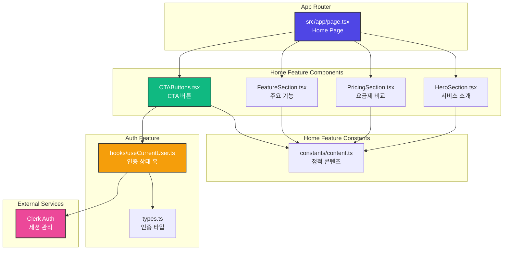

# Home Page (/) Implementation Plan

## 1. Overview

홈 페이지는 서비스의 랜딩 페이지로, 서비스 핵심 가치 제안과 요금제 안내를 제공하며, 인증 상태에 따라 다른 액션 버튼을 노출합니다.

### 주요 기능
- 서비스 소개 (AI 사주 풀이 서비스 핵심 가치 제안)
- 요금제 비교 (Free vs Pro)
- 인증 상태별 조건부 UI 렌더링
  - 비로그인: 로그인/회원가입 버튼
  - 로그인: 대시보드/새 분석하기 버튼
- 반응형 디자인 (모바일/태블릿/데스크톱)

### 참조 문서
- `/docs/prd.md` - 3. 포함 페이지 - 1. 홈
- `/docs/userflow.md` - 사용자 여정 시작점
- `/docs/usecases/001/spec.md` - Clerk 인증 연동 방식

## 2. Module List

### 2.1 프론트엔드 모듈
- `src/app/page.tsx` - 홈 페이지 메인 컴포넌트 (Client Component)
- `src/features/home/components/HeroSection.tsx` - 히어로 섹션 (서비스 소개)
- `src/features/home/components/PricingSection.tsx` - 요금제 비교 섹션
- `src/features/home/components/FeatureSection.tsx` - 주요 기능 소개 섹션
- `src/features/home/components/CTAButtons.tsx` - 인증 상태별 CTA 버튼
- `src/features/home/constants/content.ts` - 페이지 정적 콘텐츠

### 2.2 공통 모듈 (재사용)
- `src/features/auth/hooks/useCurrentUser.ts` - 현재 사용자 정보 및 인증 상태 훅
- `src/features/auth/types.ts` - 인증 관련 타입 정의
- `src/lib/utils.ts` - 유틸리티 함수 (cn 등)

### 2.3 백엔드 모듈
- 없음 (정적 페이지, 인증 상태만 클라이언트에서 확인)

## 3. Module Relationship Diagram



## 4. Implementation Plan

### 4.1 Module: `src/features/home/constants/content.ts`

**목적:** 홈 페이지의 정적 콘텐츠를 중앙 집중식으로 관리

**구현 내용:**
```typescript
export const HERO_CONTENT = {
  title: '당신의 운명을 AI가 풀어드립니다',
  subtitle: 'Gemini AI 기반 전문 사주 풀이 서비스',
  description: '전통 명리학과 현대 AI 기술의 만남. 정확하고 상세한 사주 분석을 경험하세요.',
} as const;

export const FEATURES = [
  {
    id: 'feature-1',
    title: 'AI 기반 정확한 분석',
    description: 'Google Gemini 2.5 AI 모델을 활용한 전문적인 사주 풀이',
    icon: 'Sparkles', // lucide-react 아이콘 이름
  },
  {
    id: 'feature-2',
    title: '간편한 정보 입력',
    description: '생년월일시만 입력하면 즉시 분석 시작',
    icon: 'Clock',
  },
  {
    id: 'feature-3',
    title: '상세한 분석 결과',
    description: '성격, 재물운, 직업운, 애정운을 포함한 종합 분석',
    icon: 'FileText',
  },
  {
    id: 'feature-4',
    title: '분석 결과 보관',
    description: '언제든 다시 볼 수 있는 분석 내역 관리',
    icon: 'Archive',
  },
] as const;

export const PRICING_PLANS = [
  {
    id: 'free',
    name: 'Free',
    price: 0,
    period: '평생',
    description: '서비스를 체험해보세요',
    features: [
      '총 3회 무료 분석',
      'Gemini 2.5 Flash 모델',
      '기본 사주 분석',
      '분석 결과 다운로드',
    ],
    limitations: [
      '모델 선택 불가',
      '추가 분석 불가',
    ],
    highlight: false,
  },
  {
    id: 'pro',
    name: 'Pro',
    price: 3900,
    period: '월',
    description: '전문가 수준의 상세 분석',
    features: [
      '월 10회 분석',
      'Gemini 2.5 Pro 모델 선택 가능',
      '고급 사주 분석',
      '분석 결과 다운로드',
      '무제한 과거 내역 조회',
    ],
    limitations: [],
    highlight: true,
  },
] as const;

export const CTA_CONTENT = {
  guest: {
    login: '로그인',
    signup: '회원가입',
  },
  authenticated: {
    dashboard: '대시보드',
    newAnalysis: '새 분석하기',
  },
} as const;
```

**QA Checklist:**
- [ ] 모든 콘텐츠가 한국어로 작성되었는가?
- [ ] 요금제 정보가 PRD와 일치하는가? (Free: 3회, Pro: 월 3,900원/10회)
- [ ] 아이콘 이름이 lucide-react에 존재하는 유효한 값인가?
- [ ] `as const` assertion이 올바르게 적용되었는가?

**Unit Tests:**
```typescript
describe('content.ts', () => {
  it('should export HERO_CONTENT with required fields', () => {
    expect(HERO_CONTENT).toHaveProperty('title');
    expect(HERO_CONTENT).toHaveProperty('subtitle');
    expect(HERO_CONTENT).toHaveProperty('description');
  });

  it('should have exactly 4 features', () => {
    expect(FEATURES).toHaveLength(4);
  });

  it('should have 2 pricing plans (Free and Pro)', () => {
    expect(PRICING_PLANS).toHaveLength(2);
    expect(PRICING_PLANS[0].id).toBe('free');
    expect(PRICING_PLANS[1].id).toBe('pro');
  });

  it('should have correct pricing for Pro plan', () => {
    const proPlan = PRICING_PLANS.find(p => p.id === 'pro');
    expect(proPlan?.price).toBe(3900);
    expect(proPlan?.period).toBe('월');
  });
});
```

---

### 4.2 Module: `src/features/home/components/HeroSection.tsx`

**목적:** 서비스의 핵심 가치 제안을 시각적으로 강조하는 히어로 섹션

**구현 내용:**
```typescript
'use client';

import { HERO_CONTENT } from '@/features/home/constants/content';
import { Sparkles } from 'lucide-react';

export function HeroSection() {
  return (
    <section className="relative overflow-hidden bg-gradient-to-br from-indigo-950 via-purple-900 to-slate-900 px-6 py-20 text-white md:py-32">
      {/* Background decoration */}
      <div className="absolute inset-0 bg-[url('/grid.svg')] opacity-20" />

      <div className="relative mx-auto max-w-4xl text-center">
        <div className="mb-6 inline-flex items-center gap-2 rounded-full bg-white/10 px-4 py-2 text-sm backdrop-blur-sm">
          <Sparkles className="h-4 w-4 text-yellow-300" />
          <span>AI 기반 전문 사주 분석 서비스</span>
        </div>

        <h1 className="mb-6 text-4xl font-bold tracking-tight md:text-6xl">
          {HERO_CONTENT.title}
        </h1>

        <p className="mb-4 text-xl font-medium text-indigo-200 md:text-2xl">
          {HERO_CONTENT.subtitle}
        </p>

        <p className="mx-auto mb-10 max-w-2xl text-base text-slate-300 md:text-lg">
          {HERO_CONTENT.description}
        </p>

        {/* CTA 버튼은 부모 컴포넌트에서 주입 */}
      </div>
    </section>
  );
}
```

**Props Interface:**
- 없음 (정적 콘텐츠만 표시)

**QA Checklist:**
- [ ] 반응형 디자인이 올바르게 적용되었는가? (모바일/태블릿/데스크톱)
- [ ] 배경 그라데이션이 시각적으로 조화로운가?
- [ ] 텍스트 계층 구조가 명확한가? (h1 > subtitle > description)
- [ ] 접근성: heading 태그가 올바르게 사용되었는가?

**Unit Tests:**
```typescript
import { render, screen } from '@testing-library/react';
import { HeroSection } from './HeroSection';
import { HERO_CONTENT } from '@/features/home/constants/content';

describe('HeroSection', () => {
  it('should render hero title', () => {
    render(<HeroSection />);
    expect(screen.getByText(HERO_CONTENT.title)).toBeInTheDocument();
  });

  it('should render hero subtitle', () => {
    render(<HeroSection />);
    expect(screen.getByText(HERO_CONTENT.subtitle)).toBeInTheDocument();
  });

  it('should render Sparkles icon', () => {
    const { container } = render(<HeroSection />);
    const icon = container.querySelector('svg');
    expect(icon).toBeInTheDocument();
  });
});
```

---

### 4.3 Module: `src/features/home/components/PricingSection.tsx`

**목적:** Free vs Pro 요금제를 비교하여 명확하게 표시

**구현 내용:**
```typescript
'use client';

import { PRICING_PLANS } from '@/features/home/constants/content';
import { Check, X } from 'lucide-react';
import { cn } from '@/lib/utils';

export function PricingSection() {
  return (
    <section className="bg-slate-50 px-6 py-16 md:py-24">
      <div className="mx-auto max-w-6xl">
        <div className="mb-12 text-center">
          <h2 className="mb-4 text-3xl font-bold text-slate-900 md:text-4xl">
            요금제
          </h2>
          <p className="text-lg text-slate-600">
            필요에 맞는 플랜을 선택하세요
          </p>
        </div>

        <div className="grid gap-8 md:grid-cols-2">
          {PRICING_PLANS.map((plan) => (
            <div
              key={plan.id}
              className={cn(
                'relative rounded-2xl border-2 bg-white p-8 shadow-lg transition hover:shadow-xl',
                plan.highlight
                  ? 'border-indigo-500 ring-4 ring-indigo-100'
                  : 'border-slate-200',
              )}
            >
              {plan.highlight && (
                <div className="absolute -top-4 left-1/2 -translate-x-1/2 rounded-full bg-indigo-500 px-4 py-1 text-sm font-semibold text-white">
                  추천
                </div>
              )}

              <div className="mb-6">
                <h3 className="mb-2 text-2xl font-bold text-slate-900">
                  {plan.name}
                </h3>
                <div className="mb-2 flex items-baseline gap-2">
                  <span className="text-4xl font-bold text-slate-900">
                    {plan.price === 0 ? '무료' : `₩${plan.price.toLocaleString()}`}
                  </span>
                  {plan.price > 0 && (
                    <span className="text-slate-600">/ {plan.period}</span>
                  )}
                </div>
                <p className="text-sm text-slate-600">{plan.description}</p>
              </div>

              <div className="mb-6 space-y-3">
                {plan.features.map((feature, index) => (
                  <div key={index} className="flex items-start gap-3">
                    <Check className="mt-0.5 h-5 w-5 flex-shrink-0 text-green-500" />
                    <span className="text-sm text-slate-700">{feature}</span>
                  </div>
                ))}
                {plan.limitations.map((limitation, index) => (
                  <div key={index} className="flex items-start gap-3">
                    <X className="mt-0.5 h-5 w-5 flex-shrink-0 text-slate-400" />
                    <span className="text-sm text-slate-500">{limitation}</span>
                  </div>
                ))}
              </div>
            </div>
          ))}
        </div>
      </div>
    </section>
  );
}
```

**QA Checklist:**
- [ ] Pro 플랜에 "추천" 배지가 표시되는가?
- [ ] 가격 표시 형식이 올바른가? (무료 vs ₩3,900 / 월)
- [ ] 제공 기능과 제한 사항이 명확히 구분되는가? (Check vs X 아이콘)
- [ ] 카드 hover 효과가 자연스러운가?
- [ ] 반응형 그리드가 올바르게 작동하는가?

**Unit Tests:**
```typescript
import { render, screen } from '@testing-library/react';
import { PricingSection } from './PricingSection';
import { PRICING_PLANS } from '@/features/home/constants/content';

describe('PricingSection', () => {
  it('should render both pricing plans', () => {
    render(<PricingSection />);
    expect(screen.getByText('Free')).toBeInTheDocument();
    expect(screen.getByText('Pro')).toBeInTheDocument();
  });

  it('should display Pro plan with highlight', () => {
    const { container } = render(<PricingSection />);
    const proPlan = screen.getByText('Pro').closest('div');
    expect(proPlan).toHaveClass('border-indigo-500');
  });

  it('should display correct price for Pro plan', () => {
    render(<PricingSection />);
    expect(screen.getByText('₩3,900')).toBeInTheDocument();
  });

  it('should display all features for each plan', () => {
    render(<PricingSection />);
    const freePlan = PRICING_PLANS.find(p => p.id === 'free');
    freePlan?.features.forEach(feature => {
      expect(screen.getByText(feature)).toBeInTheDocument();
    });
  });
});
```

---

### 4.4 Module: `src/features/home/components/FeatureSection.tsx`

**목적:** 서비스의 주요 기능을 아이콘과 함께 강조

**구현 내용:**
```typescript
'use client';

import { FEATURES } from '@/features/home/constants/content';
import * as Icons from 'lucide-react';

export function FeatureSection() {
  return (
    <section className="bg-white px-6 py-16 md:py-24">
      <div className="mx-auto max-w-6xl">
        <div className="mb-12 text-center">
          <h2 className="mb-4 text-3xl font-bold text-slate-900 md:text-4xl">
            주요 기능
          </h2>
          <p className="text-lg text-slate-600">
            AI 사주 풀이 서비스의 핵심 기능을 만나보세요
          </p>
        </div>

        <div className="grid gap-8 md:grid-cols-2 lg:grid-cols-4">
          {FEATURES.map((feature) => {
            const IconComponent = Icons[feature.icon as keyof typeof Icons] as React.ComponentType<{ className?: string }>;

            return (
              <div
                key={feature.id}
                className="rounded-xl border border-slate-200 bg-slate-50 p-6 transition hover:border-indigo-300 hover:bg-indigo-50"
              >
                <div className="mb-4 inline-flex h-12 w-12 items-center justify-center rounded-lg bg-indigo-100 text-indigo-600">
                  {IconComponent && <IconComponent className="h-6 w-6" />}
                </div>
                <h3 className="mb-2 text-lg font-semibold text-slate-900">
                  {feature.title}
                </h3>
                <p className="text-sm text-slate-600">
                  {feature.description}
                </p>
              </div>
            );
          })}
        </div>
      </div>
    </section>
  );
}
```

**QA Checklist:**
- [ ] 모든 아이콘이 올바르게 렌더링되는가?
- [ ] 4개의 기능이 그리드로 균등하게 배치되는가?
- [ ] 카드 hover 효과가 자연스러운가?
- [ ] 반응형: 모바일에서 1열, 태블릿에서 2열, 데스크톱에서 4열로 표시되는가?

**Unit Tests:**
```typescript
import { render, screen } from '@testing-library/react';
import { FeatureSection } from './FeatureSection';
import { FEATURES } from '@/features/home/constants/content';

describe('FeatureSection', () => {
  it('should render all features', () => {
    render(<FeatureSection />);
    FEATURES.forEach(feature => {
      expect(screen.getByText(feature.title)).toBeInTheDocument();
      expect(screen.getByText(feature.description)).toBeInTheDocument();
    });
  });

  it('should render exactly 4 feature cards', () => {
    const { container } = render(<FeatureSection />);
    const cards = container.querySelectorAll('[class*="rounded-xl"]');
    expect(cards).toHaveLength(4);
  });

  it('should render icons for each feature', () => {
    const { container } = render(<FeatureSection />);
    const icons = container.querySelectorAll('svg');
    expect(icons.length).toBeGreaterThanOrEqual(4);
  });
});
```

---

### 4.5 Module: `src/features/home/components/CTAButtons.tsx`

**목적:** 인증 상태에 따라 조건부로 CTA 버튼을 렌더링

**구현 내용:**
```typescript
'use client';

import Link from 'next/link';
import { useCurrentUser } from '@/features/auth/hooks/useCurrentUser';
import { CTA_CONTENT } from '@/features/home/constants/content';
import { Loader2 } from 'lucide-react';

export function CTAButtons() {
  const { isAuthenticated, isLoading } = useCurrentUser();

  if (isLoading) {
    return (
      <div className="flex items-center justify-center gap-2 text-sm text-slate-300">
        <Loader2 className="h-4 w-4 animate-spin" />
        <span>로딩 중...</span>
      </div>
    );
  }

  if (isAuthenticated) {
    return (
      <div className="flex flex-col gap-4 sm:flex-row sm:justify-center">
        <Link
          href="/new-analysis"
          className="rounded-lg bg-indigo-600 px-8 py-3 text-center text-base font-semibold text-white transition hover:bg-indigo-700 focus:outline-none focus:ring-4 focus:ring-indigo-300"
        >
          {CTA_CONTENT.authenticated.newAnalysis}
        </Link>
        <Link
          href="/dashboard"
          className="rounded-lg border-2 border-white bg-white/10 px-8 py-3 text-center text-base font-semibold text-white backdrop-blur-sm transition hover:bg-white/20 focus:outline-none focus:ring-4 focus:ring-white/50"
        >
          {CTA_CONTENT.authenticated.dashboard}
        </Link>
      </div>
    );
  }

  return (
    <div className="flex flex-col gap-4 sm:flex-row sm:justify-center">
      <Link
        href="/signup"
        className="rounded-lg bg-indigo-600 px-8 py-3 text-center text-base font-semibold text-white transition hover:bg-indigo-700 focus:outline-none focus:ring-4 focus:ring-indigo-300"
      >
        {CTA_CONTENT.guest.signup}
      </Link>
      <Link
        href="/login"
        className="rounded-lg border-2 border-white bg-white/10 px-8 py-3 text-center text-base font-semibold text-white backdrop-blur-sm transition hover:bg-white/20 focus:outline-none focus:ring-4 focus:ring-white/50"
      >
        {CTA_CONTENT.guest.login}
      </Link>
    </div>
  );
}
```

**Props Interface:**
- 없음 (내부에서 `useCurrentUser` 훅 사용)

**상태별 렌더링 로직:**
| 상태 | 표시 UI |
|------|---------|
| `isLoading === true` | 로딩 스피너 + "로딩 중..." 텍스트 |
| `isAuthenticated === false` | "회원가입" (primary) + "로그인" (secondary) 버튼 |
| `isAuthenticated === true` | "새 분석하기" (primary) + "대시보드" (secondary) 버튼 |

**QA Checklist:**
- [ ] 로딩 상태가 올바르게 표시되는가?
- [ ] 비로그인 상태에서 회원가입/로그인 버튼이 표시되는가?
- [ ] 로그인 상태에서 새 분석하기/대시보드 버튼이 표시되는가?
- [ ] 버튼 링크가 올바른 경로를 가리키는가?
- [ ] 접근성: focus ring이 올바르게 표시되는가?
- [ ] 모바일에서 버튼이 세로로, 데스크톱에서 가로로 배치되는가?

**Unit Tests:**
```typescript
import { render, screen } from '@testing-library/react';
import { CTAButtons } from './CTAButtons';
import { useCurrentUser } from '@/features/auth/hooks/useCurrentUser';

jest.mock('@/features/auth/hooks/useCurrentUser');

describe('CTAButtons', () => {
  beforeEach(() => {
    jest.clearAllMocks();
  });

  it('should show loading state when isLoading is true', () => {
    (useCurrentUser as jest.Mock).mockReturnValue({
      isLoading: true,
      isAuthenticated: false,
    });

    render(<CTAButtons />);
    expect(screen.getByText('로딩 중...')).toBeInTheDocument();
  });

  it('should show signup and login buttons for guest users', () => {
    (useCurrentUser as jest.Mock).mockReturnValue({
      isLoading: false,
      isAuthenticated: false,
    });

    render(<CTAButtons />);
    expect(screen.getByText('회원가입')).toBeInTheDocument();
    expect(screen.getByText('로그인')).toBeInTheDocument();
  });

  it('should show new-analysis and dashboard buttons for authenticated users', () => {
    (useCurrentUser as jest.Mock).mockReturnValue({
      isLoading: false,
      isAuthenticated: true,
    });

    render(<CTAButtons />);
    expect(screen.getByText('새 분석하기')).toBeInTheDocument();
    expect(screen.getByText('대시보드')).toBeInTheDocument();
  });

  it('should have correct href for signup button', () => {
    (useCurrentUser as jest.Mock).mockReturnValue({
      isLoading: false,
      isAuthenticated: false,
    });

    render(<CTAButtons />);
    const signupLink = screen.getByText('회원가입').closest('a');
    expect(signupLink).toHaveAttribute('href', '/signup');
  });

  it('should have correct href for new-analysis button', () => {
    (useCurrentUser as jest.Mock).mockReturnValue({
      isLoading: false,
      isAuthenticated: true,
    });

    render(<CTAButtons />);
    const newAnalysisLink = screen.getByText('새 분석하기').closest('a');
    expect(newAnalysisLink).toHaveAttribute('href', '/new-analysis');
  });
});
```

---

### 4.6 Module: `src/app/page.tsx` (Updated)

**목적:** 홈 페이지의 메인 컴포넌트로 모든 섹션을 조합

**구현 내용:**
```typescript
'use client';

import { HeroSection } from '@/features/home/components/HeroSection';
import { FeatureSection } from '@/features/home/components/FeatureSection';
import { PricingSection } from '@/features/home/components/PricingSection';
import { CTAButtons } from '@/features/home/components/CTAButtons';

export default function HomePage() {
  return (
    <main className="min-h-screen">
      {/* Hero Section with integrated CTA */}
      <section className="relative overflow-hidden bg-gradient-to-br from-indigo-950 via-purple-900 to-slate-900 px-6 py-20 text-white md:py-32">
        <div className="absolute inset-0 bg-[url('/grid.svg')] opacity-20" />

        <div className="relative mx-auto max-w-4xl text-center">
          <HeroSection />
          <div className="mt-10">
            <CTAButtons />
          </div>
        </div>
      </section>

      {/* Feature Section */}
      <FeatureSection />

      {/* Pricing Section */}
      <PricingSection />

      {/* Footer CTA */}
      <section className="bg-gradient-to-r from-indigo-600 to-purple-600 px-6 py-16 text-center text-white">
        <h2 className="mb-4 text-3xl font-bold">
          지금 바로 시작하세요
        </h2>
        <p className="mb-8 text-lg text-indigo-100">
          무료로 3회 분석을 체험해보세요
        </p>
        <CTAButtons />
      </section>
    </main>
  );
}
```

**섹션 구성 순서:**
1. Hero Section (서비스 소개 + CTA)
2. Feature Section (주요 기능 4개)
3. Pricing Section (요금제 비교)
4. Footer CTA (재유도)

**QA Checklist:**
- [ ] 모든 섹션이 올바른 순서로 렌더링되는가?
- [ ] CTA 버튼이 Hero와 Footer에 모두 표시되는가?
- [ ] 페이지 전체가 반응형으로 동작하는가?
- [ ] 스크롤이 부드럽고 자연스러운가?
- [ ] 접근성: 각 섹션의 heading 계층이 올바른가?

**Unit Tests:**
```typescript
import { render, screen } from '@testing-library/react';
import HomePage from './page';

jest.mock('@/features/auth/hooks/useCurrentUser', () => ({
  useCurrentUser: () => ({
    isLoading: false,
    isAuthenticated: false,
  }),
}));

describe('HomePage', () => {
  it('should render all main sections', () => {
    render(<HomePage />);

    // Hero section
    expect(screen.getByText(/당신의 운명을 AI가 풀어드립니다/i)).toBeInTheDocument();

    // Feature section
    expect(screen.getByText('주요 기능')).toBeInTheDocument();

    // Pricing section
    expect(screen.getByText('요금제')).toBeInTheDocument();

    // Footer CTA
    expect(screen.getByText('지금 바로 시작하세요')).toBeInTheDocument();
  });

  it('should render CTA buttons twice (hero + footer)', () => {
    render(<HomePage />);
    const signupButtons = screen.getAllByText('회원가입');
    expect(signupButtons).toHaveLength(2);
  });

  it('should be a client component', () => {
    // page.tsx 파일 최상단에 'use client' 지시문이 있는지 확인
    // 이 테스트는 실제로는 수동 검증 필요
    expect(true).toBe(true);
  });
});
```

---

## 5. Implementation Checklist

### 5.1 기능 구현
- [ ] `src/features/home/constants/content.ts` 생성 (정적 콘텐츠)
- [ ] `src/features/home/components/HeroSection.tsx` 생성
- [ ] `src/features/home/components/FeatureSection.tsx` 생성
- [ ] `src/features/home/components/PricingSection.tsx` 생성
- [ ] `src/features/home/components/CTAButtons.tsx` 생성
- [ ] `src/app/page.tsx` 업데이트 (기존 example 페이지 대체)

### 5.2 스타일링
- [ ] Tailwind CSS를 사용한 반응형 디자인 적용
- [ ] 그라데이션 배경 및 glassmorphism 효과 구현
- [ ] hover/focus 상태 스타일 정의
- [ ] 모바일/태블릿/데스크톱 breakpoint 확인

### 5.3 의존성
- [ ] `lucide-react` 아이콘 라이브러리 사용
- [ ] `@/features/auth/hooks/useCurrentUser` 훅 사용
- [ ] `@/lib/utils` (cn 함수) 사용
- [ ] `next/link` 컴포넌트 사용

### 5.4 테스트
- [ ] 각 컴포넌트별 유닛 테스트 작성
- [ ] 인증 상태별 CTA 버튼 렌더링 테스트
- [ ] 반응형 레이아웃 시각적 테스트 (Storybook 또는 수동)

### 5.5 접근성
- [ ] 적절한 heading 계층 구조 (h1 > h2 > h3)
- [ ] 링크 및 버튼에 focus ring 적용
- [ ] 색상 대비 WCAG AA 기준 충족
- [ ] 스크린 리더 호환성 확인

### 5.6 성능
- [ ] 이미지 최적화 (Next.js Image 컴포넌트 사용 고려)
- [ ] 불필요한 리렌더링 방지 (useMemo, useCallback 필요 시 사용)
- [ ] Client Component 최소화 (현재는 전체 페이지가 Client Component)

### 5.7 문서화
- [ ] 각 컴포넌트에 JSDoc 주석 추가
- [ ] Props interface 문서화
- [ ] README 또는 Storybook에 사용 예시 추가

---

## 6. Conflict Check

### 6.1 기존 코드와의 충돌 확인

**현재 `src/app/page.tsx`:**
- 기존 페이지는 템플릿 예시 페이지로, 완전히 대체 예정
- 기존 `useCurrentUser` 훅을 재사용하므로 호환성 문제 없음
- `getSupabaseBrowserClient` 등 Supabase 클라이언트 함수는 사용하지 않음 (정적 페이지이므로)

**디렉토리 구조:**
- `src/features/home/` 디렉토리는 신규 생성
- 기존 `src/features/example/`과 충돌하지 않음
- `src/features/auth/hooks/useCurrentUser.ts`는 기존 파일 재사용

**라우팅:**
- `/` 경로는 기존과 동일하게 홈 페이지로 유지
- `/login`, `/signup` 경로는 Clerk의 기본 페이지 사용 (추후 구현)
- `/dashboard`, `/new-analysis` 경로는 추후 구현 예정

**결론:** 기존 코드와 충돌 없음. 안전하게 구현 가능.

---

## 7. External Service Integration

### 7.1 Clerk Auth

**사용 위치:**
- `src/features/home/components/CTAButtons.tsx`

**연동 방식:**
- `useCurrentUser` 훅을 통해 인증 상태 확인
- Clerk 세션 토큰은 백엔드에서 검증 (홈 페이지에서는 불필요)

**필요한 환경 변수:**
- 없음 (클라이언트에서는 Clerk Provider를 통해 자동 주입)

**에러 처리:**
- 인증 상태 로딩 중: 로딩 스피너 표시
- 인증 실패: 자동으로 비로그인 상태로 간주

---

## 8. Notes

### 8.1 DRY 원칙 적용
- 정적 콘텐츠는 `constants/content.ts`에 중앙 집중화
- CTA 버튼 컴포넌트를 재사용하여 Hero와 Footer에서 동일한 로직 사용

### 8.2 성능 최적화
- 홈 페이지는 SEO가 중요하지만 현재 요구사항에서는 Client Component 사용 필수 (인증 상태 확인)
- 추후 필요 시 Server Component로 변환하고, 인증 상태는 서버에서 확인 가능

### 8.3 확장 가능성
- 추후 A/B 테스트를 위해 콘텐츠를 CMS에서 로드하도록 변경 가능
- 다국어 지원을 위해 `content.ts`를 i18n 라이브러리로 대체 가능

### 8.4 접근성 고려사항
- 모든 인터랙티브 요소에 적절한 ARIA 레이블 추가 필요 (추후 개선)
- 키보드 네비게이션 테스트 필요

---

## 9. References

- **PRD**: `/docs/prd.md` - 3. 포함 페이지 - 1. 홈
- **Userflow**: `/docs/userflow.md` - 4.1, 4.2 (사용자 여정 시작점)
- **UC-001**: `/docs/usecases/001/spec.md` - Clerk 인증 연동
- **기존 코드**: `src/app/page.tsx` (예시 페이지, 대체 예정)
- **Tailwind CSS**: https://tailwindcss.com/docs
- **Lucide React**: https://lucide.dev/guide/packages/lucide-react
