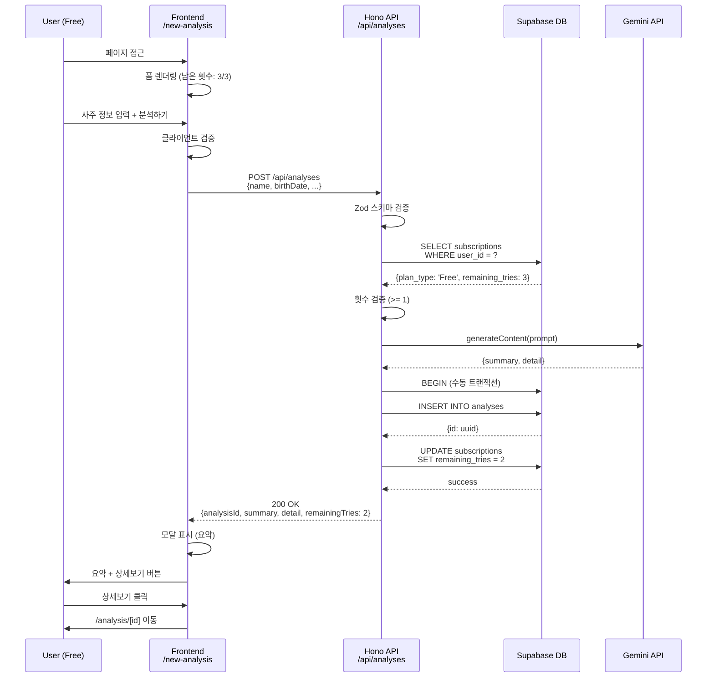
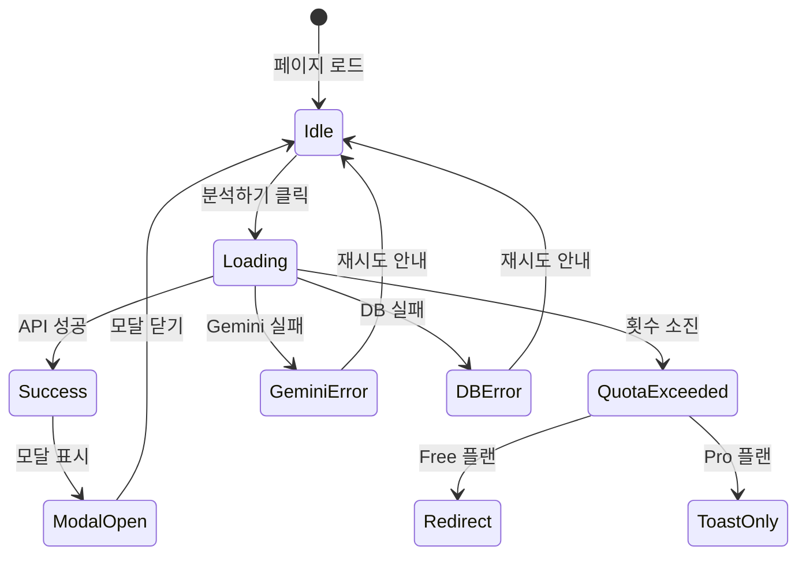

# 새 분석하기 페이지 구현 계획

## 1. Overview

### 1.1 기능 요약
새 분석하기 페이지(`/new-analysis`)는 사용자가 사주 정보를 입력하고 AI 기반 사주 분석을 요청하는 핵심 기능 페이지입니다. Free/Pro 사용자를 구분하여 모델 선택 옵션과 횟수 제한을 적용하며, Gemini API를 통해 분석 결과를 생성합니다.

### 1.2 관련 문서
- **PRD**: `/docs/prd.md` - Section 3 (새 분석하기)
- **Userflow**: `/docs/userflow.md` - Flow 2, 3, 5, 6
- **Database**: `/docs/database.md` - Section 3.3 (analyses 테이블), 3.2 (subscriptions 테이블)
- **Usecases**:
  - UC-002: Free 사용자의 사주 분석 (성공)
  - UC-003: Free 사용자의 사주 분석 (횟수 소진)
  - UC-005: Pro 사용자의 사주 분석 (성공)
  - UC-006: Pro 사용자의 사주 분석 (횟수 소진)
- **State Management**: `/docs/pages/new-analysis/state_management.md`
- **External Services**:
  - `/docs/external/gemini.md` - Gemini API 연동 상세 스펙
  - `/docs/external/clerk.md` - Clerk 인증 상세 스펙

### 1.3 핵심 비즈니스 규칙
- **Free 사용자**:
  - 총 3회 분석 기회 (평생 누적)
  - Gemini 2.5 Flash 모델 고정
  - 횟수 소진 시 `/subscription` 페이지로 리디렉션
- **Pro 사용자**:
  - 월 10회 분석 기회 (매월 리셋)
  - Gemini 2.5 Flash / Pro 모델 선택 가능
  - 횟수 소진 시 안내 메시지만 표시 (리디렉션 없음)
- **횟수 차감 원칙**:
  - Gemini API 호출 성공 + DB 저장 성공 시에만 차감
  - 트랜잭션으로 원자성 보장

---

## 2. Module Structure

### 2.1 Frontend Modules

```
src/
├── app/
│   └── new-analysis/
│       └── page.tsx                          # 메인 페이지 컴포넌트
│
└── features/
    └── analysis/
        ├── components/
        │   ├── NewAnalysisForm.tsx           # 폼 컨테이너
        │   ├── FormSection.tsx               # 입력 필드 섹션
        │   ├── ModelSelector.tsx             # 모델 선택 UI (Pro 전용)
        │   ├── SubmitButton.tsx              # 분석하기 버튼
        │   ├── ResultModal.tsx               # 결과 모달
        │   └── SubscriptionBadge.tsx         # 남은 횟수 배지
        │
        ├── context/
        │   ├── NewAnalysisContext.tsx        # Context 및 Provider
        │   ├── newAnalysisReducer.ts         # Reducer 로직
        │   ├── actions.ts                    # 액션 타입 정의
        │   └── initialState.ts               # 초기 상태
        │
        ├── hooks/
        │   ├── useNewAnalysis.ts             # Context 훅
        │   ├── useFormValidation.ts          # 검증 로직 훅
        │   └── useAnalysisSubmit.ts          # 분석 요청 훅
        │
        └── lib/
            ├── validation.ts                 # 검증 함수
            └── dto.ts                        # 스키마 재노출
```

### 2.2 Backend Modules

```
src/
├── features/
│   └── analysis/
│       └── backend/
│           ├── route.ts                      # Hono 라우터 정의
│           ├── service.ts                    # 비즈니스 로직 (Gemini 호출, DB 처리)
│           ├── schema.ts                     # Zod 스키마 (요청/응답)
│           └── error.ts                      # 에러 코드 정의
│
└── lib/
    └── external/
        └── gemini-client.ts                  # Gemini API 클라이언트 모듈
```

### 2.3 Database Migration

```
supabase/
└── migrations/
    └── YYYYMMDDHHMMSS_create_analyses_table.sql
```

---

## 3. Implementation Plan

### 3.1 Phase 1: Database Schema (DB Layer)

#### 3.1.1 analyses 테이블 생성

**파일**: `supabase/migrations/0002_create_analyses_table.sql`

```sql
-- analyses 테이블 생성
CREATE TABLE IF NOT EXISTS analyses (
  id UUID PRIMARY KEY DEFAULT gen_random_uuid(),
  user_id TEXT NOT NULL REFERENCES users(id) ON DELETE CASCADE,
  name TEXT NOT NULL,
  birth_date TEXT NOT NULL,
  birth_time TEXT,
  is_lunar BOOLEAN NOT NULL DEFAULT false,
  model_type TEXT NOT NULL CHECK (model_type IN ('flash', 'pro')),
  summary TEXT,
  detail TEXT NOT NULL,
  created_at TIMESTAMPTZ NOT NULL DEFAULT now(),
  updated_at TIMESTAMPTZ NOT NULL DEFAULT now()
);

-- 인덱스 생성
CREATE INDEX IF NOT EXISTS idx_analyses_user_id ON analyses(user_id);
CREATE INDEX IF NOT EXISTS idx_analyses_user_created ON analyses(user_id, created_at DESC);

-- updated_at 트리거 적용
CREATE TRIGGER update_analyses_updated_at
  BEFORE UPDATE ON analyses
  FOR EACH ROW
  EXECUTE FUNCTION update_updated_at_column();

-- RLS 비활성화 (프로젝트 정책)
ALTER TABLE analyses DISABLE ROW LEVEL SECURITY;
```

**체크리스트**:
- [ ] Migration 파일 작성 완료
- [ ] Supabase CLI로 migration 적용: `supabase db push`
- [ ] Supabase Studio에서 테이블 생성 확인
- [ ] 인덱스 및 트리거 정상 동작 확인

---

### 3.2 Phase 2: External Service Integration (Gemini Client)

#### 3.2.1 Gemini API 클라이언트 모듈

**파일**: `src/lib/external/gemini-client.ts`

```typescript
import { GoogleGenAI } from '@google/genai';

export type GeminiModel = 'flash' | 'pro';

export interface GeminiAnalysisRequest {
  name: string;
  birthDate: string;
  birthTime?: string | null;
  isLunar: boolean;
  modelType: GeminiModel;
}

export interface GeminiAnalysisResponse {
  summary: string;
  detail: string;
}

const MODEL_MAP: Record<GeminiModel, string> = {
  flash: 'gemini-2.5-flash',
  pro: 'gemini-2.5-pro',
};

const buildPrompt = (request: GeminiAnalysisRequest): string => {
  const timeText = request.birthTime || '모름';
  const calendarText = request.isLunar ? '음력' : '양력';

  return `
당신은 현대적인 감각을 지닌 사주 명리학 전문가입니다.
다음 정보를 바탕으로 한 사람의 사주 풀이를 생성해주세요.
결과는 친절하고 이해하기 쉬운 문체로 작성하며, 긍정적인 측면을 부각시켜주세요.
결과는 마크다운 형식의 단락으로 구성해주세요.

- 이름: ${request.name}
- 생년월일: ${request.birthDate}
- 태어난 시간: ${timeText}
- 양/음력: ${calendarText}

분석 내용은 성격, 재물운, 직업운, 애정운을 포함해야 합니다.

출력 형식:
1. 첫 200자는 요약 내용으로, 이후 "..."로 구분합니다.
2. 요약 이후에는 상세 분석 내용을 마크다운 형식으로 작성합니다.
`.trim();
};

export async function generateAnalysis(
  request: GeminiAnalysisRequest,
): Promise<GeminiAnalysisResponse> {
  const apiKey = process.env.GEMINI_API_KEY;

  if (!apiKey) {
    throw new Error('GEMINI_API_KEY is not configured');
  }

  const genAI = new GoogleGenAI(apiKey);
  const modelName = MODEL_MAP[request.modelType];
  const model = genAI.getGenerativeModel({ model: modelName });

  const prompt = buildPrompt(request);

  try {
    const result = await model.generateContent(prompt);
    const response = result.response;
    const fullText = response.text();

    // 요약과 상세 분리 (간단한 로직: 첫 200자를 요약으로 사용)
    const summary = fullText.substring(0, 200).trim() + '...';
    const detail = fullText;

    return {
      summary,
      detail,
    };
  } catch (error) {
    console.error('Gemini API Error:', error);
    throw new Error('Failed to generate analysis from Gemini API');
  }
}
```

**체크리스트**:
- [ ] `@google/genai` 패키지 설치 확인
- [ ] 환경 변수 `GEMINI_API_KEY` 설정 확인
- [ ] 프롬프트 구조 검증 (요약 + 상세 형식)
- [ ] Flash/Pro 모델 분기 로직 확인
- [ ] 에러 처리 및 타임아웃 설정 검토

---

### 3.3 Phase 3: Backend Implementation (API Layer)

#### 3.3.1 Zod 스키마 정의

**파일**: `src/features/analysis/backend/schema.ts`

```typescript
import { z } from 'zod';

export const CreateAnalysisRequestSchema = z.object({
  name: z.string().min(1, '이름을 입력해주세요.').max(50, '이름은 50자 이내여야 합니다.'),
  birthDate: z.string().regex(/^\d{4}-\d{2}-\d{2}$/, '올바른 날짜 형식이 아닙니다. (YYYY-MM-DD)'),
  birthTime: z.string().regex(/^\d{2}:\d{2}$/, '올바른 시간 형식이 아닙니다. (HH:MM)').nullable().optional(),
  isLunar: z.boolean().default(false),
  modelType: z.enum(['flash', 'pro'], {
    errorMap: () => ({ message: '모델 타입은 flash 또는 pro여야 합니다.' }),
  }),
});

export type CreateAnalysisRequest = z.infer<typeof CreateAnalysisRequestSchema>;

export const CreateAnalysisResponseSchema = z.object({
  analysisId: z.string().uuid(),
  summary: z.string(),
  detail: z.string(),
  remainingTries: z.number().int().min(0),
  modelType: z.enum(['flash', 'pro']),
});

export type CreateAnalysisResponse = z.infer<typeof CreateAnalysisResponseSchema>;
```

**체크리스트**:
- [ ] 필수 필드 검증 (name, birthDate, isLunar, modelType)
- [ ] 선택 필드 처리 (birthTime: nullable)
- [ ] 날짜 형식 정규식 검증
- [ ] 시간 형식 정규식 검증
- [ ] 모델 타입 Enum 제약

---

#### 3.3.2 에러 코드 정의

**파일**: `src/features/analysis/backend/error.ts`

```typescript
export const analysisErrorCodes = {
  // 횟수 소진 에러
  quotaExceeded: 'QUOTA_EXCEEDED' as const,              // Free 플랜
  quotaExceededPro: 'QUOTA_EXCEEDED_PRO' as const,       // Pro 플랜

  // 입력 검증 에러
  invalidRequest: 'INVALID_ANALYSIS_REQUEST' as const,

  // 외부 서비스 에러
  geminiApiError: 'GEMINI_API_ERROR' as const,

  // DB 에러
  dbError: 'ANALYSIS_DB_ERROR' as const,

  // 인증 에러
  unauthorized: 'ANALYSIS_UNAUTHORIZED' as const,

  // 구독 상태 에러
  subscriptionNotFound: 'SUBSCRIPTION_NOT_FOUND' as const,
};

export type AnalysisServiceError =
  (typeof analysisErrorCodes)[keyof typeof analysisErrorCodes];
```

**체크리스트**:
- [ ] Free/Pro 횟수 소진 에러 코드 분리
- [ ] 외부 서비스 에러 (Gemini) 정의
- [ ] DB 에러 정의
- [ ] 인증 에러 정의

---

#### 3.3.3 Service Layer (비즈니스 로직)

**파일**: `src/features/analysis/backend/service.ts`

```typescript
import type { SupabaseClient } from '@supabase/supabase-js';
import {
  failure,
  success,
  type HandlerResult,
} from '@/backend/http/response';
import { analysisErrorCodes, type AnalysisServiceError } from './error';
import type {
  CreateAnalysisRequest,
  CreateAnalysisResponse,
} from './schema';
import { generateAnalysis } from '@/lib/external/gemini-client';

export const createAnalysis = async (
  supabase: SupabaseClient,
  userId: string,
  request: CreateAnalysisRequest,
): Promise<HandlerResult<CreateAnalysisResponse, AnalysisServiceError>> => {
  // 1. 구독 상태 조회
  const { data: subscription, error: subError } = await supabase
    .from('subscriptions')
    .select('plan_type, remaining_tries, next_payment_date')
    .eq('user_id', userId)
    .single();

  if (subError || !subscription) {
    return failure(
      500,
      analysisErrorCodes.subscriptionNotFound,
      '구독 정보를 조회할 수 없습니다.',
    );
  }

  // 2. 횟수 검증
  if (subscription.remaining_tries === 0) {
    if (subscription.plan_type === 'Free') {
      return failure(
        403,
        analysisErrorCodes.quotaExceeded,
        '무료 분석 횟수를 모두 사용했습니다.',
      );
    } else {
      return failure(
        403,
        analysisErrorCodes.quotaExceededPro,
        '이번 달 분석 횟수를 모두 사용했습니다.',
        {
          planType: 'Pro',
          remainingTries: 0,
          maxTries: 10,
          nextPaymentDate: subscription.next_payment_date,
        },
      );
    }
  }

  // 3. Gemini API 호출
  let geminiResult;
  try {
    geminiResult = await generateAnalysis({
      name: request.name,
      birthDate: request.birthDate,
      birthTime: request.birthTime,
      isLunar: request.isLunar,
      modelType: request.modelType,
    });
  } catch (error) {
    return failure(
      503,
      analysisErrorCodes.geminiApiError,
      '일시적인 오류가 발생했습니다. 잠시 후 다시 시도해주세요.',
    );
  }

  // 4. DB 트랜잭션: 분석 결과 저장 + 횟수 차감
  // Note: Supabase는 명시적 트랜잭션을 지원하지 않으므로,
  // 실패 시 롤백 로직을 수동으로 처리해야 합니다.

  // 4-1. 분석 결과 저장
  const { data: analysis, error: insertError } = await supabase
    .from('analyses')
    .insert({
      user_id: userId,
      name: request.name,
      birth_date: request.birthDate,
      birth_time: request.birthTime,
      is_lunar: request.isLunar,
      model_type: request.modelType,
      summary: geminiResult.summary,
      detail: geminiResult.detail,
    })
    .select('id')
    .single();

  if (insertError || !analysis) {
    return failure(
      500,
      analysisErrorCodes.dbError,
      '분석 결과 저장에 실패했습니다.',
    );
  }

  // 4-2. 횟수 차감
  const { error: updateError } = await supabase
    .from('subscriptions')
    .update({
      remaining_tries: subscription.remaining_tries - 1,
    })
    .eq('user_id', userId);

  if (updateError) {
    // 횟수 차감 실패 시, 분석 결과 삭제 (수동 롤백)
    await supabase.from('analyses').delete().eq('id', analysis.id);

    return failure(
      500,
      analysisErrorCodes.dbError,
      '분석 횟수 차감에 실패했습니다.',
    );
  }

  // 5. 성공 응답
  return success({
    analysisId: analysis.id,
    summary: geminiResult.summary,
    detail: geminiResult.detail,
    remainingTries: subscription.remaining_tries - 1,
    modelType: request.modelType,
  });
};
```

**체크리스트**:
- [ ] 구독 상태 조회 로직
- [ ] Free/Pro 횟수 검증 분기
- [ ] Gemini API 호출 및 에러 처리
- [ ] DB INSERT (analyses) 로직
- [ ] DB UPDATE (subscriptions) 로직
- [ ] 수동 트랜잭션 롤백 처리
- [ ] 성공 응답 반환

---

#### 3.3.4 Route Handler (Hono)

**파일**: `src/features/analysis/backend/route.ts`

```typescript
import type { Hono } from 'hono';
import {
  failure,
  respond,
  type ErrorResult,
} from '@/backend/http/response';
import {
  getLogger,
  getSupabase,
  type AppEnv,
} from '@/backend/hono/context';
import { CreateAnalysisRequestSchema } from './schema';
import { createAnalysis } from './service';
import {
  analysisErrorCodes,
  type AnalysisServiceError,
} from './error';

export const registerAnalysisRoutes = (app: Hono<AppEnv>) => {
  app.post('/api/analyses', async (c) => {
    // 1. 요청 본문 검증
    const body = await c.req.json();
    const parsedBody = CreateAnalysisRequestSchema.safeParse(body);

    if (!parsedBody.success) {
      return respond(
        c,
        failure(
          400,
          analysisErrorCodes.invalidRequest,
          '요청 데이터가 유효하지 않습니다.',
          parsedBody.error.format(),
        ),
      );
    }

    // 2. 인증 확인 (Clerk 미들웨어 필요)
    // TODO: Clerk 미들웨어 구현 후 userId 추출 로직 추가
    const userId = 'temp-user-id'; // 임시 값

    if (!userId) {
      return respond(
        c,
        failure(
          401,
          analysisErrorCodes.unauthorized,
          '인증이 필요합니다.',
        ),
      );
    }

    // 3. 서비스 레이어 호출
    const supabase = getSupabase(c);
    const logger = getLogger(c);
    const result = await createAnalysis(supabase, userId, parsedBody.data);

    // 4. 에러 로깅
    if (!result.ok) {
      const errorResult = result as ErrorResult<AnalysisServiceError, unknown>;

      if (errorResult.error.code === analysisErrorCodes.geminiApiError) {
        logger.error('Gemini API 호출 실패', errorResult.error.message);
      } else if (errorResult.error.code === analysisErrorCodes.dbError) {
        logger.error('DB 작업 실패', errorResult.error.message);
      }
    }

    // 5. 응답 반환
    return respond(c, result);
  });
};
```

**체크리스트**:
- [ ] POST `/api/analyses` 엔드포인트 등록
- [ ] Zod 스키마 검증
- [ ] Clerk 인증 미들웨어 연동 (TODO)
- [ ] 서비스 레이어 호출
- [ ] 에러 로깅
- [ ] 응답 반환

---

#### 3.3.5 Hono App 등록

**파일**: `src/backend/hono/app.ts` (기존 파일 수정)

```typescript
// 기존 import에 추가
import { registerAnalysisRoutes } from '@/features/analysis/backend/route';

export const createHonoApp = () => {
  if (singletonApp) {
    return singletonApp;
  }

  const app = new Hono<AppEnv>();

  app.use('*', errorBoundary());
  app.use('*', withAppContext());
  app.use('*', withSupabase());

  registerExampleRoutes(app);
  registerAnalysisRoutes(app); // 추가

  singletonApp = app;

  return app;
};
```

**체크리스트**:
- [ ] `registerAnalysisRoutes` import 추가
- [ ] Hono 앱에 라우트 등록
- [ ] 빌드 에러 없음 확인

---

### 3.4 Phase 4: Frontend Implementation (Client Layer)

#### 3.4.1 DTO 재노출

**파일**: `src/features/analysis/lib/dto.ts`

```typescript
export {
  CreateAnalysisRequestSchema,
  CreateAnalysisResponseSchema,
  type CreateAnalysisRequest,
  type CreateAnalysisResponse,
} from '@/features/analysis/backend/schema';
```

---

#### 3.4.2 Context 및 Reducer

**파일**: `src/features/analysis/context/actions.ts`

```typescript
import type { CreateAnalysisResponse } from '../lib/dto';

export type NewAnalysisAction =
  // 폼 입력 액션
  | { type: 'FORM/SET_NAME'; payload: string }
  | { type: 'FORM/SET_BIRTH_DATE'; payload: string }
  | { type: 'FORM/SET_BIRTH_TIME'; payload: string | null }
  | { type: 'FORM/SET_IS_LUNAR'; payload: boolean }
  | { type: 'FORM/SET_MODEL_TYPE'; payload: 'flash' | 'pro' }
  | { type: 'FORM/TOGGLE_UNKNOWN_TIME' }
  | { type: 'FORM/RESET' }

  // 검증 액션
  | { type: 'VALIDATION/SET_ERROR'; payload: { field: string; message: string } }
  | { type: 'VALIDATION/CLEAR_ERROR'; payload: string }
  | { type: 'VALIDATION/VALIDATE_ALL' }

  // 분석 요청 액션
  | { type: 'REQUEST/START' }
  | { type: 'REQUEST/SUCCESS'; payload: CreateAnalysisResponse }
  | { type: 'REQUEST/FAILURE'; payload: { code: string; message: string; details?: unknown } }
  | { type: 'REQUEST/RESET' }

  // 모달 액션
  | { type: 'MODAL/OPEN' }
  | { type: 'MODAL/CLOSE' }

  // 구독 정보 액션
  | { type: 'SUBSCRIPTION/LOAD_START' }
  | {
      type: 'SUBSCRIPTION/LOAD_SUCCESS';
      payload: { planType: 'Free' | 'Pro'; remainingTries: number; nextPaymentDate: string | null };
    }
  | { type: 'SUBSCRIPTION/LOAD_FAILURE' };
```

**파일**: `src/features/analysis/context/initialState.ts`

```typescript
export interface FormState {
  name: string;
  birthDate: string;
  birthTime: string | null;
  isLunar: boolean;
  modelType: 'flash' | 'pro';
  unknownBirthTime: boolean;
}

export interface ValidationState {
  errors: Record<string, string>;
  touched: Record<string, boolean>;
}

export interface RequestState {
  status: 'idle' | 'loading' | 'success' | 'error';
  error: { code: string; message: string; details?: unknown } | null;
}

export interface ResultState {
  analysisId: string | null;
  summary: string | null;
  detail: string | null;
  showModal: boolean;
}

export interface SubscriptionState {
  planType: 'Free' | 'Pro';
  remainingTries: number;
  maxTries: number;
  nextPaymentDate: string | null;
  isLoading: boolean;
}

export interface NewAnalysisState {
  form: FormState;
  validation: ValidationState;
  request: RequestState;
  result: ResultState;
  subscription: SubscriptionState;
}

export const initialState: NewAnalysisState = {
  form: {
    name: '',
    birthDate: '',
    birthTime: null,
    isLunar: false,
    modelType: 'flash',
    unknownBirthTime: false,
  },
  validation: {
    errors: {},
    touched: {},
  },
  request: {
    status: 'idle',
    error: null,
  },
  result: {
    analysisId: null,
    summary: null,
    detail: null,
    showModal: false,
  },
  subscription: {
    planType: 'Free',
    remainingTries: 0,
    maxTries: 3,
    nextPaymentDate: null,
    isLoading: true,
  },
};
```

**파일**: `src/features/analysis/context/newAnalysisReducer.ts`

```typescript
import type { NewAnalysisAction } from './actions';
import type { NewAnalysisState } from './initialState';
import { initialState } from './initialState';

export function newAnalysisReducer(
  state: NewAnalysisState,
  action: NewAnalysisAction,
): NewAnalysisState {
  switch (action.type) {
    // 폼 액션
    case 'FORM/SET_NAME':
      return { ...state, form: { ...state.form, name: action.payload } };

    case 'FORM/SET_BIRTH_DATE':
      return { ...state, form: { ...state.form, birthDate: action.payload } };

    case 'FORM/SET_BIRTH_TIME':
      return { ...state, form: { ...state.form, birthTime: action.payload } };

    case 'FORM/SET_IS_LUNAR':
      return { ...state, form: { ...state.form, isLunar: action.payload } };

    case 'FORM/SET_MODEL_TYPE':
      return { ...state, form: { ...state.form, modelType: action.payload } };

    case 'FORM/TOGGLE_UNKNOWN_TIME':
      return {
        ...state,
        form: {
          ...state.form,
          unknownBirthTime: !state.form.unknownBirthTime,
          birthTime: !state.form.unknownBirthTime ? null : state.form.birthTime,
        },
      };

    case 'FORM/RESET':
      return { ...state, form: initialState.form };

    // 검증 액션
    case 'VALIDATION/SET_ERROR':
      return {
        ...state,
        validation: {
          ...state.validation,
          errors: {
            ...state.validation.errors,
            [action.payload.field]: action.payload.message,
          },
        },
      };

    case 'VALIDATION/CLEAR_ERROR': {
      const { [action.payload]: _, ...remainingErrors } = state.validation.errors;
      return {
        ...state,
        validation: { ...state.validation, errors: remainingErrors },
      };
    }

    // 요청 액션
    case 'REQUEST/START':
      return {
        ...state,
        request: { status: 'loading', error: null },
      };

    case 'REQUEST/SUCCESS':
      return {
        ...state,
        request: { status: 'success', error: null },
        result: {
          analysisId: action.payload.analysisId,
          summary: action.payload.summary,
          detail: action.payload.detail,
          showModal: true,
        },
        subscription: {
          ...state.subscription,
          remainingTries: action.payload.remainingTries,
        },
      };

    case 'REQUEST/FAILURE':
      return {
        ...state,
        request: { status: 'error', error: action.payload },
      };

    case 'REQUEST/RESET':
      return {
        ...state,
        request: { status: 'idle', error: null },
      };

    // 모달 액션
    case 'MODAL/OPEN':
      return { ...state, result: { ...state.result, showModal: true } };

    case 'MODAL/CLOSE':
      return { ...state, result: { ...state.result, showModal: false } };

    // 구독 액션
    case 'SUBSCRIPTION/LOAD_START':
      return {
        ...state,
        subscription: { ...state.subscription, isLoading: true },
      };

    case 'SUBSCRIPTION/LOAD_SUCCESS':
      return {
        ...state,
        subscription: {
          ...state.subscription,
          planType: action.payload.planType,
          remainingTries: action.payload.remainingTries,
          maxTries: action.payload.planType === 'Free' ? 3 : 10,
          nextPaymentDate: action.payload.nextPaymentDate,
          isLoading: false,
        },
      };

    case 'SUBSCRIPTION/LOAD_FAILURE':
      return {
        ...state,
        subscription: { ...state.subscription, isLoading: false },
      };

    default:
      return state;
  }
}
```

**체크리스트**:
- [ ] 액션 타입 정의 완료
- [ ] 초기 상태 정의 완료
- [ ] Reducer 로직 구현 완료
- [ ] 타입 안전성 검증

---

#### 3.4.3 Context Provider

**파일**: `src/features/analysis/context/NewAnalysisContext.tsx`

```typescript
'use client';

import React, { createContext, useContext, useReducer, useMemo, useEffect } from 'react';
import { useRouter } from 'next/navigation';
import { toast } from 'sonner';
import { newAnalysisReducer } from './newAnalysisReducer';
import { initialState, type NewAnalysisState } from './initialState';
import type { NewAnalysisAction } from './actions';
import type { CreateAnalysisRequest } from '../lib/dto';

interface NewAnalysisContextValue {
  state: NewAnalysisState;
  dispatch: React.Dispatch<NewAnalysisAction>;
  isFormValid: boolean;
  canAnalyze: boolean;
  canSelectModel: boolean;
  isLoading: boolean;
  isButtonDisabled: boolean;
  handleSubmit: () => Promise<void>;
}

const NewAnalysisContext = createContext<NewAnalysisContextValue | null>(null);

export function NewAnalysisProvider({ children }: { children: React.ReactNode }) {
  const [state, dispatch] = useReducer(newAnalysisReducer, initialState);
  const router = useRouter();

  // TODO: 구독 정보 로드 (실제 API 연동 필요)
  useEffect(() => {
    async function loadSubscription() {
      dispatch({ type: 'SUBSCRIPTION/LOAD_START' });
      try {
        // const subscription = await fetchSubscription();
        // 임시 데이터
        dispatch({
          type: 'SUBSCRIPTION/LOAD_SUCCESS',
          payload: {
            planType: 'Free',
            remainingTries: 3,
            nextPaymentDate: null,
          },
        });
      } catch (error) {
        dispatch({ type: 'SUBSCRIPTION/LOAD_FAILURE' });
      }
    }
    loadSubscription();
  }, []);

  // Computed Values
  const isFormValid = useMemo(() => {
    return (
      state.form.name.trim() !== '' &&
      state.form.birthDate !== '' &&
      Object.keys(state.validation.errors).length === 0
    );
  }, [state.form, state.validation.errors]);

  const canAnalyze = state.subscription.remainingTries > 0;
  const canSelectModel = state.subscription.planType === 'Pro';
  const isLoading = state.request.status === 'loading';
  const isButtonDisabled = !isFormValid || isLoading || !canAnalyze;

  // 분석 요청 핸들러
  const handleSubmit = async () => {
    if (!isFormValid) return;

    dispatch({ type: 'REQUEST/START' });

    try {
      const requestData: CreateAnalysisRequest = {
        name: state.form.name,
        birthDate: state.form.birthDate,
        birthTime: state.form.birthTime,
        isLunar: state.form.isLunar,
        modelType: state.form.modelType,
      };

      // TODO: API 호출 (실제 엔드포인트 연동 필요)
      const response = await fetch('/api/analyses', {
        method: 'POST',
        headers: { 'Content-Type': 'application/json' },
        body: JSON.stringify(requestData),
      });

      if (!response.ok) {
        const errorData = await response.json();
        throw errorData.error;
      }

      const data = await response.json();

      dispatch({ type: 'REQUEST/SUCCESS', payload: data });
    } catch (error: any) {
      dispatch({
        type: 'REQUEST/FAILURE',
        payload: {
          code: error.code || 'UNKNOWN_ERROR',
          message: error.message || '알 수 없는 오류가 발생했습니다.',
          details: error.details,
        },
      });

      // 횟수 소진 처리
      if (error.code === 'QUOTA_EXCEEDED') {
        toast.error('무료 분석 횟수를 모두 사용했습니다.');
        router.push('/subscription');
      } else if (error.code === 'QUOTA_EXCEEDED_PRO') {
        toast.warning('이번 달 분석 횟수를 모두 사용했습니다.', {
          description: `다음 결제일(${error.details?.nextPaymentDate})에 횟수가 갱신됩니다.`,
        });
      } else {
        toast.error('분석 요청 실패', {
          description: error.message,
        });
      }
    }
  };

  const value: NewAnalysisContextValue = {
    state,
    dispatch,
    isFormValid,
    canAnalyze,
    canSelectModel,
    isLoading,
    isButtonDisabled,
    handleSubmit,
  };

  return (
    <NewAnalysisContext.Provider value={value}>
      {children}
    </NewAnalysisContext.Provider>
  );
}

export function useNewAnalysis() {
  const context = useContext(NewAnalysisContext);
  if (!context) {
    throw new Error('useNewAnalysis must be used within NewAnalysisProvider');
  }
  return context;
}
```

**체크리스트**:
- [ ] Context 생성
- [ ] Provider 구현
- [ ] Computed Values 정의
- [ ] API 호출 로직 (TODO 표시)
- [ ] 에러 처리 및 토스트 알림
- [ ] 횟수 소진 시 리디렉션 로직
- [ ] Custom Hook 제공

---

#### 3.4.4 페이지 컴포넌트

**파일**: `src/app/new-analysis/page.tsx`

```typescript
'use client';

import { NewAnalysisProvider } from '@/features/analysis/context/NewAnalysisContext';
import { NewAnalysisForm } from '@/features/analysis/components/NewAnalysisForm';

export default function NewAnalysisPage() {
  return (
    <NewAnalysisProvider>
      <div className="container mx-auto py-8">
        <h1 className="text-3xl font-bold mb-6">새 분석하기</h1>
        <NewAnalysisForm />
      </div>
    </NewAnalysisProvider>
  );
}
```

**파일**: `src/features/analysis/components/NewAnalysisForm.tsx`

```typescript
'use client';

import { useNewAnalysis } from '../context/NewAnalysisContext';
import { FormSection } from './FormSection';
import { ModelSelector } from './ModelSelector';
import { SubmitButton } from './SubmitButton';
import { ResultModal } from './ResultModal';
import { SubscriptionBadge } from './SubscriptionBadge';

export function NewAnalysisForm() {
  const { handleSubmit } = useNewAnalysis();

  return (
    <form
      onSubmit={(e) => {
        e.preventDefault();
        handleSubmit();
      }}
      className="space-y-6"
    >
      <SubscriptionBadge />
      <FormSection />
      <ModelSelector />
      <SubmitButton />
      <ResultModal />
    </form>
  );
}
```

**체크리스트**:
- [ ] 페이지 컴포넌트 생성
- [ ] Provider로 페이지 감싸기
- [ ] 폼 컴포넌트 구조화
- [ ] 하위 컴포넌트 import

---

### 3.5 Phase 5: Testing & QA

#### 3.5.1 Backend Unit Tests

**파일**: `src/features/analysis/backend/__tests__/service.test.ts`

```typescript
import { describe, it, expect, vi } from 'vitest';
import { createAnalysis } from '../service';
import { analysisErrorCodes } from '../error';

describe('createAnalysis', () => {
  it('should return QUOTA_EXCEEDED for Free user with 0 tries', async () => {
    const mockSupabase = {
      from: vi.fn().mockReturnValue({
        select: vi.fn().mockReturnValue({
          eq: vi.fn().mockReturnValue({
            single: vi.fn().mockResolvedValue({
              data: { plan_type: 'Free', remaining_tries: 0 },
              error: null,
            }),
          }),
        }),
      }),
    };

    const result = await createAnalysis(
      mockSupabase as any,
      'user-123',
      {
        name: '홍길동',
        birthDate: '1990-01-15',
        birthTime: null,
        isLunar: false,
        modelType: 'flash',
      },
    );

    expect(result.ok).toBe(false);
    if (!result.ok) {
      expect(result.error.code).toBe(analysisErrorCodes.quotaExceeded);
    }
  });

  // TODO: 추가 테스트 케이스 작성
});
```

**체크리스트**:
- [ ] 횟수 소진 시나리오 테스트 (Free)
- [ ] 횟수 소진 시나리오 테스트 (Pro)
- [ ] Gemini API 실패 시나리오 테스트
- [ ] DB 저장 실패 시나리오 테스트
- [ ] 정상 플로우 테스트

---

#### 3.5.2 E2E Test Scenarios

**QA Checklist**:

| 시나리오 | 테스트 케이스 | 예상 결과 | 상태 |
|---------|-------------|----------|------|
| Free 분석 성공 | 1. Free 사용자 로그인<br/>2. 사주 정보 입력<br/>3. 분석하기 클릭 | - 로딩 표시<br/>- 요약 모달 표시<br/>- 횟수 3→2 차감 | ☐ |
| Free 횟수 소진 | 1. remaining_tries = 0 상태<br/>2. 분석하기 클릭 | - 토스트 알림<br/>- /subscription 리디렉션 | ☐ |
| Pro 모델 선택 | 1. Pro 사용자 로그인<br/>2. Flash/Pro 선택 UI 확인<br/>3. Pro 모델 선택 후 분석 | - 모델 선택 UI 노출<br/>- 정상 분석 완료 | ☐ |
| Pro 횟수 소진 | 1. Pro, remaining_tries = 0<br/>2. 분석하기 클릭 | - 토스트 알림<br/>- 리디렉션 없음<br/>- 다음 결제일 표시 | ☐ |
| 입력 검증 | 1. 이름 미입력<br/>2. 잘못된 날짜 형식 | - 필드별 에러 메시지 표시 | ☐ |
| Gemini API 실패 | 1. API 키 제거 또는 네트워크 오류<br/>2. 분석 요청 | - 503 에러<br/>- 횟수 차감 없음<br/>- 재시도 안내 | ☐ |

---

## 4. Mermaid Diagram

### 4.1 Sequence Diagram (Free 사용자 분석 성공)



### 4.2 State Flow Diagram



---

## 5. Implementation Checklist

### 5.1 Phase 1: Database ✓

- [ ] Migration 파일 작성 (`0002_create_analyses_table.sql`)
- [ ] Supabase에 migration 적용
- [ ] 테이블 생성 확인 (Supabase Studio)
- [ ] 인덱스 및 트리거 확인

### 5.2 Phase 2: External Service ✓

- [ ] `@google/genai` 패키지 설치
- [ ] 환경 변수 `GEMINI_API_KEY` 설정
- [ ] `gemini-client.ts` 구현
- [ ] 프롬프트 구조 검증
- [ ] Flash/Pro 모델 분기 로직 확인

### 5.3 Phase 3: Backend ✓

- [ ] `schema.ts` 작성 (Zod 스키마)
- [ ] `error.ts` 작성 (에러 코드)
- [ ] `service.ts` 작성 (비즈니스 로직)
- [ ] `route.ts` 작성 (Hono 라우터)
- [ ] Hono 앱에 라우트 등록
- [ ] 빌드 에러 없음 확인

### 5.4 Phase 4: Frontend ✓

- [ ] Context 구조 구현 (actions, reducer, initialState)
- [ ] Provider 구현 (`NewAnalysisContext.tsx`)
- [ ] 페이지 컴포넌트 (`page.tsx`)
- [ ] 폼 컴포넌트 (`NewAnalysisForm.tsx`)
- [ ] 하위 컴포넌트 구현 (FormSection, ModelSelector 등)
- [ ] API 호출 로직 연동 (TODO 해결)

### 5.5 Phase 5: Testing ✓

- [ ] Backend 단위 테스트 작성
- [ ] E2E QA 체크리스트 완료
- [ ] 횟수 소진 시나리오 테스트
- [ ] Gemini API 에러 핸들링 테스트
- [ ] 모델 선택 기능 테스트 (Pro 사용자)

---

## 6. Dependencies

### 6.1 NPM Packages

```bash
npm install @google/genai zod sonner
```

### 6.2 Environment Variables

`.env.local`:
```
GEMINI_API_KEY=your_gemini_api_key_here
```

---

## 7. Known Issues & TODOs

### 7.1 Known Issues

1. **Supabase 트랜잭션**: Supabase는 명시적 트랜잭션을 지원하지 않으므로, INSERT 실패 시 수동 롤백 필요
2. **Clerk 인증**: 현재 임시 userId 사용 중, Clerk 미들웨어 구현 필요

### 7.2 TODOs

- [ ] Clerk 인증 미들웨어 구현
- [ ] 구독 정보 로드 API 연동
- [ ] 하위 컴포넌트 상세 구현 (FormSection, ModelSelector 등)
- [ ] 에러 메시지 다국어 지원 (i18n)
- [ ] 로딩 상태 UX 개선 (스켈레톤 UI)

---

## 8. References

- **PRD**: `/docs/prd.md`
- **Database Schema**: `/docs/database.md`
- **Gemini API Docs**: `/docs/external/gemini.md`
- **Clerk Docs**: `/docs/external/clerk.md`
- **Usecases**: `/docs/usecases/002/spec.md`, `/docs/usecases/003/spec.md`, `/docs/usecases/005/spec.md`, `/docs/usecases/006/spec.md`
- **State Management**: `/docs/pages/new-analysis/state_management.md`

---

**Document Version**: 1.0
**Last Updated**: 2025-10-25
**Author**: Claude Code
**Status**: ✅ Ready for Implementation
**Estimated Time**: 16-20 hours
