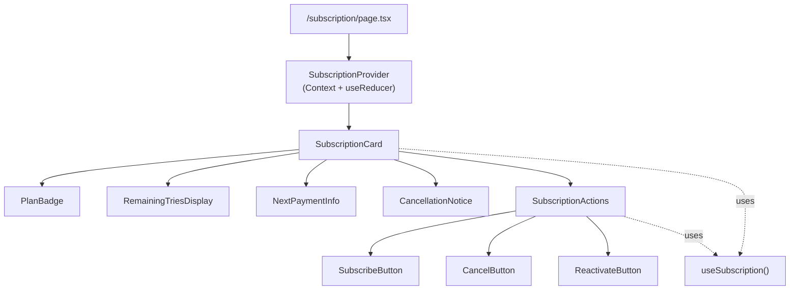
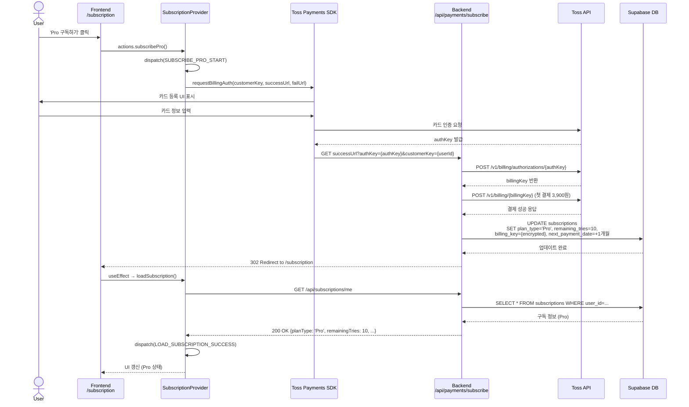
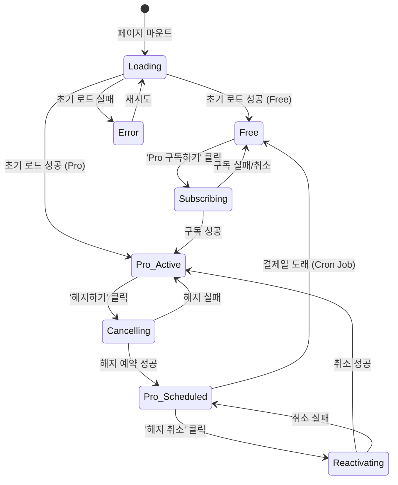

# 구독 관리 페이지(/subscription) 구현 계획

## 1. Overview

### 1.1 목적
사용자가 현재 구독 상태를 확인하고, Pro 플랜 구독/해지/해지 취소 등의 작업을 수행할 수 있는 페이지입니다.

### 1.2 주요 기능
- **Free 사용자**: 현재 구독 상태 표시, Pro 구독하기 버튼
- **Pro 사용자 (정상)**: 구독 정보 표시 (플랜, 남은 횟수, 다음 결제일), 해지하기 버튼
- **Pro 사용자 (해지 예약)**: 해지 예약 안내, 해지 취소 버튼

### 1.3 참조 문서
- PRD: `/docs/prd.md` - 3. 포함 페이지 > 6. 구독 관리
- Userflow: `/docs/userflow.md` - 4, 7, 8번
- Use Cases:
  - UC-004: `/docs/usecases/004/spec.md` - Pro 구독 신청
  - UC-007: `/docs/usecases/007/spec.md` - 해지 예약
  - UC-008: `/docs/usecases/008/spec.md` - 해지 취소
- Database: `/docs/database.md` - subscriptions 테이블
- State Management: `/docs/pages/subscription/state_management.md`

---

## 2. 모듈 구조

### 2.1 Frontend Modules

```
src/app/subscription/
  ├─ page.tsx                          # 페이지 엔트리 (SubscriptionProvider 래핑)
  └─ layout.tsx (선택적)               # 페이지별 레이아웃

src/features/subscription/
  ├─ components/
  │  ├─ SubscriptionProvider.tsx       # Context + useReducer 상태 관리
  │  ├─ SubscriptionCard.tsx           # 메인 카드 컴포넌트
  │  ├─ PlanBadge.tsx                  # Free/Pro 플랜 배지
  │  ├─ RemainingTriesDisplay.tsx      # 남은 횟수 표시
  │  ├─ NextPaymentInfo.tsx            # 다음 결제일 정보
  │  ├─ CancellationNotice.tsx         # 해지 예약 안내 메시지
  │  ├─ SubscriptionActions.tsx        # 액션 버튼 컨테이너
  │  ├─ SubscribeButton.tsx            # Pro 구독하기 버튼
  │  ├─ CancelButton.tsx               # 해지하기 버튼
  │  ├─ ReactivateButton.tsx           # 해지 취소 버튼
  │  ├─ SubscriptionSkeleton.tsx       # 로딩 스켈레톤
  │  └─ ErrorAlert.tsx                 # 에러 알림
  │
  ├─ hooks/
  │  └─ useSubscription.ts             # Custom Hook (Context 소비)
  │
  ├─ lib/
  │  ├─ dto.ts                         # Backend schema 재노출
  │  └─ toss-client.ts                 # 토스페이먼츠 SDK 래퍼
  │
  ├─ constants/
  │  └─ subscription.ts                # 상수 (PLAN_NAMES, MONTHLY_QUOTA, etc.)
  │
  └─ backend/
     ├─ route.ts                       # Hono 라우터 정의
     ├─ service.ts                     # Supabase 비즈니스 로직
     ├─ schema.ts                      # Zod 스키마 (요청/응답)
     └─ error.ts                       # 에러 코드 정의
```

### 2.2 Backend Modules

```
src/features/subscription/backend/
  ├─ route.ts
  │  └─ registerSubscriptionRoutes()
  │     ├─ GET    /api/subscriptions/me          # 구독 정보 조회
  │     ├─ POST   /api/subscriptions/cancel      # 해지 신청
  │     └─ POST   /api/subscriptions/reactivate  # 해지 취소
  │
  ├─ service.ts
  │  ├─ getSubscriptionByUserId()                # 구독 정보 조회
  │  ├─ scheduleSubscriptionCancellation()       # 해지 예약
  │  └─ reactivateSubscription()                 # 해지 취소
  │
  ├─ schema.ts
  │  ├─ SubscriptionResponseSchema               # 구독 정보 응답 스키마
  │  ├─ CancelRequestSchema                      # 해지 요청 스키마
  │  └─ ReactivateRequestSchema                  # 해지 취소 요청 스키마
  │
  └─ error.ts
     └─ subscriptionErrorCodes
        ├─ NOT_FOUND
        ├─ NOT_PRO_SUBSCRIBER
        ├─ ALREADY_SCHEDULED
        ├─ NOT_SCHEDULED_FOR_CANCELLATION
        └─ DATABASE_ERROR
```

### 2.3 Pro 구독 결제 모듈 (별도 feature)

```
src/features/payment/backend/
  ├─ route.ts
  │  └─ POST /api/payments/subscribe             # 빌링키 발급 및 첫 결제
  │
  ├─ service.ts
  │  ├─ issueBillingKey()                        # 토스 API: 빌링키 발급
  │  ├─ processFirstPayment()                    # 토스 API: 첫 결제
  │  └─ upgradeSubscriptionToPro()               # DB: Pro로 업그레이드
  │
  ├─ schema.ts
  │  └─ SubscribeCallbackSchema                  # 토스 콜백 쿼리 파라미터
  │
  └─ error.ts
     └─ paymentErrorCodes
        ├─ BILLING_KEY_FAILED
        ├─ FIRST_PAYMENT_FAILED
        └─ TOSS_API_ERROR
```

---

## 3. Mermaid Diagram

### 3.1 컴포넌트 구조



### 3.2 데이터 플로우 (Pro 구독 신청)



### 3.3 상태 전환 다이어그램



---

## 4. Implementation Plan

### 4.1 Phase 1: Backend API 구현

#### Step 1.1: Schema 정의 (`schema.ts`)

**파일**: `src/features/subscription/backend/schema.ts`

```typescript
import { z } from 'zod';

// === 요청 스키마 ===
export const CancelRequestSchema = z.object({
  userId: z.string().min(1),
});

export const ReactivateRequestSchema = z.object({
  userId: z.string().min(1),
});

// === 응답 스키마 ===
export const SubscriptionResponseSchema = z.object({
  id: z.string().uuid(),
  userId: z.string(),
  planType: z.enum(['Free', 'Pro']),
  remainingTries: z.number().int().min(0),
  nextPaymentDate: z.string().nullable(), // ISO 8601 날짜
  subscribedAt: z.string().nullable(),
  cancellationScheduled: z.boolean(),
  billingKeyExists: z.boolean(), // 클라이언트에서는 빌링키 존재 여부만 확인
  updatedAt: z.string(),
});

export type SubscriptionResponse = z.infer<typeof SubscriptionResponseSchema>;

// === DB Row 스키마 ===
export const SubscriptionRowSchema = z.object({
  id: z.string().uuid(),
  user_id: z.string(),
  plan_type: z.string(),
  remaining_tries: z.number(),
  next_payment_date: z.string().nullable(),
  subscribed_at: z.string().nullable(),
  cancellation_scheduled: z.boolean(),
  billing_key: z.string().nullable(),
  updated_at: z.string(),
});

export type SubscriptionRow = z.infer<typeof SubscriptionRowSchema>;
```

**QA Sheet**:
- [ ] 모든 스키마가 database.md의 subscriptions 테이블과 일치하는가?
- [ ] 민감한 데이터(billing_key)가 응답 스키마에서 제외되었는가?
- [ ] 날짜 필드가 ISO 8601 문자열로 처리되는가?

---

#### Step 1.2: Error Code 정의 (`error.ts`)

**파일**: `src/features/subscription/backend/error.ts`

```typescript
export const subscriptionErrorCodes = {
  notFound: 'SUBSCRIPTION_NOT_FOUND',
  notProSubscriber: 'NOT_PRO_SUBSCRIBER',
  alreadyScheduled: 'ALREADY_SCHEDULED_FOR_CANCELLATION',
  notScheduled: 'NOT_SCHEDULED_FOR_CANCELLATION',
  databaseError: 'DATABASE_ERROR',
} as const;

type SubscriptionErrorValue = (typeof subscriptionErrorCodes)[keyof typeof subscriptionErrorCodes];

export type SubscriptionServiceError = SubscriptionErrorValue;
```

**QA Sheet**:
- [ ] UC-007, UC-008의 모든 에러 케이스가 커버되는가?
- [ ] 에러 코드 네이밍이 일관성 있는가?

---

#### Step 1.3: Service Layer 구현 (`service.ts`)

**파일**: `src/features/subscription/backend/service.ts`

```typescript
import type { SupabaseClient } from '@supabase/supabase-js';
import { failure, success, type HandlerResult } from '@/backend/http/response';
import {
  SubscriptionResponseSchema,
  SubscriptionRowSchema,
  type SubscriptionResponse,
  type SubscriptionRow,
} from './schema';
import {
  subscriptionErrorCodes,
  type SubscriptionServiceError,
} from './error';

const SUBSCRIPTIONS_TABLE = 'subscriptions';

/**
 * 사용자 ID로 구독 정보 조회
 */
export const getSubscriptionByUserId = async (
  client: SupabaseClient,
  userId: string,
): Promise<HandlerResult<SubscriptionResponse, SubscriptionServiceError, unknown>> => {
  const { data, error } = await client
    .from(SUBSCRIPTIONS_TABLE)
    .select('*')
    .eq('user_id', userId)
    .maybeSingle<SubscriptionRow>();

  if (error) {
    return failure(500, subscriptionErrorCodes.databaseError, error.message);
  }

  if (!data) {
    return failure(404, subscriptionErrorCodes.notFound, '구독 정보를 찾을 수 없습니다.');
  }

  // DB Row 검증
  const rowParse = SubscriptionRowSchema.safeParse(data);
  if (!rowParse.success) {
    return failure(
      500,
      subscriptionErrorCodes.databaseError,
      'Subscription row validation failed',
      rowParse.error.format(),
    );
  }

  // snake_case → camelCase 변환
  const mapped: SubscriptionResponse = {
    id: rowParse.data.id,
    userId: rowParse.data.user_id,
    planType: rowParse.data.plan_type as 'Free' | 'Pro',
    remainingTries: rowParse.data.remaining_tries,
    nextPaymentDate: rowParse.data.next_payment_date,
    subscribedAt: rowParse.data.subscribed_at,
    cancellationScheduled: rowParse.data.cancellation_scheduled,
    billingKeyExists: !!rowParse.data.billing_key, // 빌링키 존재 여부만 전달
    updatedAt: rowParse.data.updated_at,
  };

  // 응답 스키마 검증
  const parsed = SubscriptionResponseSchema.safeParse(mapped);
  if (!parsed.success) {
    return failure(
      500,
      subscriptionErrorCodes.databaseError,
      'Response validation failed',
      parsed.error.format(),
    );
  }

  return success(parsed.data);
};

/**
 * 구독 해지 예약
 */
export const scheduleSubscriptionCancellation = async (
  client: SupabaseClient,
  userId: string,
): Promise<HandlerResult<SubscriptionResponse, SubscriptionServiceError, unknown>> => {
  // 1. 현재 구독 상태 조회
  const { data: subscription, error: fetchError } = await client
    .from(SUBSCRIPTIONS_TABLE)
    .select('*')
    .eq('user_id', userId)
    .maybeSingle<SubscriptionRow>();

  if (fetchError || !subscription) {
    return failure(404, subscriptionErrorCodes.notFound, '구독 정보를 찾을 수 없습니다.');
  }

  // 2. 비즈니스 룰 검증
  if (subscription.plan_type !== 'Pro') {
    return failure(400, subscriptionErrorCodes.notProSubscriber, 'Pro 플랜이 아닙니다.');
  }

  if (subscription.cancellation_scheduled) {
    return failure(409, subscriptionErrorCodes.alreadyScheduled, '이미 해지 예약된 구독입니다.');
  }

  // 3. 해지 예약 상태 업데이트
  const { data: updated, error: updateError } = await client
    .from(SUBSCRIPTIONS_TABLE)
    .update({ cancellation_scheduled: true })
    .eq('user_id', userId)
    .select()
    .single<SubscriptionRow>();

  if (updateError || !updated) {
    return failure(500, subscriptionErrorCodes.databaseError, '해지 예약에 실패했습니다.');
  }

  // 4. 응답 매핑
  const mapped: SubscriptionResponse = {
    id: updated.id,
    userId: updated.user_id,
    planType: updated.plan_type as 'Free' | 'Pro',
    remainingTries: updated.remaining_tries,
    nextPaymentDate: updated.next_payment_date,
    subscribedAt: updated.subscribed_at,
    cancellationScheduled: updated.cancellation_scheduled,
    billingKeyExists: !!updated.billing_key,
    updatedAt: updated.updated_at,
  };

  return success(mapped);
};

/**
 * 해지 취소 (구독 재활성화)
 */
export const reactivateSubscription = async (
  client: SupabaseClient,
  userId: string,
): Promise<HandlerResult<SubscriptionResponse, SubscriptionServiceError, unknown>> => {
  // 1. 현재 구독 상태 조회
  const { data: subscription, error: fetchError } = await client
    .from(SUBSCRIPTIONS_TABLE)
    .select('*')
    .eq('user_id', userId)
    .maybeSingle<SubscriptionRow>();

  if (fetchError || !subscription) {
    return failure(404, subscriptionErrorCodes.notFound, '구독 정보를 찾을 수 없습니다.');
  }

  // 2. 비즈니스 룰 검증
  if (subscription.plan_type !== 'Pro') {
    return failure(403, subscriptionErrorCodes.notProSubscriber, 'Pro 플랜이 아닙니다.');
  }

  if (!subscription.cancellation_scheduled) {
    return failure(409, subscriptionErrorCodes.notScheduled, '해지 예약된 구독이 아닙니다.');
  }

  // 3. 해지 예약 취소 (Optimistic Locking)
  const { data: updated, error: updateError } = await client
    .from(SUBSCRIPTIONS_TABLE)
    .update({ cancellation_scheduled: false })
    .eq('user_id', userId)
    .eq('cancellation_scheduled', true) // 동시성 제어
    .select()
    .single<SubscriptionRow>();

  if (updateError || !updated) {
    return failure(500, subscriptionErrorCodes.databaseError, '해지 취소에 실패했습니다.');
  }

  // 4. 응답 매핑
  const mapped: SubscriptionResponse = {
    id: updated.id,
    userId: updated.user_id,
    planType: updated.plan_type as 'Free' | 'Pro',
    remainingTries: updated.remaining_tries,
    nextPaymentDate: updated.next_payment_date,
    subscribedAt: updated.subscribed_at,
    cancellationScheduled: updated.cancellation_scheduled,
    billingKeyExists: !!updated.billing_key,
    updatedAt: updated.updated_at,
  };

  return success(mapped);
};
```

**Unit Tests**:
```typescript
// service.test.ts
describe('getSubscriptionByUserId', () => {
  it('Free 사용자 정보를 올바르게 반환해야 함', async () => {
    const mockClient = createMockSupabaseClient({
      user_id: 'user_123',
      plan_type: 'Free',
      remaining_tries: 3,
      // ...
    });
    const result = await getSubscriptionByUserId(mockClient, 'user_123');
    expect(result.ok).toBe(true);
    expect(result.data.planType).toBe('Free');
  });

  it('구독 정보가 없으면 404 에러 반환', async () => {
    const mockClient = createMockSupabaseClient(null);
    const result = await getSubscriptionByUserId(mockClient, 'unknown');
    expect(result.ok).toBe(false);
    expect(result.error.code).toBe('SUBSCRIPTION_NOT_FOUND');
  });
});

describe('scheduleSubscriptionCancellation', () => {
  it('Pro 사용자의 해지 예약에 성공해야 함', async () => {
    const result = await scheduleSubscriptionCancellation(mockClient, 'pro_user');
    expect(result.ok).toBe(true);
    expect(result.data.cancellationScheduled).toBe(true);
  });

  it('이미 해지 예약된 경우 409 에러 반환', async () => {
    const result = await scheduleSubscriptionCancellation(mockClient, 'already_cancelled');
    expect(result.ok).toBe(false);
    expect(result.error.code).toBe('ALREADY_SCHEDULED_FOR_CANCELLATION');
  });
});

describe('reactivateSubscription', () => {
  it('해지 예약 상태를 취소해야 함', async () => {
    const result = await reactivateSubscription(mockClient, 'scheduled_user');
    expect(result.ok).toBe(true);
    expect(result.data.cancellationScheduled).toBe(false);
  });

  it('해지 예약 상태가 아니면 409 에러 반환', async () => {
    const result = await reactivateSubscription(mockClient, 'active_user');
    expect(result.ok).toBe(false);
    expect(result.error.code).toBe('NOT_SCHEDULED_FOR_CANCELLATION');
  });
});
```

**QA Sheet**:
- [ ] 모든 함수가 `HandlerResult<T, E, D>` 패턴을 따르는가?
- [ ] DB 에러 처리가 적절히 구현되었는가?
- [ ] snake_case → camelCase 변환이 정확한가?
- [ ] 빌링키가 응답에서 제외되었는가?
- [ ] Optimistic Locking이 동시성 문제를 방지하는가?

---

#### Step 1.4: Route Handler 구현 (`route.ts`)

**파일**: `src/features/subscription/backend/route.ts`

```typescript
import type { Hono } from 'hono';
import { failure, respond } from '@/backend/http/response';
import { getSupabase, getLogger, type AppEnv } from '@/backend/hono/context';
import {
  CancelRequestSchema,
  ReactivateRequestSchema,
} from './schema';
import {
  getSubscriptionByUserId,
  scheduleSubscriptionCancellation,
  reactivateSubscription,
} from './service';
import { subscriptionErrorCodes } from './error';

export const registerSubscriptionRoutes = (app: Hono<AppEnv>) => {
  /**
   * GET /api/subscriptions/me
   * 현재 사용자의 구독 정보 조회
   */
  app.get('/api/subscriptions/me', async (c) => {
    const userId = c.req.header('X-User-Id'); // Clerk 미들웨어에서 주입된다고 가정

    if (!userId) {
      return respond(c, failure(401, 'UNAUTHORIZED', '인증이 필요합니다.'));
    }

    const supabase = getSupabase(c);
    const logger = getLogger(c);

    const result = await getSubscriptionByUserId(supabase, userId);

    if (!result.ok) {
      if (result.error.code === subscriptionErrorCodes.notFound) {
        logger.warn('Subscription not found', { userId });
      } else {
        logger.error('Failed to fetch subscription', { userId, error: result.error.message });
      }
    }

    return respond(c, result);
  });

  /**
   * POST /api/subscriptions/cancel
   * 구독 해지 예약
   */
  app.post('/api/subscriptions/cancel', async (c) => {
    const body = await c.req.json();
    const parsed = CancelRequestSchema.safeParse(body);

    if (!parsed.success) {
      return respond(
        c,
        failure(400, 'INVALID_REQUEST', '요청이 올바르지 않습니다.', parsed.error.format()),
      );
    }

    const supabase = getSupabase(c);
    const logger = getLogger(c);

    const result = await scheduleSubscriptionCancellation(supabase, parsed.data.userId);

    if (!result.ok) {
      logger.error('Failed to cancel subscription', {
        userId: parsed.data.userId,
        error: result.error.message,
      });
    } else {
      logger.info('Subscription cancellation scheduled', { userId: parsed.data.userId });
    }

    return respond(c, result);
  });

  /**
   * POST /api/subscriptions/reactivate
   * 해지 취소 (구독 재활성화)
   */
  app.post('/api/subscriptions/reactivate', async (c) => {
    const body = await c.req.json();
    const parsed = ReactivateRequestSchema.safeParse(body);

    if (!parsed.success) {
      return respond(
        c,
        failure(400, 'INVALID_REQUEST', '요청이 올바르지 않습니다.', parsed.error.format()),
      );
    }

    const supabase = getSupabase(c);
    const logger = getLogger(c);

    const result = await reactivateSubscription(supabase, parsed.data.userId);

    if (!result.ok) {
      logger.error('Failed to reactivate subscription', {
        userId: parsed.data.userId,
        error: result.error.message,
      });
    } else {
      logger.info('Subscription reactivated', { userId: parsed.data.userId });
    }

    return respond(c, result);
  });
};
```

**QA Sheet**:
- [ ] 모든 엔드포인트가 인증 검증을 수행하는가?
- [ ] 요청 body가 zod 스키마로 검증되는가?
- [ ] 에러 로깅이 적절히 수행되는가?
- [ ] `respond()` 헬퍼로 일관된 응답 형식을 유지하는가?

---

#### Step 1.5: Hono 앱에 라우터 등록

**파일**: `src/backend/hono/app.ts`

```typescript
import { createHonoApp } from '@/backend/hono/app';
import { registerExampleRoutes } from '@/features/example/backend/route';
import { registerSubscriptionRoutes } from '@/features/subscription/backend/route'; // 추가

export function createApp() {
  const app = createHonoApp();

  registerExampleRoutes(app);
  registerSubscriptionRoutes(app); // 추가

  return app;
}
```

**QA Sheet**:
- [ ] 라우터가 올바르게 등록되었는가?
- [ ] 빌드 에러가 없는가?

---

### 4.2 Phase 2: Pro 구독 결제 구현

#### Step 2.1: 토스페이먼츠 SDK 래퍼

**파일**: `src/features/subscription/lib/toss-client.ts`

```typescript
import { loadTossPayments, type TossPaymentsInstance } from '@tosspayments/payment-sdk';

const TOSS_CLIENT_KEY = process.env.NEXT_PUBLIC_TOSS_CLIENT_KEY!;

let tossPaymentsInstance: TossPaymentsInstance | null = null;

/**
 * 토스페이먼츠 SDK 인스턴스를 로드 (싱글톤)
 */
export async function getTossPayments(): Promise<TossPaymentsInstance> {
  if (tossPaymentsInstance) {
    return tossPaymentsInstance;
  }

  tossPaymentsInstance = await loadTossPayments(TOSS_CLIENT_KEY);
  return tossPaymentsInstance;
}

/**
 * 빌링키 발급을 위한 카드 등록 UI 호출
 */
export async function requestBillingAuth(
  customerKey: string,
  successUrl: string,
  failUrl: string,
) {
  const tossPayments = await getTossPayments();

  return tossPayments.requestBillingAuth('카드', {
    customerKey,
    successUrl,
    failUrl,
  });
}
```

**QA Sheet**:
- [ ] 환경 변수가 올바르게 설정되었는가?
- [ ] 싱글톤 패턴으로 중복 로딩을 방지하는가?

---

#### Step 2.2: 결제 백엔드 서비스

**파일**: `src/features/payment/backend/service.ts`

```typescript
import type { SupabaseClient } from '@supabase/supabase-js';
import { failure, success, type HandlerResult } from '@/backend/http/response';
import { paymentErrorCodes, type PaymentServiceError } from './error';

const TOSS_SECRET_KEY = process.env.TOSS_SECRET_KEY!;
const TOSS_API_BASE_URL = 'https://api.tosspayments.com';

/**
 * authKey로 빌링키 발급
 */
export async function issueBillingKey(
  authKey: string,
  customerKey: string,
): Promise<HandlerResult<{ billingKey: string }, PaymentServiceError, unknown>> {
  try {
    const response = await fetch(
      `${TOSS_API_BASE_URL}/v1/billing/authorizations/${authKey}`,
      {
        method: 'POST',
        headers: {
          Authorization: `Basic ${Buffer.from(TOSS_SECRET_KEY + ':').toString('base64')}`,
          'Content-Type': 'application/json',
        },
        body: JSON.stringify({ customerKey }),
      },
    );

    if (!response.ok) {
      const error = await response.json();
      return failure(503, paymentErrorCodes.billingKeyFailed, error.message || '빌링키 발급 실패');
    }

    const data = await response.json();
    return success({ billingKey: data.billingKey });
  } catch (error) {
    return failure(503, paymentErrorCodes.tossApiError, '토스페이먼츠 API 호출 실패');
  }
}

/**
 * 빌링키로 첫 결제 수행
 */
export async function processFirstPayment(
  billingKey: string,
  customerKey: string,
  amount: number,
  orderId: string,
  orderName: string,
): Promise<HandlerResult<{ paymentKey: string }, PaymentServiceError, unknown>> {
  try {
    const response = await fetch(
      `${TOSS_API_BASE_URL}/v1/billing/${billingKey}`,
      {
        method: 'POST',
        headers: {
          Authorization: `Basic ${Buffer.from(TOSS_SECRET_KEY + ':').toString('base64')}`,
          'Content-Type': 'application/json',
        },
        body: JSON.stringify({
          customerKey,
          amount,
          orderId,
          orderName,
        }),
      },
    );

    if (!response.ok) {
      const error = await response.json();
      return failure(402, paymentErrorCodes.firstPaymentFailed, error.message || '결제 실패');
    }

    const data = await response.json();
    return success({ paymentKey: data.paymentKey });
  } catch (error) {
    return failure(503, paymentErrorCodes.tossApiError, '토스페이먼츠 API 호출 실패');
  }
}

/**
 * 구독을 Pro로 업그레이드
 */
export async function upgradeSubscriptionToPro(
  client: SupabaseClient,
  userId: string,
  encryptedBillingKey: string,
): Promise<HandlerResult<void, PaymentServiceError, unknown>> {
  const nextPaymentDate = new Date();
  nextPaymentDate.setMonth(nextPaymentDate.getMonth() + 1);

  const { error } = await client
    .from('subscriptions')
    .update({
      plan_type: 'Pro',
      remaining_tries: 10,
      billing_key: encryptedBillingKey,
      customer_key: userId,
      next_payment_date: nextPaymentDate.toISOString().split('T')[0],
      subscribed_at: new Date().toISOString(),
    })
    .eq('user_id', userId);

  if (error) {
    return failure(500, 'DATABASE_ERROR', 'DB 업데이트 실패');
  }

  return success(undefined);
}
```

**QA Sheet**:
- [ ] 토스페이먼츠 API 호출이 정확한가?
- [ ] 에러 처리가 충분한가?
- [ ] 빌링키가 암호화되어 저장되는가?

---

#### Step 2.3: 결제 라우터

**파일**: `src/features/payment/backend/route.ts`

```typescript
import type { Hono } from 'hono';
import { failure, respond } from '@/backend/http/response';
import { getSupabase, getLogger, type AppEnv } from '@/backend/hono/context';
import { SubscribeCallbackSchema } from './schema';
import {
  issueBillingKey,
  processFirstPayment,
  upgradeSubscriptionToPro,
} from './service';
import { encryptBillingKey } from '@/lib/crypto'; // 암호화 유틸

export const registerPaymentRoutes = (app: Hono<AppEnv>) => {
  /**
   * GET /api/payments/subscribe
   * 토스페이먼츠 콜백 URL (빌링키 발급 및 첫 결제)
   */
  app.get('/api/payments/subscribe', async (c) => {
    const query = c.req.query();
    const parsed = SubscribeCallbackSchema.safeParse(query);

    if (!parsed.success) {
      return c.redirect('/subscription?error=invalid_callback');
    }

    const { authKey, customerKey } = parsed.data;
    const supabase = getSupabase(c);
    const logger = getLogger(c);

    // 1. 빌링키 발급
    const billingKeyResult = await issueBillingKey(authKey, customerKey);
    if (!billingKeyResult.ok) {
      logger.error('Billing key issuance failed', billingKeyResult.error);
      return c.redirect('/subscription?error=billing_key_failed');
    }

    const { billingKey } = billingKeyResult.data;

    // 2. 첫 결제
    const orderId = `order_${Date.now()}_${customerKey}`;
    const paymentResult = await processFirstPayment(
      billingKey,
      customerKey,
      3900,
      orderId,
      'AI 사주풀이 Pro 구독 - 첫 결제',
    );

    if (!paymentResult.ok) {
      logger.error('First payment failed', paymentResult.error);
      return c.redirect('/subscription?error=payment_failed');
    }

    // 3. 빌링키 암호화
    const encryptedBillingKey = encryptBillingKey(billingKey);

    // 4. DB 업데이트
    const upgradeResult = await upgradeSubscriptionToPro(
      supabase,
      customerKey,
      encryptedBillingKey,
    );

    if (!upgradeResult.ok) {
      logger.error('Subscription upgrade failed', {
        userId: customerKey,
        error: upgradeResult.error.message,
      });
      // Critical: 결제는 성공했으나 DB 업데이트 실패
      return c.redirect('/subscription?error=critical_db_failure');
    }

    logger.info('Pro subscription activated', { userId: customerKey });
    return c.redirect('/subscription?success=true');
  });
};
```

**QA Sheet**:
- [ ] 콜백 파라미터가 검증되는가?
- [ ] 결제 실패 시 빌링키가 저장되지 않는가?
- [ ] Critical 에러 시 로깅이 충분한가?

---

### 4.3 Phase 3: Frontend 상태 관리

#### Step 3.1: Context + Reducer 구현

**파일**: `src/features/subscription/components/SubscriptionProvider.tsx`

```typescript
'use client';

import { createContext, useContext, useReducer, useEffect, useMemo, type ReactNode } from 'react';
import { useAuth } from '@clerk/nextjs'; // Clerk 인증
import { apiClient } from '@/lib/remote/api-client';
import { requestBillingAuth } from '@/features/subscription/lib/toss-client';
import type { SubscriptionResponse } from '@/features/subscription/lib/dto';

// === State 정의 ===
interface SubscriptionState {
  subscription: {
    planType: 'Free' | 'Pro';
    remainingTries: number;
    nextPaymentDate: string | null;
    subscribedAt: string | null;
    cancellationScheduled: boolean;
    billingKeyExists: boolean;
  };
  ui: {
    isLoading: boolean;
    isSubscribing: boolean;
    isCancelling: boolean;
    isReactivating: boolean;
    error: string | null;
  };
}

// === Action 정의 ===
type SubscriptionAction =
  | { type: 'LOAD_SUBSCRIPTION_START' }
  | { type: 'LOAD_SUBSCRIPTION_SUCCESS'; payload: SubscriptionResponse }
  | { type: 'LOAD_SUBSCRIPTION_FAILURE'; payload: { error: string } }
  | { type: 'SUBSCRIBE_PRO_START' }
  | { type: 'SUBSCRIBE_PRO_FAILURE'; payload: { error: string } }
  | { type: 'CANCEL_SUBSCRIPTION_START' }
  | { type: 'CANCEL_SUBSCRIPTION_SUCCESS'; payload: SubscriptionResponse }
  | { type: 'CANCEL_SUBSCRIPTION_FAILURE'; payload: { error: string } }
  | { type: 'REACTIVATE_SUBSCRIPTION_START' }
  | { type: 'REACTIVATE_SUBSCRIPTION_SUCCESS'; payload: SubscriptionResponse }
  | { type: 'REACTIVATE_SUBSCRIPTION_FAILURE'; payload: { error: string } }
  | { type: 'CLEAR_ERROR' };

// === Initial State ===
const initialState: SubscriptionState = {
  subscription: {
    planType: 'Free',
    remainingTries: 0,
    nextPaymentDate: null,
    subscribedAt: null,
    cancellationScheduled: false,
    billingKeyExists: false,
  },
  ui: {
    isLoading: true,
    isSubscribing: false,
    isCancelling: false,
    isReactivating: false,
    error: null,
  },
};

// === Reducer ===
function subscriptionReducer(
  state: SubscriptionState,
  action: SubscriptionAction,
): SubscriptionState {
  switch (action.type) {
    case 'LOAD_SUBSCRIPTION_START':
      return { ...state, ui: { ...state.ui, isLoading: true, error: null } };

    case 'LOAD_SUBSCRIPTION_SUCCESS':
      return {
        subscription: {
          planType: action.payload.planType,
          remainingTries: action.payload.remainingTries,
          nextPaymentDate: action.payload.nextPaymentDate,
          subscribedAt: action.payload.subscribedAt,
          cancellationScheduled: action.payload.cancellationScheduled,
          billingKeyExists: action.payload.billingKeyExists,
        },
        ui: { ...state.ui, isLoading: false, error: null },
      };

    case 'LOAD_SUBSCRIPTION_FAILURE':
      return { ...state, ui: { ...state.ui, isLoading: false, error: action.payload.error } };

    case 'SUBSCRIBE_PRO_START':
      return { ...state, ui: { ...state.ui, isSubscribing: true, error: null } };

    case 'SUBSCRIBE_PRO_FAILURE':
      return { ...state, ui: { ...state.ui, isSubscribing: false, error: action.payload.error } };

    case 'CANCEL_SUBSCRIPTION_START':
      return { ...state, ui: { ...state.ui, isCancelling: true, error: null } };

    case 'CANCEL_SUBSCRIPTION_SUCCESS':
      return {
        subscription: {
          ...state.subscription,
          cancellationScheduled: action.payload.cancellationScheduled,
        },
        ui: { ...state.ui, isCancelling: false, error: null },
      };

    case 'CANCEL_SUBSCRIPTION_FAILURE':
      return { ...state, ui: { ...state.ui, isCancelling: false, error: action.payload.error } };

    case 'REACTIVATE_SUBSCRIPTION_START':
      return { ...state, ui: { ...state.ui, isReactivating: true, error: null } };

    case 'REACTIVATE_SUBSCRIPTION_SUCCESS':
      return {
        subscription: {
          ...state.subscription,
          cancellationScheduled: action.payload.cancellationScheduled,
        },
        ui: { ...state.ui, isReactivating: false, error: null },
      };

    case 'REACTIVATE_SUBSCRIPTION_FAILURE':
      return { ...state, ui: { ...state.ui, isReactivating: false, error: action.payload.error } };

    case 'CLEAR_ERROR':
      return { ...state, ui: { ...state.ui, error: null } };

    default:
      return state;
  }
}

// === Context ===
interface SubscriptionContextValue {
  subscription: SubscriptionState['subscription'];
  ui: SubscriptionState['ui'];
  computed: {
    remainingDays: number | null;
    canSubscribe: boolean;
    canCancel: boolean;
    canReactivate: boolean;
    displayPlanName: string;
    monthlyQuota: number;
  };
  actions: {
    loadSubscription: () => Promise<void>;
    subscribePro: () => Promise<void>;
    cancelSubscription: () => Promise<void>;
    reactivateSubscription: () => Promise<void>;
    clearError: () => void;
  };
}

const SubscriptionContext = createContext<SubscriptionContextValue | null>(null);

export function SubscriptionProvider({ children }: { children: ReactNode }) {
  const [state, dispatch] = useReducer(subscriptionReducer, initialState);
  const { userId } = useAuth();

  // === 초기 데이터 로드 ===
  useEffect(() => {
    if (userId) {
      loadSubscription();
    }
  }, [userId]);

  const loadSubscription = async () => {
    dispatch({ type: 'LOAD_SUBSCRIPTION_START' });
    try {
      const data = await apiClient.get<SubscriptionResponse>('/api/subscriptions/me');
      dispatch({ type: 'LOAD_SUBSCRIPTION_SUCCESS', payload: data });
    } catch (error: any) {
      dispatch({ type: 'LOAD_SUBSCRIPTION_FAILURE', payload: { error: error.message } });
    }
  };

  const subscribePro = async () => {
    if (!userId) return;

    dispatch({ type: 'SUBSCRIBE_PRO_START' });
    try {
      await requestBillingAuth(
        userId,
        `${window.location.origin}/api/payments/subscribe`,
        `${window.location.origin}/subscription?error=payment_cancelled`,
      );
      // 토스 SDK가 리디렉션을 처리하므로 여기서는 대기
    } catch (error: any) {
      dispatch({ type: 'SUBSCRIBE_PRO_FAILURE', payload: { error: error.message } });
    }
  };

  const cancelSubscription = async () => {
    if (!userId) return;

    dispatch({ type: 'CANCEL_SUBSCRIPTION_START' });
    try {
      const data = await apiClient.post<SubscriptionResponse>('/api/subscriptions/cancel', { userId });
      dispatch({ type: 'CANCEL_SUBSCRIPTION_SUCCESS', payload: data });
    } catch (error: any) {
      dispatch({ type: 'CANCEL_SUBSCRIPTION_FAILURE', payload: { error: error.message } });
    }
  };

  const reactivateSubscription = async () => {
    if (!userId) return;

    dispatch({ type: 'REACTIVATE_SUBSCRIPTION_START' });
    try {
      const data = await apiClient.post<SubscriptionResponse>('/api/subscriptions/reactivate', { userId });
      dispatch({ type: 'REACTIVATE_SUBSCRIPTION_SUCCESS', payload: data });
    } catch (error: any) {
      dispatch({ type: 'REACTIVATE_SUBSCRIPTION_FAILURE', payload: { error: error.message } });
    }
  };

  const clearError = () => {
    dispatch({ type: 'CLEAR_ERROR' });
  };

  // === 파생 데이터 계산 ===
  const computed = useMemo(() => {
    const { subscription, ui } = state;

    return {
      remainingDays: subscription.nextPaymentDate
        ? Math.ceil((new Date(subscription.nextPaymentDate).getTime() - Date.now()) / (1000 * 60 * 60 * 24))
        : null,
      canSubscribe: subscription.planType === 'Free' && !ui.isSubscribing,
      canCancel: subscription.planType === 'Pro' && !subscription.cancellationScheduled && !ui.isCancelling,
      canReactivate: subscription.planType === 'Pro' && subscription.cancellationScheduled && !ui.isReactivating,
      displayPlanName: subscription.planType === 'Pro' ? 'Pro 플랜' : 'Free 플랜',
      monthlyQuota: subscription.planType === 'Pro' ? 10 : 3,
    };
  }, [state]);

  const value: SubscriptionContextValue = {
    subscription: state.subscription,
    ui: state.ui,
    computed,
    actions: {
      loadSubscription,
      subscribePro,
      cancelSubscription,
      reactivateSubscription,
      clearError,
    },
  };

  return (
    <SubscriptionContext.Provider value={value}>
      {children}
    </SubscriptionContext.Provider>
  );
}

export function useSubscription() {
  const context = useContext(SubscriptionContext);
  if (!context) {
    throw new Error('useSubscription must be used within SubscriptionProvider');
  }
  return context;
}
```

**QA Sheet**:
- [ ] Reducer가 모든 액션을 처리하는가?
- [ ] 파생 데이터 계산이 정확한가?
- [ ] Context가 올바르게 제공되는가?

---

#### Step 3.2: UI 컴포넌트 구현

**파일**: `src/features/subscription/components/SubscriptionCard.tsx`

```typescript
'use client';

import { useSubscription } from './SubscriptionProvider';
import { Card, CardContent, CardHeader, CardTitle } from '@/components/ui/card';
import { PlanBadge } from './PlanBadge';
import { RemainingTriesDisplay } from './RemainingTriesDisplay';
import { NextPaymentInfo } from './NextPaymentInfo';
import { CancellationNotice } from './CancellationNotice';
import { SubscriptionActions } from './SubscriptionActions';
import { SubscriptionSkeleton } from './SubscriptionSkeleton';
import { ErrorAlert } from './ErrorAlert';

export function SubscriptionCard() {
  const { subscription, ui, computed, actions } = useSubscription();

  if (ui.isLoading) {
    return <SubscriptionSkeleton />;
  }

  if (ui.error) {
    return (
      <ErrorAlert
        message={ui.error}
        onRetry={actions.loadSubscription}
        onDismiss={actions.clearError}
      />
    );
  }

  return (
    <Card className="max-w-2xl mx-auto">
      <CardHeader>
        <CardTitle className="flex items-center justify-between">
          <span>구독 관리</span>
          <PlanBadge planType={subscription.planType} />
        </CardTitle>
      </CardHeader>

      <CardContent className="space-y-6">
        {/* 남은 횟수 */}
        <RemainingTriesDisplay
          value={subscription.remainingTries}
          max={computed.monthlyQuota}
          planType={subscription.planType}
        />

        {/* 다음 결제일 (Pro 플랜만) */}
        {subscription.planType === 'Pro' && subscription.nextPaymentDate && (
          <NextPaymentInfo
            date={subscription.nextPaymentDate}
            remainingDays={computed.remainingDays}
          />
        )}

        {/* 해지 예약 안내 */}
        {subscription.cancellationScheduled && (
          <CancellationNotice nextPaymentDate={subscription.nextPaymentDate} />
        )}

        {/* 액션 버튼 */}
        <SubscriptionActions
          planType={subscription.planType}
          cancellationScheduled={subscription.cancellationScheduled}
          isSubscribing={ui.isSubscribing}
          isCancelling={ui.isCancelling}
          isReactivating={ui.isReactivating}
          canSubscribe={computed.canSubscribe}
          canCancel={computed.canCancel}
          canReactivate={computed.canReactivate}
          onSubscribe={actions.subscribePro}
          onCancel={actions.cancelSubscription}
          onReactivate={actions.reactivateSubscription}
        />
      </CardContent>
    </Card>
  );
}
```

**QA Sheet**:
- [ ] 로딩/에러 상태가 적절히 표시되는가?
- [ ] 조건부 렌더링이 정확한가?

---

#### Step 3.3: 페이지 구현

**파일**: `src/app/subscription/page.tsx`

```typescript
'use client';

import { SubscriptionProvider } from '@/features/subscription/components/SubscriptionProvider';
import { SubscriptionCard } from '@/features/subscription/components/SubscriptionCard';

export default function SubscriptionPage() {
  return (
    <SubscriptionProvider>
      <div className="container mx-auto py-8 px-4">
        <h1 className="text-3xl font-bold mb-8">구독 관리</h1>
        <SubscriptionCard />
      </div>
    </SubscriptionProvider>
  );
}
```

**QA Sheet**:
- [ ] Provider가 페이지 최상위에 위치하는가?
- [ ] 레이아웃이 반응형인가?

---

## 5. QA & Testing Checklist

### 5.1 Backend API Tests
- [ ] GET /api/subscriptions/me - Free 사용자 조회 성공
- [ ] GET /api/subscriptions/me - Pro 사용자 조회 성공
- [ ] GET /api/subscriptions/me - 구독 정보 없음 (404)
- [ ] POST /api/subscriptions/cancel - 해지 예약 성공
- [ ] POST /api/subscriptions/cancel - 이미 예약됨 (409)
- [ ] POST /api/subscriptions/cancel - Free 사용자 (400)
- [ ] POST /api/subscriptions/reactivate - 취소 성공
- [ ] POST /api/subscriptions/reactivate - 예약 안 됨 (409)

### 5.2 Payment Flow Tests
- [ ] 토스페이먼츠 SDK 정상 로드
- [ ] 빌링키 발급 성공
- [ ] 첫 결제 성공 및 DB 업데이트
- [ ] 결제 실패 시 빌링키 미저장
- [ ] DB 업데이트 실패 시 Critical 로그

### 5.3 Frontend Tests
- [ ] 초기 로드 시 구독 정보 표시
- [ ] Free 사용자 UI - 'Pro 구독하기' 버튼 표시
- [ ] Pro 사용자 UI - '해지하기' 버튼 표시
- [ ] 해지 예약 UI - '해지 취소' 버튼 표시
- [ ] 로딩 상태 표시
- [ ] 에러 상태 표시 및 재시도
- [ ] 파생 데이터 계산 정확성 (remainingDays, canSubscribe, etc.)

### 5.4 Integration Tests
- [ ] Free → Pro 업그레이드 플로우 E2E
- [ ] Pro → 해지 예약 → 취소 플로우 E2E
- [ ] 결제 실패 시 사용자 플로우
- [ ] 동시성 테스트 (해지 버튼 연속 클릭)

### 5.5 Security Tests
- [ ] 빌링키가 클라이언트로 노출되지 않음
- [ ] API 엔드포인트 인증 검증
- [ ] SQL Injection 방어 (파라미터 바인딩)
- [ ] 타 사용자 구독 정보 접근 불가

---

## 6. 배포 체크리스트

### 6.1 환경 변수 설정
- [ ] `NEXT_PUBLIC_TOSS_CLIENT_KEY` (프론트엔드)
- [ ] `TOSS_SECRET_KEY` (백엔드)
- [ ] `ENCRYPTION_KEY` (빌링키 암호화)
- [ ] `DATABASE_URL` (Supabase)

### 6.2 데이터베이스 마이그레이션
- [ ] subscriptions 테이블 생성 확인
- [ ] 인덱스 생성 확인
- [ ] RLS 비활성화 확인

### 6.3 빌드 검증
- [ ] TypeScript 컴파일 에러 없음
- [ ] ESLint 에러 없음
- [ ] Next.js 빌드 성공
- [ ] 번들 사이즈 확인 (토스 SDK 동적 로드)

---

## 7. 문서 참조

- **PRD**: `/docs/prd.md`
- **Userflow**: `/docs/userflow.md` (4, 7, 8번)
- **Database**: `/docs/database.md`
- **State Management**: `/docs/pages/subscription/state_management.md`
- **Use Cases**:
  - UC-004: `/docs/usecases/004/spec.md`
  - UC-007: `/docs/usecases/007/spec.md`
  - UC-008: `/docs/usecases/008/spec.md`

---

**문서 버전**: 1.0
**작성일**: 2025-10-25
**작성자**: Claude Code (AI)
