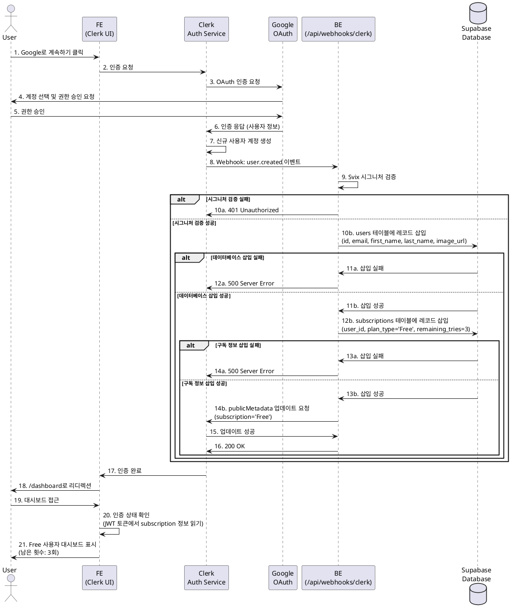

# Usecase 001: 신규 사용자 가입 (Clerk / 구글 로그인 연동)

## Primary Actor
- 신규 방문자 (Guest)

## Precondition
- 사용자가 서비스에 접속하여 회원가입 또는 로그인 페이지(`/sign-up`, `/sign-in`)에 접근할 수 있습니다.
- Clerk 인증 시스템이 정상적으로 설정되어 있습니다.
- Google OAuth 인증이 Clerk에 연동되어 있습니다.

## Trigger
- 사용자가 `/sign-up` 또는 `/sign-in` 페이지에서 'Google로 계속하기' 버튼을 클릭합니다.

## Main Scenario

### 1. 사용자 인증 플로우
1. 사용자가 Clerk UI에서 'Google로 계속하기' 버튼을 클릭합니다.
2. Clerk이 Google OAuth 인증 팝업/리디렉션을 처리합니다.
3. 사용자가 Google 계정을 선택하고 서비스 접근 권한을 승인합니다.
4. Google이 인증 응답을 Clerk으로 전송합니다.
5. Clerk이 사용자 정보를 기반으로 신규 사용자 계정을 생성합니다.

### 2. 웹훅을 통한 데이터 동기화
1. Clerk이 `user.created` 이벤트를 감지하고 웹훅 엔드포인트(`/api/webhooks/clerk`)로 이벤트를 전송합니다.
2. 백엔드 API가 웹훅 요청의 시그니처(Svix)를 검증합니다.
3. 검증 성공 시, 웹훅 페이로드에서 사용자 정보(`user_id`, `email`, `first_name`, `last_name`, `image_url`)를 추출합니다.
4. Supabase `users` 테이블에 신규 사용자 레코드를 생성합니다.
   - `id`: Clerk의 `user_id`
   - `email`: 사용자 이메일
   - `first_name`, `last_name`, `image_url`: Clerk에서 제공하는 프로필 정보
5. Supabase `subscriptions` 테이블에 기본 구독 정보를 생성합니다.
   - `user_id`: Clerk의 `user_id`
   - `plan_type`: 'Free' (기본값)
   - `remaining_tries`: 3 (무료 사용자 기본 제공 횟수)
   - `billing_key`: null
   - `next_payment_date`: null
   - `cancellation_scheduled`: false
6. Clerk의 `publicMetadata`를 업데이트하여 구독 상태를 저장합니다.
   - `metadata.subscription`: 'Free'

### 3. 사용자 리디렉션
1. 인증 완료 후 사용자를 `/dashboard`로 리디렉션합니다.
2. 프론트엔드에서 인증 상태를 확인하고 사용자 정보를 표시합니다.

## Edge Cases

### 1. Google 인증 실패
- **발생 조건**: 사용자가 Google 인증 팝업에서 권한을 거부하거나, 네트워크 오류가 발생하는 경우
- **처리**: Clerk UI에서 에러 메시지를 표시하고 사용자를 로그인 페이지로 복귀시킵니다.

### 2. 웹훅 시그니처 검증 실패
- **발생 조건**: 웹훅 요청이 Clerk이 아닌 다른 출처에서 전송되거나, 시그니처가 손상된 경우
- **처리**: `401 Unauthorized` 응답을 반환하고 요청을 거부합니다. Clerk은 자동으로 재시도를 수행합니다.

### 3. 데이터베이스 트랜잭션 실패
- **발생 조건**: `users` 또는 `subscriptions` 테이블 삽입 시 데이터베이스 오류가 발생하는 경우
- **처리**:
  - `500 Server Error` 응답을 반환합니다.
  - 오류를 로깅하여 관리자가 확인할 수 있도록 합니다.
  - Clerk의 웹훅 재시도 메커니즘이 작동하여 일정 시간 후 재시도합니다.

### 4. 중복 이메일 계정
- **발생 조건**: 동일한 이메일로 이미 계정이 생성되어 있는 경우
- **처리**:
  - Clerk 단계에서 이미 존재하는 계정으로 자동 로그인됩니다.
  - `user.created` 이벤트가 발생하지 않으므로 웹훅이 호출되지 않습니다.

### 5. Clerk Webhook 재시도 시 중복 삽입 방지
- **발생 조건**: 웹훅 처리 중 일시적인 오류로 인해 Clerk이 동일한 이벤트를 재전송하는 경우
- **처리**:
  - `users` 테이블의 `id` (PK)와 `email` (UNIQUE) 제약 조건이 중복 삽입을 방지합니다.
  - INSERT 시 `ON CONFLICT DO NOTHING` 또는 중복 오류를 무시하는 로직을 구현합니다.

## Business Rules

### BR-001: 기본 구독 상태
- 모든 신규 가입 사용자는 'Free' 플랜으로 시작합니다.
- 'Free' 플랜 사용자는 총 3회의 무료 사주 분석 기회를 가집니다.

### BR-002: 사용자 ID 일관성
- Clerk의 `user_id`를 Supabase 데이터베이스의 Primary Key로 사용하여 데이터 일관성을 보장합니다.
- 모든 사용자 관련 데이터(구독, 분석 내역)는 Clerk `user_id`를 외래 키로 참조합니다.

### BR-003: 인증 상태 관리
- Clerk의 세션 토큰을 통해 사용자 인증 상태를 관리합니다.
- JWT 토큰에 `publicMetadata.subscription` 정보를 포함하여 매번 데이터베이스 조회 없이 구독 상태를 확인할 수 있습니다.

### BR-004: External Service Integration
- **Clerk**: 사용자 인증 및 세션 관리를 담당합니다.
  - OAuth Provider: Google
  - Webhook Event: `user.created`
  - Metadata: `publicMetadata.subscription` (Free/Pro)
- **Clerk Webhook 보안**: Svix 서명을 사용하여 웹훅 요청의 진위를 검증합니다.
- **Clerk Configuration**:
  - JWT 템플릿 설정: `publicMetadata`를 세션 토큰에 포함
  - Redirect URLs: 로그인 후 `/dashboard`로 이동
  - Social Connections: Google OAuth 활성화

## API Specification

### 1. POST /api/webhooks/clerk

Clerk의 `user.created` 이벤트를 수신하여 Supabase에 사용자 정보를 동기화합니다.

**Request Headers:**
```
svix-id: <webhook-id>
svix-timestamp: <timestamp>
svix-signature: <signature>
Content-Type: application/json
```

**Request Body:**
```json
{
  "type": "user.created",
  "data": {
    "id": "user_abc123xyz",
    "email_addresses": [
      {
        "email_address": "user@example.com",
        "id": "email_abc123"
      }
    ],
    "first_name": "홍",
    "last_name": "길동",
    "image_url": "https://img.clerk.com/user_abc123xyz"
  }
}
```

**Success Response (200 OK):**
```json
{
  "success": true,
  "message": "User synchronized successfully"
}
```

**Error Responses:**

**400 Bad Request** (Missing Svix Headers):
```json
{
  "error": "INVALID_WEBHOOK",
  "message": "Missing svix headers"
}
```

**401 Unauthorized** (Signature Verification Failed):
```json
{
  "error": "UNAUTHORIZED_WEBHOOK",
  "message": "Invalid webhook signature"
}
```

**500 Internal Server Error** (Database Error):
```json
{
  "error": "DATABASE_ERROR",
  "message": "Failed to synchronize user data"
}
```

**Implementation Notes:**
- `runtime = 'nodejs'` 설정 (Supabase service-role 키 사용)
- Svix 라이브러리를 사용한 시그니처 검증
- 트랜잭션 처리: `users` 및 `subscriptions` 테이블 동시 삽입
- 멱등성(Idempotency) 보장: 중복 요청 시 안전하게 처리
- Clerk `publicMetadata` 업데이트를 통한 구독 상태 동기화

## Sequence Diagram



## Related Features
- **UC-002**: Free 사용자의 사주 분석 요청
- **UC-004**: Pro 플랜 구독 신청
- **UC-011**: 사용자 프로필 관리

## Notes
- Clerk의 세션 토큰은 클라이언트 사이드에서 자동으로 관리되며, `@clerk/nextjs`의 훅(`useUser`, `useAuth`)을 통해 접근할 수 있습니다.
- 서버 사이드에서는 Next.js 미들웨어와 `auth()` 헬퍼를 사용하여 인증 상태를 확인합니다.
- `publicMetadata`는 클라이언트에서도 읽을 수 있지만, 민감한 정보는 `privateMetadata`를 사용해야 합니다.
- 이 유스케이스는 Clerk의 기본 인증 플로우를 활용하므로, 커스텀 UI 개발이 필요하지 않습니다.
