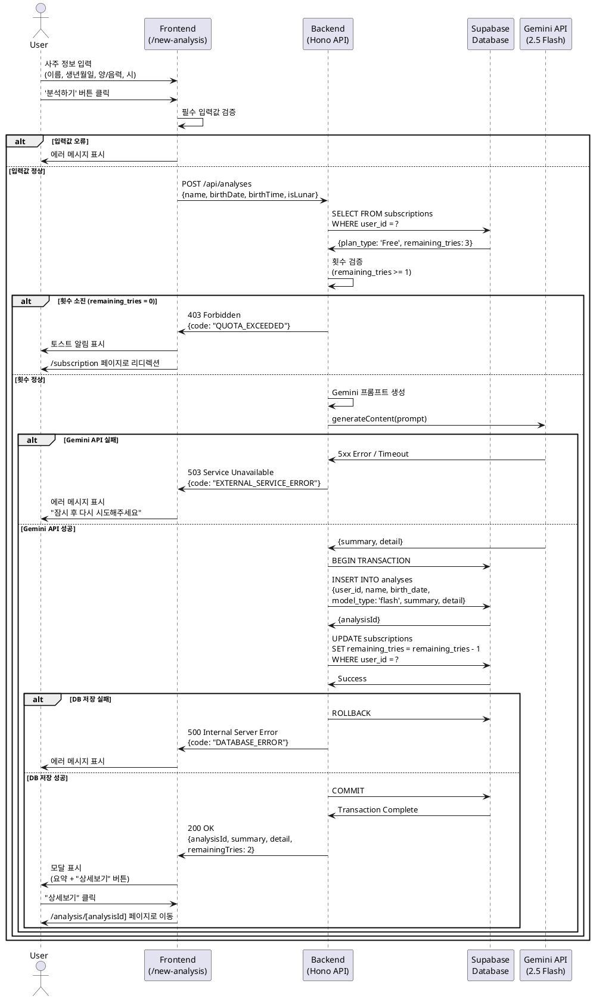

# Usecase 002: Free 사용자의 사주 분석

## Overview
Free 플랜 사용자가 사주 분석 서비스를 이용하여 AI 기반 사주 풀이 결과를 받는 기능입니다. Free 사용자는 총 3회의 무료 분석 기회를 가지며, Gemini 2.5 Flash 모델을 사용하여 분석을 수행합니다.

## Primary Actor
- **Free User**: 회원가입 후 Pro 구독을 하지 않은 사용자 (총 3회 무료 분석 기회 보유)

## Precondition
- 사용자가 Clerk를 통해 인증된 상태여야 함
- 사용자의 구독 상태가 'Free'이며 `remaining_tries >= 1`이어야 함
- `/new-analysis` 페이지에 접근 가능해야 함

## Trigger
사용자가 `/new-analysis` 페이지에서 사주 정보를 입력하고 '분석하기' 버튼을 클릭

## Main Scenario

### 1. 사주 정보 입력
1. 사용자가 `/new-analysis` 페이지에 접근
2. 입력 폼에 다음 정보를 입력:
   - 이름 (필수)
   - 생년월일 (필수, YYYY-MM-DD 형식)
   - 양/음력 선택 (필수, 기본값: 양력)
   - 태어난 시간 (선택, HH:MM 형식 또는 '모름' 체크)
3. 사용자가 '분석하기' 버튼 클릭

### 2. 프론트엔드 유효성 검증
1. 필수 입력값(이름, 생년월일, 양/음력) 누락 여부 확인
2. 생년월일 형식 유효성 검증
3. 검증 실패 시: 해당 필드에 에러 메시지 표시 후 중단
4. 검증 성공 시: 백엔드 API 호출

### 3. 백엔드 분석 처리
1. 프론트엔드가 백엔드 API(`POST /api/analyses`)에 분석 요청 전송
   - Request Body: `{ name, birthDate, birthTime, isLunar, userId }`
2. 백엔드가 `userId`로 Supabase `subscriptions` 테이블 조회
3. 구독 상태 검증:
   - `plan_type = 'Free'`
   - `remaining_tries >= 1`
4. Gemini 2.5 Flash 모델 API 호출:
   - 입력된 사주 정보를 포함한 프롬프트 생성
   - Gemini API 호출 (`model: "gemini-2.5-flash"`)
   - AI 응답 수신 (요약 + 상세 분석 텍스트)
5. 분석 결과 저장:
   - `analyses` 테이블에 신규 레코드 생성
     - `user_id`, `name`, `birth_date`, `birth_time`, `is_lunar`
     - `model_type: 'flash'`
     - `summary`: 요약 텍스트
     - `detail`: 상세 분석 텍스트 (마크다운 형식)
6. 사용자 횟수 차감:
   - `subscriptions` 테이블의 `remaining_tries` 1 감소 (예: 3 → 2)
7. 응답 반환:
   - Status: 200 OK
   - Response Body: `{ analysisId, summary, detail, remainingTries }`

### 4. 결과 표시
1. 프론트엔드가 응답 수신
2. 현재 페이지(`/new-analysis`)에 모달(Modal) 표시:
   - 타이틀: "분석 완료"
   - 내용: AI가 생성한 요약 텍스트 (`summary`)
   - 버튼: "상세보기" (클릭 시 `/analysis/[analysisId]` 페이지로 이동)
3. 남은 분석 횟수 UI 업데이트 (예: "남은 분석 횟수: 2회")

## Edge Cases

### EC1: 횟수 소진
- **조건**: `remaining_tries = 0`
- **처리**:
  1. 백엔드가 403 Forbidden 응답 반환 (`errorCode: "QUOTA_EXCEEDED"`)
  2. 프론트엔드가 토스트 알림 표시: "무료 분석 횟수를 모두 사용했습니다."
  3. 자동으로 `/subscription` (구독 관리) 페이지로 리디렉션

### EC2: Gemini API 호출 실패
- **조건**: Gemini API 타임아웃, 5xx 에러, 네트워크 오류 등
- **처리**:
  1. 백엔드가 503 Service Unavailable 응답 반환 (`errorCode: "EXTERNAL_SERVICE_ERROR"`)
  2. 횟수 차감 없음 (트랜잭션 롤백)
  3. 프론트엔드가 에러 메시지 표시: "일시적인 오류가 발생했습니다. 잠시 후 다시 시도해주세요."

### EC3: DB 저장 실패
- **조건**: `analyses` 테이블 INSERT 또는 `subscriptions` 테이블 UPDATE 실패
- **처리**:
  1. 백엔드가 500 Internal Server Error 응답 반환 (`errorCode: "DATABASE_ERROR"`)
  2. 트랜잭션 롤백으로 횟수 차감 없음
  3. 프론트엔드가 에러 메시지 표시: "분석 결과 저장에 실패했습니다. 다시 시도해주세요."

### EC4: 입력값 유효성 오류
- **조건**: 백엔드 측에서 필수 필드 누락, 잘못된 데이터 형식 감지
- **처리**:
  1. 백엔드가 400 Bad Request 응답 반환 (`errorCode: "INVALID_INPUT"`)
  2. 프론트엔드가 해당 필드에 에러 메시지 표시

### EC5: 인증 실패
- **조건**: `userId`가 유효하지 않거나 Clerk 세션 만료
- **처리**:
  1. 백엔드가 401 Unauthorized 응답 반환
  2. 프론트엔드가 로그인 페이지로 리디렉션

## Business Rules

### BR1: 횟수 제한 정책
- Free 사용자는 회원가입 시점부터 **총 3회**의 분석 기회를 가짐
- 1회 분석 성공 시마다 `remaining_tries` 1 감소
- 횟수가 0이 되면 추가 분석 불가 (Pro 구독 유도)
- **재충전 불가**: Free 플랜 사용자는 3회 소진 후 추가 횟수를 얻을 수 없음

### BR2: 모델 선택 제한
- Free 사용자는 **Gemini 2.5 Flash 모델만 사용 가능**
- 모델 선택 UI가 표시되지 않음 (Flash 고정)
- `analyses` 테이블의 `model_type`은 항상 `'flash'`로 저장

### BR3: 분석 결과 저장 정책
- 모든 분석 결과는 `analyses` 테이블에 영구 저장
- 사용자는 `/dashboard`에서 과거 분석 내역을 무제한 조회 가능
- 분석 결과는 사용자 본인만 조회 가능 (보안)

### BR4: 트랜잭션 보장
- Gemini API 호출, DB 저장, 횟수 차감은 하나의 트랜잭션으로 처리
- 일부 단계 실패 시 전체 롤백하여 데이터 정합성 보장
- 특히 Gemini API 호출 실패 시 횟수 차감 방지

### BR5: External Service Integration
- **Gemini API 연동**:
  - 모델: `gemini-2.5-flash`
  - API Key: 환경 변수 `GEMINI_API_KEY`에서 로드
  - 프롬프트: `/docs/external/gemini.md`의 명세에 따라 구성
    - 역할 부여: "현대적인 감각을 지닌 사주 명리학 전문가"
    - 출력 형식: 마크다운 단락 구조
    - 분석 항목: 성격, 재물운, 직업운, 애정운 포함
  - 타임아웃: 30초
  - 재시도: 1회 (5xx 에러 시)
  - 에러 처리: 503 응답 후 사용자에게 재시도 안내

## API Specification

### Endpoint
```
POST /api/analyses
```

### Request Headers
```
Authorization: Bearer {clerkJWT}
Content-Type: application/json
```

### Request Body
```typescript
{
  name: string;           // 분석 대상 이름
  birthDate: string;      // 생년월일 (YYYY-MM-DD)
  birthTime?: string;     // 태어난 시간 (HH:MM), 선택
  isLunar: boolean;       // 음력 여부 (기본값: false)
}
```

### Response (Success: 200 OK)
```typescript
{
  success: true;
  data: {
    analysisId: string;       // UUID
    summary: string;          // 요약 텍스트
    detail: string;           // 상세 분석 (마크다운)
    remainingTries: number;   // 남은 분석 횟수
  }
}
```

### Response (Error: 403 Forbidden - 횟수 소진)
```typescript
{
  success: false;
  error: {
    code: "QUOTA_EXCEEDED";
    message: "무료 분석 횟수를 모두 사용했습니다.";
  }
}
```

### Response (Error: 503 Service Unavailable - Gemini API 실패)
```typescript
{
  success: false;
  error: {
    code: "EXTERNAL_SERVICE_ERROR";
    message: "일시적인 오류가 발생했습니다. 잠시 후 다시 시도해주세요.";
  }
}
```

### Response (Error: 400 Bad Request - 입력값 오류)
```typescript
{
  success: false;
  error: {
    code: "INVALID_INPUT";
    message: "필수 입력값이 누락되었거나 형식이 올바르지 않습니다.";
    details: {
      field: string;
      reason: string;
    }
  }
}
```

## Sequence Diagram



## Data Flow

### Input Data
| Field | Type | Required | Validation | Description |
|-------|------|----------|------------|-------------|
| name | string | Yes | 1-50자 | 분석 대상 이름 |
| birthDate | string | Yes | YYYY-MM-DD 형식 | 생년월일 |
| birthTime | string | No | HH:MM 형식 또는 null | 태어난 시간 |
| isLunar | boolean | Yes | true/false | 음력 여부 |

### Database Changes

#### 1. analyses 테이블 INSERT
```sql
INSERT INTO analyses (
  user_id,
  name,
  birth_date,
  birth_time,
  is_lunar,
  model_type,
  summary,
  detail
) VALUES (
  ?, -- userId
  ?, -- name
  ?, -- birthDate
  ?, -- birthTime (nullable)
  ?, -- isLunar
  'flash',
  ?, -- summary from Gemini
  ?  -- detail from Gemini
);
```

#### 2. subscriptions 테이블 UPDATE
```sql
UPDATE subscriptions
SET
  remaining_tries = remaining_tries - 1,
  updated_at = NOW()
WHERE
  user_id = ?;
```

## Related Usecases
- **Usecase 001**: 신규 사용자 가입 (Clerk Webhook)
- **Usecase 003**: Free 사용자의 사주 분석 (횟수 소진)
- **Usecase 004**: Pro 구독 신청
- **Usecase 011**: 분석 내역 조회 (대시보드)
- **Usecase 012**: 분석 상세보기 및 MD 다운로드

## Notes
- Free 사용자는 첫 3회 분석이 완료되면 더 이상 분석 기능을 사용할 수 없으며, Pro 구독으로 전환해야 함
- Gemini API 호출 시 `/docs/external/gemini.md`에 명시된 프롬프트 구조를 정확히 따라야 일관된 품질의 분석 결과를 얻을 수 있음
- 분석 결과는 사용자의 개인정보가 포함되므로 엄격한 접근 제어 필요 (백엔드에서 `userId` 검증 필수)
