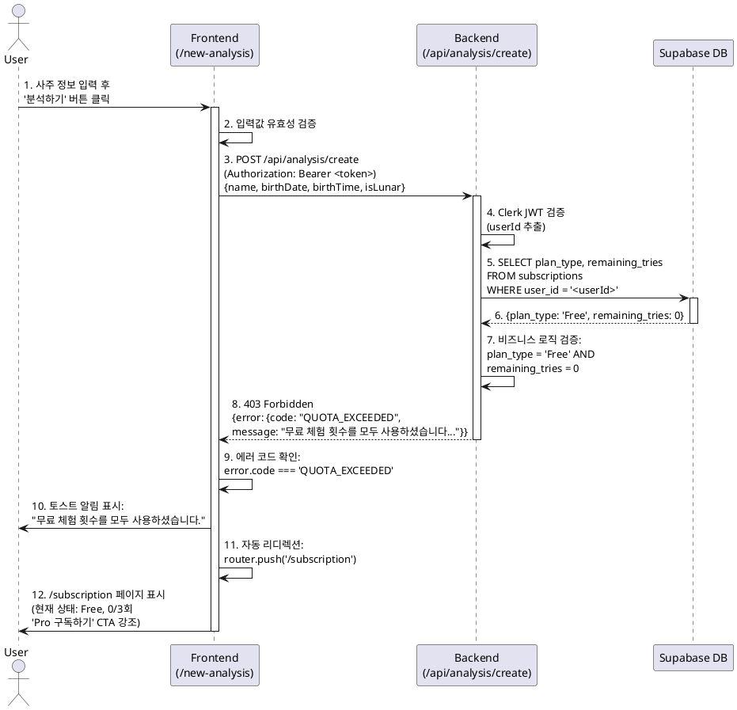

# UC-003: Free 사용자의 사주 분석 (횟수 소진)

## Overview
Free 플랜 사용자가 총 3회의 무료 분석 횟수를 모두 사용한 상태에서 추가 사주 분석을 시도하는 시나리오입니다. 시스템은 사용자에게 횟수 소진을 알리고 구독 관리 페이지로 자동 리디렉션하여 Pro 플랜 구독을 유도합니다.

## Primary Actor
- **Free 플랜 사용자** (remaining_tries = 0)

## Precondition
- 사용자가 Clerk 인증을 완료한 상태입니다.
- 사용자의 구독 상태가 'Free' 플랜입니다.
- 사용자의 `remaining_tries`가 **0**입니다. (3회 모두 사용 완료)

## Trigger
사용자가 `/new-analysis` 페이지에서 사주 정보를 입력하고 '분석하기' 버튼을 클릭합니다.

## Main Scenario

### 1. 입력 단계
1. 사용자가 `/new-analysis` 페이지에 접근합니다.
2. 폼에 필수 정보를 입력합니다:
   - 이름 (name)
   - 생년월일 (birthDate)
   - 양/음력 선택 (isLunar)
   - 태어난 시간 (birthTime, 선택 사항 - '모름' 체크 가능)
3. '분석하기' 버튼을 클릭합니다.

### 2. 검증 단계
1. **프론트엔드**는 필수 입력값의 유효성을 검증합니다.
2. 검증 통과 시, 백엔드 API `/api/analysis/create` (POST)로 분석 요청을 전송합니다.
   - 요청 헤더: `Authorization: Bearer <Clerk JWT Token>`
   - 요청 본문:
     ```json
     {
       "name": "홍길동",
       "birthDate": "1990-03-15",
       "birthTime": null,
       "isLunar": false
     }
     ```

### 3. 백엔드 처리
1. **인증 미들웨어**가 Clerk JWT를 검증하여 `userId`를 추출합니다.
2. **Supabase** `subscriptions` 테이블을 조회합니다:
   ```sql
   SELECT plan_type, remaining_tries
   FROM subscriptions
   WHERE user_id = '<userId>'
   ```
3. 조회 결과:
   - `plan_type`: 'Free'
   - `remaining_tries`: 0

4. **비즈니스 로직 검증**:
   - `plan_type = 'Free'` **AND** `remaining_tries = 0` 조건 충족 확인
   - 조건 충족 시, **Gemini API 호출을 중단**합니다.

5. **에러 응답 반환**:
   ```json
   {
     "error": {
       "code": "QUOTA_EXCEEDED",
       "message": "무료 체험 횟수를 모두 사용하셨습니다. Pro 플랜을 구독하여 월 10회의 분석 기회를 받으세요."
     }
   }
   ```
   - HTTP Status: `403 Forbidden`

### 4. 프론트엔드 응답 처리
1. **에러 코드 확인**: `error.code === 'QUOTA_EXCEEDED'` 확인
2. **사용자 알림**:
   - 토스트(Toast) 또는 간단한 알림 모달을 표시:
     > "무료 체험 횟수를 모두 사용하셨습니다."
3. **자동 리디렉션**:
   - 알림 표시 후 즉시 `/subscription` (구독 관리) 페이지로 이동
   ```typescript
   router.push('/subscription');
   ```

### 5. 구독 관리 페이지 표시
1. `/subscription` 페이지에서 현재 구독 상태를 표시합니다:
   - 요금제: Free
   - 남은 분석 횟수: 0/3회
   - 'Pro 구독하기' CTA 버튼 강조 표시
2. 사용자가 'Pro 구독하기' 버튼을 클릭하면 UC-004 (Pro 구독 신청) 플로우가 시작됩니다.

## Edge Cases

### E1. 클라이언트 측 입력 검증 실패
- **조건**: 필수 필드 누락 또는 형식 오류
- **처리**: 폼 필드에 즉시 에러 메시지 표시, 백엔드 요청 전송 안 함

### E2. 인증 토큰 만료 또는 유효하지 않음
- **조건**: Clerk JWT 검증 실패
- **응답**: `401 Unauthorized`
- **처리**: 프론트엔드가 자동으로 로그인 페이지로 리디렉션

### E3. DB 조회 실패
- **조건**: Supabase 연결 오류 또는 쿼리 실패
- **응답**: `500 Internal Server Error`, `code: "DB_ERROR"`
- **처리**: 사용자에게 "일시적인 오류가 발생했습니다. 잠시 후 다시 시도해주세요." 메시지 표시

### E4. 동시성 문제 (Race Condition)
- **조건**: 사용자가 여러 브라우저 탭에서 동시에 분석 요청을 전송
- **처리**:
  - 백엔드에서 `remaining_tries` 조회 및 검증을 **원자적(Atomic) 트랜잭션**으로 처리
  - 첫 번째 요청만 성공, 나머지는 `QUOTA_EXCEEDED` 응답

### E5. 네트워크 타임아웃
- **조건**: API 요청이 일정 시간 내에 응답하지 않음
- **처리**: 프론트엔드에서 타임아웃 에러 처리, "서버 응답이 지연되고 있습니다." 메시지 표시

## Business Rules

### BR-001: Free 플랜 횟수 제한
- Free 플랜 사용자는 **총 3회**의 사주 분석 기회를 가집니다.
- 횟수는 누적 총량이며, **월간 리셋되지 않습니다**.
- 모든 횟수 소진 시, Pro 플랜 구독 전까지 추가 분석이 불가능합니다.

### BR-002: 횟수 차감 정책
- 횟수는 **분석 결과가 성공적으로 생성된 경우에만** 차감됩니다.
- Gemini API 호출 실패, DB 저장 실패 등 시스템 오류 시에는 횟수를 차감하지 않습니다.

### BR-003: 모델 선택 제한
- Free 플랜 사용자는 **Gemini 2.5 Flash 모델만** 사용 가능합니다.
- 모델 선택 UI는 Free 플랜 사용자에게 노출되지 않습니다.

### BR-004: 자동 리디렉션
- `QUOTA_EXCEEDED` 에러 발생 시, 프론트엔드는 **반드시** 사용자를 `/subscription` 페이지로 자동 리디렉션해야 합니다.
- 리디렉션 전에 사용자에게 횟수 소진 사실을 명확히 알립니다.

### BR-005: 구독 전환 시 횟수 복구 불가
- Free 플랜에서 Pro 플랜으로 전환 시, Free 플랜의 잔여 횟수(0회)는 복구되지 않습니다.
- Pro 플랜 전환 즉시 **새로운 10회의 횟수**가 부여됩니다.

## API Specification

### Endpoint
```
POST /api/analysis/create
```

### Authentication
- **Required**: Yes
- **Type**: Bearer Token (Clerk JWT)
- **Header**: `Authorization: Bearer <token>`

### Request Body
```typescript
{
  name: string;          // 분석 대상 이름 (필수)
  birthDate: string;     // 생년월일 YYYY-MM-DD 형식 (필수)
  birthTime?: string;    // 태어난 시간 HH:MM 형식 (선택, null 가능)
  isLunar: boolean;      // 음력 여부 (필수)
}
```

#### Request Body Schema (Zod)
```typescript
const CreateAnalysisRequestSchema = z.object({
  name: z.string().min(1, "이름을 입력해주세요."),
  birthDate: z.string().regex(/^\d{4}-\d{2}-\d{2}$/, "올바른 날짜 형식이 아닙니다."),
  birthTime: z.string().regex(/^\d{2}:\d{2}$/).nullable().optional(),
  isLunar: z.boolean(),
});
```

### Response - Success (200 OK)
```typescript
{
  id: string;            // 분석 레코드 UUID
  summary: string;       // AI 분석 요약
  detail: string;        // AI 분석 상세 (마크다운)
  createdAt: string;     // 분석 수행 시각 (ISO 8601)
}
```

### Response - Quota Exceeded (403 Forbidden)
```typescript
{
  error: {
    code: "QUOTA_EXCEEDED";
    message: "무료 체험 횟수를 모두 사용하셨습니다. Pro 플랜을 구독하여 월 10회의 분석 기회를 받으세요.";
  }
}
```

### Response - Invalid Input (400 Bad Request)
```typescript
{
  error: {
    code: "INVALID_REQUEST";
    message: "요청 데이터가 유효하지 않습니다.";
    details: {
      // Zod validation errors
    };
  }
}
```

### Response - Unauthorized (401 Unauthorized)
```typescript
{
  error: {
    code: "UNAUTHORIZED";
    message: "인증이 필요합니다.";
  }
}
```

### Response - Server Error (500 Internal Server Error)
```typescript
{
  error: {
    code: "DB_ERROR" | "GEMINI_API_ERROR" | "INTERNAL_ERROR";
    message: "일시적인 오류가 발생했습니다. 잠시 후 다시 시도해주세요.";
  }
}
```

## Backend Implementation Guide (Hono)

### 1. Schema Definition (`src/features/analysis/backend/schema.ts`)
```typescript
import { z } from 'zod';

export const CreateAnalysisRequestSchema = z.object({
  name: z.string().min(1, "이름을 입력해주세요."),
  birthDate: z.string().regex(/^\d{4}-\d{2}-\d{2}$/, "올바른 날짜 형식이 아닙니다."),
  birthTime: z.string().regex(/^\d{2}:\d{2}$/).nullable().optional(),
  isLunar: z.boolean(),
});

export type CreateAnalysisRequest = z.infer<typeof CreateAnalysisRequestSchema>;

export const AnalysisResponseSchema = z.object({
  id: z.string().uuid(),
  summary: z.string(),
  detail: z.string(),
  createdAt: z.string(),
});

export type AnalysisResponse = z.infer<typeof AnalysisResponseSchema>;
```

### 2. Error Codes (`src/features/analysis/backend/error.ts`)
```typescript
export const analysisErrorCodes = {
  quotaExceeded: 'QUOTA_EXCEEDED' as const,
  invalidRequest: 'INVALID_REQUEST' as const,
  dbError: 'DB_ERROR' as const,
  geminiApiError: 'GEMINI_API_ERROR' as const,
  internalError: 'INTERNAL_ERROR' as const,
  unauthorized: 'UNAUTHORIZED' as const,
};

export type AnalysisServiceError = typeof analysisErrorCodes[keyof typeof analysisErrorCodes];
```

### 3. Route Handler (`src/features/analysis/backend/route.ts`)
```typescript
import type { Hono } from 'hono';
import { failure, respond, type ErrorResult } from '@/backend/http/response';
import { getLogger, getSupabase, type AppEnv } from '@/backend/hono/context';
import { CreateAnalysisRequestSchema } from './schema';
import { createAnalysisForFreeUser } from './service';
import { analysisErrorCodes, type AnalysisServiceError } from './error';

export const registerAnalysisRoutes = (app: Hono<AppEnv>) => {
  app.post('/api/analysis/create', async (c) => {
    // 1. 인증 확인 (Clerk 미들웨어에서 처리된 userId 사용)
    const userId = c.get('userId'); // 인증 미들웨어에서 주입됨

    if (!userId) {
      return respond(
        c,
        failure(401, analysisErrorCodes.unauthorized, '인증이 필요합니다.'),
      );
    }

    // 2. 요청 본문 검증
    const body = await c.req.json();
    const parsedBody = CreateAnalysisRequestSchema.safeParse(body);

    if (!parsedBody.success) {
      return respond(
        c,
        failure(
          400,
          analysisErrorCodes.invalidRequest,
          '요청 데이터가 유효하지 않습니다.',
          parsedBody.error.format(),
        ),
      );
    }

    const supabase = getSupabase(c);
    const logger = getLogger(c);

    // 3. 서비스 레이어 호출
    const result = await createAnalysisForFreeUser(
      supabase,
      userId,
      parsedBody.data,
    );

    if (!result.ok) {
      const errorResult = result as ErrorResult<AnalysisServiceError, unknown>;

      // 4. 에러 로깅
      if (errorResult.error.code === analysisErrorCodes.dbError) {
        logger.error('DB 조회 실패', errorResult.error.message);
      } else if (errorResult.error.code === analysisErrorCodes.geminiApiError) {
        logger.error('Gemini API 호출 실패', errorResult.error.message);
      }

      return respond(c, result);
    }

    // 5. 성공 응답
    return respond(c, result);
  });
};
```

### 4. Service Layer (`src/features/analysis/backend/service.ts`)
```typescript
import type { SupabaseClient } from '@supabase/supabase-js';
import { failure, success, type HandlerResult } from '@/backend/http/response';
import { analysisErrorCodes, type AnalysisServiceError } from './error';
import type { CreateAnalysisRequest, AnalysisResponse } from './schema';

export const createAnalysisForFreeUser = async (
  supabase: SupabaseClient,
  userId: string,
  request: CreateAnalysisRequest,
): Promise<HandlerResult<AnalysisResponse, AnalysisServiceError>> => {
  // 1. 구독 상태 조회
  const { data: subscription, error: subError } = await supabase
    .from('subscriptions')
    .select('plan_type, remaining_tries')
    .eq('user_id', userId)
    .single();

  if (subError || !subscription) {
    return failure(500, analysisErrorCodes.dbError, '구독 정보를 조회할 수 없습니다.');
  }

  // 2. 횟수 검증
  if (subscription.plan_type === 'Free' && subscription.remaining_tries === 0) {
    return failure(
      403,
      analysisErrorCodes.quotaExceeded,
      '무료 체험 횟수를 모두 사용하셨습니다. Pro 플랜을 구독하여 월 10회의 분석 기회를 받으세요.',
    );
  }

  // 3. Gemini API 호출 (UC-002에서 정상 처리되므로 여기서는 생략)
  // ... (정상 분석 로직은 UC-002 참조)

  // 이 유스케이스는 횟수 소진 시나리오이므로 여기까지 도달하지 않음
  return failure(500, analysisErrorCodes.internalError, '예상치 못한 오류가 발생했습니다.');
};
```

## Sequence Diagram



## Related Use Cases
- **UC-002**: Free 사용자의 사주 분석 (성공) - 횟수가 남아있는 경우의 정상 플로우
- **UC-004**: 신규 Pro 플랜 구독 신청 - 횟수 소진 후 사용자가 진입하는 다음 단계
- **UC-001**: 신규 사용자 가입 - Free 플랜 초기 상태 (remaining_tries = 3) 설정

## Notes
- 이 유스케이스는 Free 플랜의 **비즈니스 모델 전환점(Conversion Point)** 역할을 합니다.
- UX 관점에서 사용자가 막힌 느낌(friction)을 받지 않도록 명확한 안내와 즉각적인 대안(Pro 구독) 제시가 중요합니다.
- 백엔드에서는 횟수 검증을 **Gemini API 호출 전**에 수행하여 불필요한 API 비용을 방지합니다.
- 프론트엔드는 `/new-analysis` 페이지 로드 시 사용자의 남은 횟수를 미리 표시하여 사용자가 횟수 소진 상태를 인지할 수 있도록 하는 것이 좋습니다.
