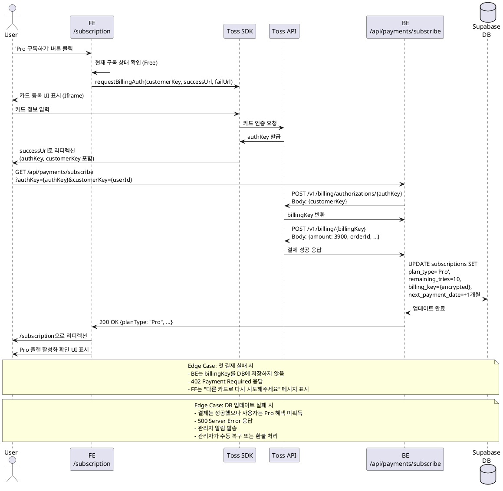

# Usecase 004: 신규 Pro 플랜 구독 신청

## 개요
Free 플랜 사용자가 Pro 플랜으로 업그레이드하여 월 10회 분석 권한과 Gemini Pro 모델 접근 권한을 얻는 프로세스입니다. 토스페이먼츠를 통해 결제수단을 등록하고 빌링키를 발급받은 후 첫 구독료(3,900원)를 결제합니다.

## Primary Actor
- Free 플랜 사용자 (인증된 상태)

## Precondition
- 사용자가 Clerk를 통해 인증된 상태
- 사용자의 현재 구독 상태가 'Free'
- 사용자가 `/subscription` 페이지에 접근 가능

## Trigger
- 사용자가 구독 관리 페이지에서 'Pro 구독하기' 버튼 클릭

## Main Scenario

### 1. 구독 신청 시작
1. 사용자가 `/subscription` 페이지에서 'Pro 구독하기' (월 3,900원) 버튼 클릭
2. FE가 현재 사용자의 구독 상태를 확인 (Free인지 검증)
3. FE가 토스페이먼츠 SDK `requestBillingAuth()` 호출
   - `customerKey`: Clerk `userId`
   - `successUrl`: `/api/payments/subscribe`
   - `failUrl`: `/subscription/fail`

### 2. 결제수단 등록 (토스페이먼츠)
4. 토스페이먼츠 카드 등록 UI(Iframe)가 모달로 표시
5. 사용자가 카드 정보(카드번호, 유효기간, CVC 등) 입력
6. 토스페이먼츠가 카드 정보 검증 및 본인 인증 수행
7. 인증 성공 시 토스페이먼츠가 임시 `authKey` 발급
8. 토스페이먼츠가 사용자를 `successUrl`로 리디렉션 (쿼리 파라미터로 `authKey`, `customerKey` 전달)

### 3. 빌링키 발급 및 첫 결제
9. BE(`/api/payments/subscribe`)가 쿼리 파라미터에서 `authKey`, `customerKey` 추출
10. BE가 토스페이먼츠 API `POST /v1/billing/authorizations/{authKey}` 호출
    - Request Body: `{ "customerKey": "{userId}" }`
    - Response: 영구 `billingKey` 수신
11. BE가 수신한 `billingKey`로 즉시 첫 결제 요청
    - API: `POST /v1/billing/{billingKey}`
    - Request Body:
      ```json
      {
        "customerKey": "{userId}",
        "amount": 3900,
        "orderId": "{generated-order-id}",
        "orderName": "AI 사주풀이 Pro 구독 - 첫 결제",
        "customerEmail": "{user-email}"
      }
      ```
12. 토스페이먼츠가 결제 처리 및 성공 응답 반환

### 4. 구독 상태 업데이트
13. BE가 Supabase `subscriptions` 테이블 업데이트:
    - `plan_type`: 'Pro'
    - `remaining_tries`: 10
    - `billing_key`: (암호화된) `{billingKey}`
    - `customer_key`: `{userId}`
    - `next_payment_date`: 오늘 + 1개월
    - `subscribed_at`: 현재 타임스탬프
    - `cancellation_scheduled`: false
14. BE가 FE로 성공 응답 반환 (200 OK)
15. FE가 `/subscription` 페이지로 리디렉션
16. 구독 관리 페이지 UI 갱신:
    - 현재 플랜: Pro
    - 남은 분석 횟수: 10회
    - 다음 결제일: [YYYY-MM-DD]
    - '해지하기' 버튼 표시

## Edge Cases

### EC1: 사용자가 토스페이먼츠 UI에서 중도 취소
- **발생 시점**: Main Scenario 5-6 단계
- **처리**: 토스페이먼츠가 사용자를 `failUrl`(/subscription/fail)로 리디렉션
- **결과**: FE가 "구독 신청이 취소되었습니다" 메시지 표시 후 `/subscription`으로 리디렉션. 시스템 상태 변경 없음.

### EC2: 카드 인증 실패
- **발생 시점**: Main Scenario 6 단계
- **처리**: 토스페이먼츠 UI가 오류 메시지 표시 ("카드 정보가 올바르지 않습니다" 등)
- **결과**: 사용자가 정보를 재입력하거나 취소. 시스템 상태 변경 없음.

### EC3: 빌링키 발급 API 호출 실패
- **발생 시점**: Main Scenario 10 단계
- **원인**: 네트워크 오류, 토스페이먼츠 서버 오류, 잘못된 `authKey`
- **처리**: BE가 503 Service Unavailable 응답 반환
- **결과**: FE가 "일시적인 오류가 발생했습니다. 잠시 후 다시 시도해주세요" 메시지 표시. DB 변경 없음.

### EC4: 첫 결제 실패
- **발생 시점**: Main Scenario 11-12 단계
- **원인**: 한도 초과, 잔액 부족, 정지 카드, 해지된 카드
- **처리**:
  1. BE가 발급받은 `billingKey`를 DB에 저장하지 않음
  2. BE가 402 Payment Required 응답 반환
  3. FE가 사용자에게 결제 실패 사유와 함께 "다른 카드로 다시 시도해주세요" 메시지 표시
- **결과**: 구독 상태는 'Free'로 유지. 빌링키 미저장.

### EC5: 결제는 성공했으나 DB 업데이트 실패
- **발생 시점**: Main Scenario 13 단계
- **원인**: DB 연결 오류, 트랜잭션 실패
- **심각도**: Critical (결제는 이루어졌으나 사용자가 Pro 혜택을 받지 못함)
- **처리**:
  1. BE가 즉시 오류 로그 기록 (결제 정보, 사용자 ID, 빌링키, 오류 상세)
  2. BE가 500 Internal Server Error 응답 반환
  3. 관리자에게 알림 발송 (이메일, Slack 등)
- **복구**: 관리자가 로그를 확인하여 수동으로 DB 업데이트 또는 환불 처리

### EC6: 이미 Pro 플랜 사용자가 재구독 시도
- **발생 시점**: Main Scenario 2 단계
- **처리**: FE가 "이미 Pro 플랜을 이용 중입니다" 메시지 표시
- **결과**: 구독 신청 프로세스 진행 차단

## Business Rules

### BR1: 요금제 정책
- Free 플랜: 총 3회 무료 분석, Gemini 2.5 Flash 모델 사용
- Pro 플랜: 월 3,900원, 월 10회 분석, Gemini 2.5 Flash/Pro 모델 선택 가능
- Pro 구독 시 즉시 10회 횟수 부여

### BR2: 결제 정책
- 최초 구독 시 즉시 결제 (선결제)
- 정기 결제일: 최초 결제일로부터 매월 같은 날짜
- 예) 1월 15일 구독 시 → 매월 15일 02:00 정기 결제

### BR3: 빌링키 관리
- 빌링키는 암호화하여 Supabase `subscriptions.billing_key`에 저장
- `customerKey`는 Clerk `userId`와 동일하게 유지 (1:1 매핑)
- 빌링키는 구독 해지 시 즉시 삭제

### BR4: 보안 정책
- 토스페이먼츠 서버 API 호출 시 Basic Auth 사용 (`TOSS_SECRET_KEY` 기반)
- 빌링키는 클라이언트로 절대 노출 금지
- `authKey`는 일회성이며 빌링키 발급 후 즉시 무효화

### BR5: 데이터 일관성
- 빌링키 발급 → 첫 결제 → DB 업데이트는 트랜잭션으로 처리
- 첫 결제 실패 시 빌링키를 DB에 저장하지 않음 (원자성 보장)
- DB 업데이트 실패 시 관리자 개입을 통한 수동 복구

### BR6: External Service Integration
- **토스페이먼츠 연동**:
  - 클라이언트: `@tosspayments/payment-sdk` 사용
  - 서버: REST API (`/v1/billing/authorizations`, `/v1/billing`)
  - 인증: Basic Auth (Secret Key Base64 인코딩)
  - 자세한 명세: `/docs/external/toss.md` 참조

## API Specification

### 1. 구독 신청 요청 (클라이언트 → 토스페이먼츠 SDK)

**함수**: `tossPayments.requestBillingAuth('카드', options)`

**Parameters**:
```typescript
{
  customerKey: string;  // Clerk userId
  successUrl: string;   // "/api/payments/subscribe"
  failUrl: string;      // "/subscription/fail"
}
```

### 2. 빌링키 발급 및 첫 결제 (BE 엔드포인트)

**Endpoint**: `POST /api/payments/subscribe`

**Query Parameters**:
```typescript
{
  authKey: string;      // 토스페이먼츠에서 발급한 임시 인증 키
  customerKey: string;  // userId
}
```

**Internal Process**:
1. 토스 API 호출: `POST /v1/billing/authorizations/{authKey}`
2. 토스 API 호출: `POST /v1/billing/{billingKey}`
3. DB 업데이트: `subscriptions` 테이블

**Success Response** (200 OK):
```json
{
  "success": true,
  "data": {
    "planType": "Pro",
    "remainingTries": 10,
    "nextPaymentDate": "2025-11-25"
  }
}
```

**Error Responses**:
- `400 Bad Request`: authKey 또는 customerKey 누락
- `402 Payment Required`: 첫 결제 실패
- `409 Conflict`: 이미 Pro 플랜 사용자
- `503 Service Unavailable`: 토스페이먼츠 API 호출 실패
- `500 Internal Server Error`: DB 업데이트 실패

## Sequence Diagram



## Related Documents
- PRD: `/docs/prd.md` - 4.2 유료 구독자 (Pro User) 여정
- Userflow: `/docs/userflow.md` - 유저플로우 4
- Database: `/docs/database.md` - 2.3 Pro 구독 신청 플로우, 3.2 subscriptions 테이블
- External API: `/docs/external/toss.md` - 토스페이먼츠 연동 명세
