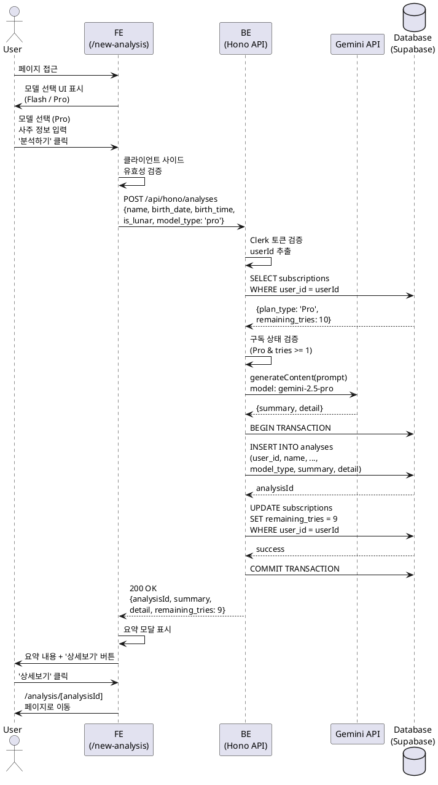

# Usecase 005: Pro 사용자의 사주 분석 (성공)

## 1. 개요

Pro 요금제 구독 사용자가 Gemini 2.5 Flash 또는 2.5 Pro 모델을 선택하여 사주 분석을 요청하고, 남은 횟수가 1회 이상일 때 성공적으로 분석 결과를 받는 기능입니다.

## 2. Primary Actor

- **Pro 구독자 (Pro User)**: Pro 요금제를 구독 중이며, 월 10회의 분석 기회를 가진 인증된 사용자

## 3. Precondition

- 사용자가 Clerk를 통해 인증된 상태
- 사용자의 구독 상태가 'Pro' (`subscriptions.plan_type = 'Pro'`)
- 사용자의 남은 분석 횟수가 1회 이상 (`subscriptions.remaining_tries >= 1`)
- 사용자가 `/new-analysis` 페이지에 접근 가능

## 4. Trigger

사용자가 `/new-analysis` 페이지에서 사주 정보(이름, 생년월일시, 양/음력)를 입력하고, Gemini 모델(Flash 또는 Pro)을 선택한 후 '분석하기' 버튼을 클릭합니다.

## 5. Main Scenario

### 5.1 프론트엔드 (사용자 입력 및 검증)

1. 사용자가 `/new-analysis` 페이지에 접근
2. UI에 모델 선택 옵션 표시 (Gemini 2.5 Flash / Gemini 2.5 Pro)
3. 사용자가 원하는 모델 선택 (예: Gemini 2.5 Pro)
4. 사용자가 폼에 다음 정보 입력:
   - 이름 (name)
   - 생년월일 (birth_date)
   - 태어난 시간 (birth_time) - '모름' 옵션 가능
   - 양/음력 구분 (is_lunar)
5. 프론트엔드에서 클라이언트 사이드 유효성 검증 수행
   - 필수 필드 누락 체크
   - 날짜 형식 체크
6. '분석하기' 버튼 클릭

### 5.2 백엔드 (분석 요청 처리)

7. 프론트엔드가 백엔드 API (`POST /api/hono/analyses` 또는 유사 엔드포인트)로 분석 요청 전송
   - Request Body: `{ name, birth_date, birth_time, is_lunar, model_type }`
   - Authorization: Clerk 세션 토큰
8. 백엔드가 Clerk 세션 토큰 검증하여 `userId` 추출
9. `subscriptions` 테이블에서 해당 `userId`의 구독 정보 조회
10. 구독 상태 검증:
    - `plan_type = 'Pro'` 확인
    - `remaining_tries >= 1` 확인
11. 선택한 모델 타입에 따라 Gemini API 호출
    - Flash 선택 시: `gemini-2.5-flash` 모델
    - Pro 선택 시: `gemini-2.5-pro` 모델
12. Gemini API에 프롬프트 전송:
    - 사주 정보를 포함한 상세 프롬프트 구성
    - 출력 형식 지정 (마크다운, 친절한 문체, 긍정적 관점)
13. Gemini API로부터 분석 결과 수신 (요약 + 상세 텍스트)
14. `analyses` 테이블에 새 레코드 생성:
    - `user_id`: 현재 사용자 ID
    - `name`: 입력받은 이름
    - `birth_date`, `birth_time`, `is_lunar`: 입력받은 사주 정보
    - `model_type`: 선택한 모델 ('flash' 또는 'pro')
    - `summary`: AI가 생성한 요약 텍스트
    - `detail`: AI가 생성한 상세 분석 텍스트 (마크다운 형식)
15. `subscriptions` 테이블의 `remaining_tries` 1 차감
    - UPDATE: `remaining_tries = remaining_tries - 1`
16. 트랜잭션 커밋 (14, 15 단계를 원자적으로 처리)
17. 프론트엔드에 성공 응답 반환:
    - HTTP 200 OK
    - Response Body: `{ analysisId, summary, detail, remaining_tries }`

### 5.3 프론트엔드 (결과 표시)

18. 성공 응답 수신
19. 현재 페이지(`/new-analysis`)에 **요약 내용 모달(Modal)** 표시
20. 모달에 다음 내용 포함:
    - AI가 생성한 요약 텍스트 (`summary`)
    - '상세보기' 버튼
    - 남은 분석 횟수 표시 (업데이트된 `remaining_tries`)
21. 사용자가 '상세보기' 버튼 클릭 시:
    - `/analysis/[analysisId]` 페이지로 이동
    - 상세 분석 내용 (`detail`) 전체 표시

## 6. Edge Cases

### 6.1 남은 횟수 부족 (횟수 소진)

- **조건**: `subscriptions.remaining_tries = 0`
- **처리**:
  - 백엔드가 403 Forbidden 응답 반환 (`QUOTA_EXCEEDED_PRO`)
  - Gemini API 호출하지 않음
  - 프론트엔드가 토스트/모달로 안내 메시지 표시
  - "이번 달 분석 횟수를 모두 사용했습니다. 다음 결제일에 횟수가 갱신됩니다."
  - 리디렉션 없음 (구독 관리 페이지로 이동하지 않음)

### 6.2 Gemini API 호출 실패

- **조건**: Gemini API 서버 오류, 네트워크 타임아웃, API 키 문제
- **처리**:
  - 백엔드가 503 Service Unavailable 응답 반환
  - 횟수 차감하지 않음 (DB 트랜잭션 롤백)
  - 프론트엔드가 에러 메시지 표시
  - "일시적인 오류가 발생했습니다. 잠시 후 다시 시도해주세요."

### 6.3 데이터베이스 저장 실패

- **조건**: `analyses` 테이블 INSERT 또는 `subscriptions` 테이블 UPDATE 실패
- **처리**:
  - 백엔드가 500 Internal Server Error 응답 반환
  - 트랜잭션 롤백으로 횟수 차감 취소
  - 에러 로깅 (관리자 개입 필요)
  - 프론트엔드가 에러 메시지 표시

### 6.4 유효하지 않은 입력값

- **조건**: 필수 필드 누락, 날짜 형식 오류
- **처리**:
  - 프론트엔드가 클라이언트 사이드 검증으로 1차 차단
  - 백엔드가 추가 검증 후 400 Bad Request 응답 반환
  - 구체적인 오류 필드와 메시지 반환

### 6.5 구독 상태 불일치 (Pro → Free 전환)

- **조건**: 결제 실패로 구독이 해지되었으나 클라이언트 캐시가 갱신되지 않음
- **처리**:
  - 백엔드가 최신 DB 상태를 기준으로 검증
  - 403 Forbidden 응답 반환
  - 프론트엔드가 구독 상태 재조회 및 UI 갱신
  - "구독이 해지되었습니다. 구독을 다시 시작하려면 '구독 관리' 페이지를 확인하세요."

### 6.6 중복 요청 (동시성 문제)

- **조건**: 사용자가 짧은 시간 내에 '분석하기' 버튼을 여러 번 클릭
- **처리**:
  - 프론트엔드가 버튼 비활성화 및 로딩 상태 표시
  - 백엔드가 트랜잭션 격리 수준으로 동시성 제어
  - 필요 시 낙관적 락(Optimistic Locking) 구현

## 7. Business Rules

### 7.1 모델 선택 권한

- Free 사용자는 Gemini 2.5 Flash 모델만 사용 가능 (모델 선택 UI 비노출)
- Pro 사용자만 Gemini 2.5 Flash / 2.5 Pro 모델 선택 가능
- 모델 선택 UI는 Pro 사용자에게만 표시됨

### 7.2 횟수 차감 원칙

- 분석 요청은 **Gemini API 호출 성공** 후에만 횟수 차감
- API 호출 실패 또는 DB 저장 실패 시 횟수 차감하지 않음
- 횟수 차감과 분석 결과 저장은 **원자적 트랜잭션**으로 처리

### 7.3 Pro 플랜 횟수 정책

- Pro 사용자는 월 10회의 분석 기회 보유
- 횟수는 정기 결제 성공 시 매월 10회로 리셋
- 남은 횟수는 다음 달로 이월되지 않음
- 구독 해지 시 잔여 횟수는 즉시 소멸

### 7.4 모델별 비용 고려

- Flash 모델: 빠른 응답, 비용 효율적
- Pro 모델: 깊이 있는 분석, 높은 품질, 상대적으로 비용 증가
- 두 모델 모두 동일하게 1회 횟수 차감 (추후 차등 정책 가능)

### 7.5 분석 결과 저장

- 모든 분석 결과는 `analyses` 테이블에 영구 저장
- 사용자는 과거 분석 내역을 `/dashboard`에서 무제한 조회 가능
- 분석 결과는 사용자 본인만 조회 가능 (보안 검증 필요)

### 7.6 Gemini API 프롬프트 정책

- 프롬프트는 다음 내용 포함:
  - 페르소나: "현대적인 감각을 지닌 사주 명리학 전문가"
  - 톤앤매너: 친절하고 이해하기 쉬운 문체, 긍정적 관점
  - 출력 형식: 마크다운 형식의 단락
  - 분석 항목: 성격, 재물운, 직업운, 애정운
- 프롬프트는 백엔드에서 일관되게 관리

### 7.7 External Service Integration

#### Gemini API 연동

- **모델 선택**:
  - Free 사용자: `gemini-2.5-flash` 고정
  - Pro 사용자: `gemini-2.5-flash` 또는 `gemini-2.5-pro` 선택 가능
- **API 키 관리**:
  - 환경 변수 `GEMINI_API_KEY`에서 로드
  - 클라이언트 사이드 노출 금지 (서버 사이드 전용)
- **프롬프트 구조**:
  ```
  당신은 현대적인 감각을 지닌 사주 명리학 전문가입니다.
  다음 정보를 바탕으로 한 사람의 사주 풀이를 생성해주세요.
  결과는 친절하고 이해하기 쉬운 문체로 작성하며, 긍정적인 측면을 부각시켜주세요.
  결과는 마크다운 형식의 단락으로 구성해주세요.

  - 이름: {name}
  - 생년월일: {birth_date}
  - 태어난 시간: {birth_time}
  - 양/음력: {is_lunar ? '음력' : '양력'}

  분석 내용은 성격, 재물운, 직업운, 애정운을 포함해야 합니다.
  ```
- **응답 처리**:
  - `result.response.text()` 메서드로 생성된 텍스트 추출
  - 요약 버전과 상세 버전으로 분리 (필요 시)
- **에러 핸들링**:
  - API 호출 실패 시 503 Service Unavailable 반환
  - 횟수 차감하지 않고 트랜잭션 롤백
  - 에러 로깅 및 모니터링

## 8. Postcondition

- `analyses` 테이블에 새로운 분석 레코드 1건 생성
- `subscriptions.remaining_tries`가 1 감소
- 사용자에게 분석 결과 요약이 모달로 표시됨
- 사용자가 상세 페이지로 이동하여 전체 분석 내용 확인 가능
- 사용자는 해당 분석 결과를 `.md` 파일로 다운로드 가능

## 9. API Specification (Hono Backend)

### 9.1 Endpoint

```
POST /api/hono/analyses
```

### 9.2 Request

#### Headers
```
Authorization: Bearer {clerk_session_token}
Content-Type: application/json
```

#### Body (JSON)
```json
{
  "name": "홍길동",
  "birth_date": "1990-05-15",
  "birth_time": "14:30",
  "is_lunar": false,
  "model_type": "pro"
}
```

#### Schema (Zod)
```typescript
const analyzeRequestSchema = z.object({
  name: z.string().min(1).max(50),
  birth_date: z.string().regex(/^\d{4}-\d{2}-\d{2}$/),
  birth_time: z.string().regex(/^\d{2}:\d{2}$/).nullable().optional(),
  is_lunar: z.boolean(),
  model_type: z.enum(['flash', 'pro'])
});
```

### 9.3 Response

#### Success (200 OK)
```json
{
  "success": true,
  "data": {
    "analysisId": "550e8400-e29b-41d4-a716-446655440000",
    "summary": "홍길동님의 사주는 리더십과 창의력이 돋보이는 구성입니다...",
    "detail": "# 홍길동님의 사주 풀이\n\n## 성격\n...",
    "remaining_tries": 9,
    "model_type": "pro"
  }
}
```

#### Error (403 Forbidden - 횟수 소진)
```json
{
  "success": false,
  "error": {
    "code": "QUOTA_EXCEEDED_PRO",
    "message": "이번 달 분석 횟수를 모두 사용했습니다."
  }
}
```

#### Error (503 Service Unavailable - Gemini API 실패)
```json
{
  "success": false,
  "error": {
    "code": "GEMINI_API_ERROR",
    "message": "일시적인 오류가 발생했습니다. 잠시 후 다시 시도해주세요."
  }
}
```

#### Error (400 Bad Request - 유효하지 않은 입력)
```json
{
  "success": false,
  "error": {
    "code": "INVALID_REQUEST",
    "message": "입력값이 유효하지 않습니다.",
    "details": {
      "birth_date": "날짜 형식은 YYYY-MM-DD여야 합니다."
    }
  }
}
```

### 9.4 Backend Implementation Structure

#### Route Handler (`src/features/analysis/backend/route.ts`)
```typescript
import { Hono } from 'hono';
import { analyzeRequestSchema } from './schema';
import { createAnalysis } from './service';
import { withAuth } from '@/backend/middleware/auth';

const app = new Hono();

app.post('/analyses', withAuth, async (c) => {
  const userId = c.get('userId');
  const body = await c.req.json();

  const validated = analyzeRequestSchema.parse(body);
  const result = await createAnalysis(userId, validated);

  return c.json({
    success: true,
    data: result
  });
});

export default app;
```

#### Service Layer (`src/features/analysis/backend/service.ts`)
```typescript
import { GoogleGenAI } from "@google/genai";
import { supabaseAdmin } from '@/backend/supabase';

export async function createAnalysis(
  userId: string,
  data: {
    name: string;
    birth_date: string;
    birth_time?: string | null;
    is_lunar: boolean;
    model_type: 'flash' | 'pro';
  }
) {
  // 1. 구독 상태 조회 및 검증
  const { data: subscription } = await supabaseAdmin
    .from('subscriptions')
    .select('plan_type, remaining_tries')
    .eq('user_id', userId)
    .single();

  if (!subscription || subscription.plan_type !== 'Pro') {
    throw new Error('PRO_SUBSCRIPTION_REQUIRED');
  }

  if (subscription.remaining_tries < 1) {
    throw new Error('QUOTA_EXCEEDED_PRO');
  }

  // 2. Gemini API 호출
  const genAI = new GoogleGenAI(process.env.GEMINI_API_KEY!);
  const modelName = data.model_type === 'pro'
    ? 'gemini-2.5-pro'
    : 'gemini-2.5-flash';
  const model = genAI.getGenerativeModel({ model: modelName });

  const prompt = buildPrompt(data);
  const result = await model.generateContent(prompt);
  const fullText = result.response.text();

  // 3. DB 트랜잭션 (분석 저장 + 횟수 차감)
  const { data: analysis } = await supabaseAdmin
    .from('analyses')
    .insert({
      user_id: userId,
      name: data.name,
      birth_date: data.birth_date,
      birth_time: data.birth_time,
      is_lunar: data.is_lunar,
      model_type: data.model_type,
      summary: extractSummary(fullText),
      detail: fullText
    })
    .select()
    .single();

  await supabaseAdmin
    .from('subscriptions')
    .update({
      remaining_tries: subscription.remaining_tries - 1
    })
    .eq('user_id', userId);

  return {
    analysisId: analysis.id,
    summary: analysis.summary,
    detail: analysis.detail,
    remaining_tries: subscription.remaining_tries - 1,
    model_type: data.model_type
  };
}

function buildPrompt(data: any): string {
  return `
    당신은 현대적인 감각을 지닌 사주 명리학 전문가입니다.
    다음 정보를 바탕으로 한 사람의 사주 풀이를 생성해주세요.
    결과는 친절하고 이해하기 쉬운 문체로 작성하며, 긍정적인 측면을 부각시켜주세요.
    결과는 마크다운 형식의 단락으로 구성해주세요.

    - 이름: ${data.name}
    - 생년월일: ${data.birth_date}
    - 태어난 시간: ${data.birth_time || '모름'}
    - 양/음력: ${data.is_lunar ? '음력' : '양력'}

    분석 내용은 성격, 재물운, 직업운, 애정운을 포함해야 합니다.
  `;
}

function extractSummary(fullText: string): string {
  // 첫 200자 또는 첫 단락 추출 로직
  return fullText.substring(0, 200) + '...';
}
```

## 10. Sequence Diagram



## 11. Related Usecases

- **Usecase 002**: Free 사용자의 사주 분석 (성공) - 모델 선택 없이 Flash 고정
- **Usecase 003**: Free 사용자의 사주 분석 (횟수 소진) - 구독 관리 페이지로 리디렉션
- **Usecase 006**: Pro 사용자의 사주 분석 (횟수 소진) - 안내 메시지만 표시
- **Usecase 004**: 신규 Pro 플랜 구독 신청 - 횟수 10회 부여
- **Usecase 009**: 정기 결제 및 구독 갱신 - 횟수 10회 리셋
- **Usecase 011**: 분석 내역 조회 (대시보드)
- **Usecase 012**: 분석 상세보기 및 MD 파일 다운로드

## 12. Implementation Checklist

### 12.1 프론트엔드
- [ ] `/new-analysis` 페이지에 Pro 사용자 전용 모델 선택 UI 추가
- [ ] Flash / Pro 선택 라디오 버튼 또는 드롭다운 구현
- [ ] 폼 유효성 검증 (클라이언트 사이드)
- [ ] API 호출 시 `model_type` 파라미터 포함
- [ ] 로딩 상태 및 버튼 비활성화 처리 (중복 요청 방지)
- [ ] 성공 시 요약 모달 표시
- [ ] 에러 처리 (403, 503, 400 등)
- [ ] 남은 횟수 UI 업데이트

### 12.2 백엔드
- [ ] `src/features/analysis/backend/route.ts` 생성
- [ ] `src/features/analysis/backend/service.ts` 생성
- [ ] `src/features/analysis/backend/schema.ts` 생성 (Zod 스키마)
- [ ] Clerk 인증 미들웨어 적용
- [ ] 구독 상태 검증 로직 구현
- [ ] Gemini API 클라이언트 초기화
- [ ] 모델별 분기 로직 (Flash / Pro)
- [ ] 프롬프트 빌더 함수 구현
- [ ] DB 트랜잭션 처리 (analyses INSERT + subscriptions UPDATE)
- [ ] 에러 핸들링 및 로깅

### 12.3 데이터베이스
- [ ] `analyses` 테이블 `model_type` 컬럼 확인
- [ ] `subscriptions` 테이블 인덱스 최적화
- [ ] 트랜잭션 격리 수준 설정

### 12.4 환경 설정
- [ ] `.env.local`에 `GEMINI_API_KEY` 추가
- [ ] Gemini API 키 발급 및 검증
- [ ] Vertex AI (선택사항) 설정 검토

### 12.5 테스트
- [ ] Pro 사용자 분석 성공 시나리오 테스트
- [ ] Flash / Pro 모델 선택 테스트
- [ ] 횟수 차감 검증
- [ ] Gemini API 실패 시나리오 테스트
- [ ] DB 트랜잭션 롤백 테스트
- [ ] 동시 요청 처리 테스트
- [ ] 보안 검증 (타인 분석 접근 차단)
