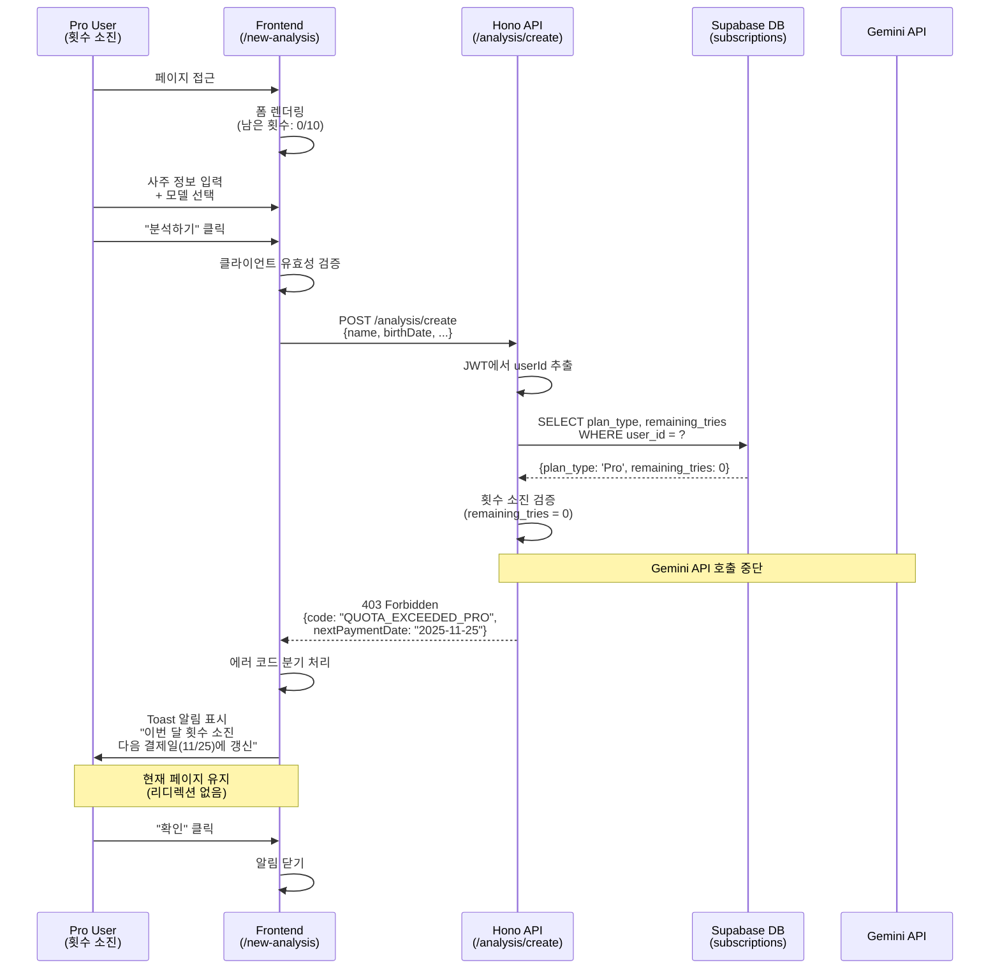

# Usecase 006: Pro 사용자의 사주 분석 (횟수 소진)

## 1. Overview

### 1.1 Feature Summary
Pro 플랜 사용자가 월 10회의 분석 횟수를 모두 소진한 상태에서 새로운 사주 분석을 시도하는 경우, 시스템은 Gemini API 호출 없이 요청을 거부하고 적절한 안내 메시지를 표시합니다. 이는 Free 플랜의 횟수 소진 케이스와 유사하지만, Pro 사용자의 경우 구독 관리 페이지로 리디렉션하지 않고 다음 결제일에 횟수가 갱신된다는 안내를 제공합니다.

### 1.2 User Journey Reference
- **PRD Section**: 3. 포함 페이지 - "새 분석하기"
- **Userflow**: 6. Pro 사용자의 사주 분석 (횟수 소진)
- **Related Usecases**:
  - Usecase 003 (Free 사용자의 사주 분석 - 횟수 소진)
  - Usecase 005 (Pro 사용자의 사주 분석 - 성공)

### 1.3 Success Criteria
- Pro 사용자가 `remaining_tries = 0` 상태에서 분석 요청 시, Gemini API 호출이 발생하지 않음
- 적절한 에러 코드(`403 Forbidden / QUOTA_EXCEEDED_PRO`)가 반환됨
- 프론트엔드에서 다음 결제일 안내를 포함한 알림 메시지가 표시됨
- 데이터베이스 상태가 변경되지 않음 (횟수 차감 없음)
- 구독 관리 페이지로 강제 리디렉션되지 않음

---

## 2. User Flow

### 2.1 Preconditions
- 사용자가 Clerk를 통해 인증된 상태
- 사용자의 `subscriptions.plan_type = 'Pro'`
- 사용자의 `subscriptions.remaining_tries = 0`
- 사용자의 `subscriptions.next_payment_date`가 존재하고 미래 날짜임

### 2.2 Main Flow

#### Step 1: 페이지 접근
**Actor**: Pro 사용자 (횟수 소진 상태)
**Action**: `/new-analysis` 페이지에 접근
**System Response**:
- 사주 정보 입력 폼 렌더링
- Gemini 모델 선택 UI 노출 (Flash / Pro)
- 현재 남은 횟수 표시 (0/10)

#### Step 2: 사주 정보 입력
**Actor**: Pro 사용자
**Action**:
- 이름, 생년월일, 양/음력 정보 입력
- 시간 정보 입력 또는 '모름' 체크
- 모델 선택 (Flash 또는 Pro)

**System Response**:
- 입력 필드 유효성 검사 (클라이언트 사이드)

#### Step 3: 분석 요청
**Actor**: Pro 사용자
**Action**: '분석하기' 버튼 클릭
**System Response**:
- 프론트엔드에서 백엔드 API로 POST 요청 전송
  - Endpoint: `/api/analysis/create` (또는 Hono 라우트)
  - Headers: `Authorization: Bearer {Clerk JWT}`
  - Body:
    ```json
    {
      "name": "홍길동",
      "birthDate": "1990-01-15",
      "birthTime": "14:30",
      "isLunar": false,
      "modelType": "pro"
    }
    ```

#### Step 4: 구독 상태 검증 (Backend)
**System Action**:
1. Clerk JWT에서 `userId` 추출
2. Supabase `subscriptions` 테이블 조회:
   ```sql
   SELECT plan_type, remaining_tries, next_payment_date
   FROM subscriptions
   WHERE user_id = $1
   ```
3. 조회 결과 검증:
   - `plan_type = 'Pro'` ✓
   - `remaining_tries = 0` ✓ (횟수 소진)

#### Step 5: 횟수 소진 에러 응답
**System Action**:
- Gemini API 호출 중단
- 데이터베이스 변경 없음
- HTTP 응답:
  ```json
  {
    "ok": false,
    "status": 403,
    "error": {
      "code": "QUOTA_EXCEEDED_PRO",
      "message": "이번 달 분석 횟수를 모두 사용했습니다.",
      "details": {
        "planType": "Pro",
        "remainingTries": 0,
        "nextPaymentDate": "2025-11-25"
      }
    }
  }
  ```

#### Step 6: 사용자 안내
**Actor**: 프론트엔드
**Action**:
- 에러 응답 수신 후 `error.code === 'QUOTA_EXCEEDED_PRO'` 분기 처리
- 토스트 또는 모달 형태로 안내 메시지 표시:
  ```
  이번 달 분석 횟수를 모두 사용했습니다.
  다음 결제일(YYYY-MM-DD)에 횟수가 갱신됩니다.
  ```
- 현재 페이지(`/new-analysis`)에 유지 (리디렉션 없음)
- 사용자가 '확인' 버튼을 클릭하거나 일정 시간 후 알림 자동 닫힘

### 2.3 Postconditions
- 사용자가 다음 결제일 정보를 인지
- `subscriptions` 테이블 상태 불변
- `analyses` 테이블에 새로운 레코드 생성 안 됨
- Gemini API 호출 비용 발생 안 됨

---

## 3. Business Rules

### 3.1 Quota Management
- **Pro 플랜 월간 할당량**: 10회
- **횟수 차감 시점**: 분석 성공적으로 완료된 후에만 차감 (Gemini API 호출 성공 + DB 저장 성공)
- **횟수 갱신 시점**:
  - 매월 정기 결제 성공 시 `remaining_tries = 10`으로 리셋
  - Cron Job (`/api/cron/process-subscriptions`) 실행 시점: 매일 02:00 KST
- **횟수 소진 상태 지속 기간**: 다음 결제일까지

### 3.2 Error Handling
- **에러 코드**: `QUOTA_EXCEEDED_PRO`
- **HTTP Status**: `403 Forbidden`
- **에러 메시지 원칙**:
  - 명확성: 현재 상태(횟수 소진)와 해결 방법(다음 결제일 대기) 명시
  - 일관성: Free 플랜 횟수 소진(`QUOTA_EXCEEDED`)과 구분
  - 정보성: `next_payment_date` 포함하여 대기 기간 예측 가능

### 3.3 External Service Integration
- **Gemini API**:
  - 횟수 소진 상태에서는 API 호출하지 않음 (비용 절감)
  - 요청 전 구독 상태 검증 필수

### 3.4 Data Integrity
- **원자성(Atomicity)**: 횟수 검증 실패 시 어떠한 데이터 변경도 발생하지 않음
- **일관성(Consistency)**: `remaining_tries` 값은 항상 0 이상 10 이하 유지
- **격리성(Isolation)**: 동시 요청 시 횟수 차감 경쟁 조건(Race Condition) 방지 필요
  - 해결 방안: DB 트랜잭션 + `SELECT FOR UPDATE` 또는 Optimistic Locking

---

## 4. API Specification

### 4.1 Request Analysis (POST)

#### Endpoint
```
POST /api/analysis/create
```
또는 Hono 라우트:
```
POST /analysis/create
```

#### Headers
```http
Authorization: Bearer {Clerk JWT}
Content-Type: application/json
```

#### Request Body Schema
```typescript
// src/features/analysis/backend/schema.ts
import { z } from 'zod';

export const CreateAnalysisRequestSchema = z.object({
  name: z.string().min(1, 'Name is required').max(50),
  birthDate: z.string().regex(/^\d{4}-\d{2}-\d{2}$/, 'Invalid date format (YYYY-MM-DD)'),
  birthTime: z.string().regex(/^\d{2}:\d{2}$/, 'Invalid time format (HH:MM)').nullable(),
  isLunar: z.boolean().default(false),
  modelType: z.enum(['flash', 'pro'], {
    errorMap: () => ({ message: 'Model type must be either "flash" or "pro"' }),
  }),
});

export type CreateAnalysisRequest = z.infer<typeof CreateAnalysisRequestSchema>;
```

#### Example Request
```json
{
  "name": "홍길동",
  "birthDate": "1990-01-15",
  "birthTime": "14:30",
  "isLunar": false,
  "modelType": "pro"
}
```

### 4.2 Response Specification

#### Success Response (Not applicable for this usecase)
```typescript
// This usecase only covers the quota exceeded scenario
// For success response, see Usecase 005
```

#### Error Response: Quota Exceeded
```typescript
// src/features/analysis/backend/error.ts
export const analysisErrorCodes = {
  quotaExceeded: 'QUOTA_EXCEEDED',           // Free plan quota exceeded
  quotaExceededPro: 'QUOTA_EXCEEDED_PRO',    // Pro plan quota exceeded
  invalidInput: 'INVALID_ANALYSIS_INPUT',
  geminiApiError: 'GEMINI_API_ERROR',
  dbError: 'ANALYSIS_DB_ERROR',
  unauthorized: 'ANALYSIS_UNAUTHORIZED',
} as const;

export type AnalysisServiceError =
  (typeof analysisErrorCodes)[keyof typeof analysisErrorCodes];
```

#### HTTP Response
```http
HTTP/1.1 403 Forbidden
Content-Type: application/json
```

```json
{
  "ok": false,
  "status": 403,
  "error": {
    "code": "QUOTA_EXCEEDED_PRO",
    "message": "이번 달 분석 횟수를 모두 사용했습니다.",
    "details": {
      "planType": "Pro",
      "remainingTries": 0,
      "maxTries": 10,
      "nextPaymentDate": "2025-11-25"
    }
  }
}
```

#### Response Schema
```typescript
// src/features/analysis/backend/schema.ts
export const QuotaExceededResponseSchema = z.object({
  ok: z.literal(false),
  status: z.literal(403),
  error: z.object({
    code: z.literal('QUOTA_EXCEEDED_PRO'),
    message: z.string(),
    details: z.object({
      planType: z.literal('Pro'),
      remainingTries: z.literal(0),
      maxTries: z.literal(10),
      nextPaymentDate: z.string(), // ISO date format (YYYY-MM-DD)
    }),
  }),
});

export type QuotaExceededResponse = z.infer<typeof QuotaExceededResponseSchema>;
```

### 4.3 Backend Implementation Pseudocode

```typescript
// src/features/analysis/backend/route.ts
import { Hono } from 'hono';
import { getSupabase, getLogger, type AppEnv } from '@/backend/hono/context';
import { respond, failure } from '@/backend/http/response';
import { CreateAnalysisRequestSchema } from './schema';
import { analysisErrorCodes } from './error';
import { createAnalysis } from './service';

export const registerAnalysisRoutes = (app: Hono<AppEnv>) => {
  app.post('/analysis/create', async (c) => {
    // 1. Request body validation
    const body = await c.req.json();
    const parsedBody = CreateAnalysisRequestSchema.safeParse(body);

    if (!parsedBody.success) {
      return respond(
        c,
        failure(
          400,
          analysisErrorCodes.invalidInput,
          'Invalid analysis request',
          parsedBody.error.format(),
        ),
      );
    }

    // 2. Extract userId from Clerk JWT
    const auth = c.req.header('Authorization');
    const userId = extractUserIdFromJWT(auth); // Clerk helper function

    if (!userId) {
      return respond(
        c,
        failure(
          401,
          analysisErrorCodes.unauthorized,
          'Unauthorized request',
        ),
      );
    }

    // 3. Call service layer
    const supabase = getSupabase(c);
    const logger = getLogger(c);
    const result = await createAnalysis(supabase, userId, parsedBody.data);

    // 4. Handle quota exceeded error
    if (!result.ok && result.error.code === analysisErrorCodes.quotaExceededPro) {
      return respond(c, result); // Return 403 with detailed error
    }

    // 5. Handle other errors or success
    return respond(c, result);
  });
};
```

```typescript
// src/features/analysis/backend/service.ts
import type { SupabaseClient } from '@supabase/supabase-js';
import type { Result } from '@/backend/http/response';
import { success, failure } from '@/backend/http/response';
import { analysisErrorCodes } from './error';
import type { CreateAnalysisRequest } from './schema';

export async function createAnalysis(
  supabase: SupabaseClient,
  userId: string,
  request: CreateAnalysisRequest
): Promise<Result<AnalysisResponse, AnalysisServiceError>> {

  // 1. Fetch subscription status
  const { data: subscription, error: subError } = await supabase
    .from('subscriptions')
    .select('plan_type, remaining_tries, next_payment_date')
    .eq('user_id', userId)
    .single();

  if (subError || !subscription) {
    return failure(
      500,
      analysisErrorCodes.dbError,
      'Failed to fetch subscription',
      subError,
    );
  }

  // 2. Check quota for Pro plan
  if (subscription.plan_type === 'Pro' && subscription.remaining_tries === 0) {
    return failure(
      403,
      analysisErrorCodes.quotaExceededPro,
      '이번 달 분석 횟수를 모두 사용했습니다.',
      {
        planType: 'Pro',
        remainingTries: 0,
        maxTries: 10,
        nextPaymentDate: subscription.next_payment_date,
      },
    );
  }

  // 3. Proceed with analysis (Gemini API call, DB save, etc.)
  // ... (see Usecase 005 for success flow)
}
```

---

## 5. Database Schema

### 5.1 Relevant Tables

#### subscriptions
```sql
-- 기존 테이블 구조 활용 (database.md 참조)
SELECT
  user_id,
  plan_type,
  remaining_tries,
  next_payment_date
FROM subscriptions
WHERE user_id = $1;
```

### 5.2 Query Examples

#### Check Pro User Quota
```sql
-- 횟수 소진 여부 확인
SELECT
  plan_type,
  remaining_tries,
  next_payment_date,
  CASE
    WHEN plan_type = 'Pro' AND remaining_tries > 0 THEN true
    ELSE false
  END AS can_analyze
FROM subscriptions
WHERE user_id = $1;
```

#### Quota Status Monitoring (Admin)
```sql
-- Pro 플랜 사용자 중 횟수 소진 현황
SELECT
  user_id,
  remaining_tries,
  next_payment_date,
  DATE(next_payment_date) - CURRENT_DATE AS days_until_renewal
FROM subscriptions
WHERE plan_type = 'Pro'
  AND remaining_tries = 0
ORDER BY next_payment_date ASC;
```

---

## 6. UI/UX Specifications

### 6.1 Page State: Before Request

**Component**: `/new-analysis` 페이지

**Display Elements**:
- 남은 횟수 배지: "분석 가능 횟수: 0/10" (빨간색 또는 경고색)
- 모델 선택 UI: 활성화 상태 (선택 가능)
- 분석하기 버튼: 활성화 상태

**Recommended UX Enhancement** (Optional):
- 횟수가 0일 때 "분석하기" 버튼에 비활성화 스타일 적용
- 버튼 위에 "다음 결제일(YYYY-MM-DD)에 횟수가 갱신됩니다" 툴팁 표시

### 6.2 Error Notification

**Type**: Toast Notification 또는 Modal

**Content**:
```
제목: 분석 횟수 소진
내용: 이번 달 분석 횟수를 모두 사용했습니다.
      다음 결제일(2025-11-25)에 10회 횟수가 갱신됩니다.
버튼: [확인]
```

**Styling Guidelines**:
- Icon: ⚠️ 또는 정보 아이콘
- Color: Warning (Orange/Yellow) 또는 Info (Blue)
- Duration: Toast인 경우 5초 자동 닫힘, Modal인 경우 사용자가 확인 클릭 시 닫힘

**No Redirect**:
- Free 플랜 횟수 소진과 달리, `/subscription` 페이지로 자동 리디렉션하지 않음
- 사용자는 현재 페이지(`/new-analysis`)에 유지됨

### 6.3 Frontend Error Handling

```typescript
// Example: React component error handling
import { useMutation } from '@tanstack/react-query';
import { toast } from 'sonner'; // or your toast library

function NewAnalysisPage() {
  const createAnalysisMutation = useMutation({
    mutationFn: (data: CreateAnalysisRequest) =>
      apiClient.post('/analysis/create', data),
    onError: (error) => {
      if (error.response?.data?.error?.code === 'QUOTA_EXCEEDED_PRO') {
        const details = error.response.data.error.details;
        toast.warning('분석 횟수 소진', {
          description: `이번 달 분석 횟수를 모두 사용했습니다.\n다음 결제일(${details.nextPaymentDate})에 횟수가 갱신됩니다.`,
          duration: 5000,
        });
        // Stay on current page (no redirect)
      } else {
        toast.error('분석 요청 실패', {
          description: error.response?.data?.error?.message || '알 수 없는 오류가 발생했습니다.',
        });
      }
    },
  });

  // ... rest of component
}
```

---

## 7. Edge Cases

### 7.1 Concurrent Requests (Race Condition)
**Scenario**: Pro 사용자가 `remaining_tries = 1` 상태에서 두 개의 분석 요청을 거의 동시에 전송

**Expected Behavior**:
- 첫 번째 요청: 성공 처리, `remaining_tries = 0`으로 차감
- 두 번째 요청: `QUOTA_EXCEEDED_PRO` 에러 반환

**Solution**:
```sql
-- Use SELECT FOR UPDATE to prevent race condition
BEGIN;

SELECT remaining_tries
FROM subscriptions
WHERE user_id = $1
FOR UPDATE; -- Lock the row

-- Check quota, then update
UPDATE subscriptions
SET remaining_tries = remaining_tries - 1
WHERE user_id = $1 AND remaining_tries > 0
RETURNING remaining_tries;

COMMIT;
```

### 7.2 Subscription Renewal During Request
**Scenario**: 사용자가 분석 요청 중 정기 결제 Cron Job이 실행되어 횟수가 갱신됨

**Expected Behavior**:
- 요청 시작 시점의 `remaining_tries` 상태로 처리
- DB 트랜잭션을 사용하여 일관성 보장

**Solution**:
- 트랜잭션 격리 수준 `READ COMMITTED` 이상 사용
- 분석 요청 처리는 평균 5-10초 소요, Cron Job은 02:00에 실행되므로 실제 충돌 확률 낮음

### 7.3 Next Payment Date Missing
**Scenario**: `subscriptions.next_payment_date`가 `null`인 Pro 사용자 (데이터 정합성 오류)

**Expected Behavior**:
- 횟수 소진 에러는 정상 반환
- `next_payment_date` 없이 안내 메시지 표시: "횟수가 소진되었습니다. 구독 관리 페이지를 확인해주세요."
- 백엔드에서 Warning 로그 기록

**Solution**:
```typescript
if (subscription.plan_type === 'Pro' && subscription.remaining_tries === 0) {
  if (!subscription.next_payment_date) {
    logger.warn(`Pro user ${userId} has 0 tries but no next_payment_date`);
  }

  return failure(
    403,
    analysisErrorCodes.quotaExceededPro,
    '이번 달 분석 횟수를 모두 사용했습니다.',
    {
      planType: 'Pro',
      remainingTries: 0,
      maxTries: 10,
      nextPaymentDate: subscription.next_payment_date || null,
    },
  );
}
```

### 7.4 Client-Side Manipulation
**Scenario**: 악의적인 사용자가 프론트엔드에서 "분석하기" 버튼을 강제로 활성화하여 요청 전송

**Expected Behavior**:
- 클라이언트 사이드 검증과 무관하게 백엔드에서 횟수 검증 수행
- `QUOTA_EXCEEDED_PRO` 에러 반환
- 분석 처리 중단

**Solution**:
- "Never trust the client" 원칙 준수
- 모든 권한 및 할당량 검증은 백엔드에서 수행

---

## 8. Sequence Diagram



---

## 9. Testing Checklist

### 9.1 Unit Tests
- [ ] `CreateAnalysisRequestSchema` 유효성 검증 테스트
- [ ] `analysisErrorCodes.quotaExceededPro` 상수 정의 확인
- [ ] `createAnalysis` 서비스 함수:
  - [ ] Pro 플랜, `remaining_tries = 0` 입력 시 `QUOTA_EXCEEDED_PRO` 반환
  - [ ] `next_payment_date` 포함된 에러 상세 정보 반환
  - [ ] Gemini API 모킹하여 호출되지 않음 확인

### 9.2 Integration Tests
- [ ] Hono 라우트 `/analysis/create` 엔드포인트:
  - [ ] Pro 사용자, 횟수 0인 상태에서 요청 시 403 응답
  - [ ] 응답 body에 `error.code = "QUOTA_EXCEEDED_PRO"` 포함
  - [ ] 응답 body에 `error.details.nextPaymentDate` 포함
- [ ] Database 상태 불변 확인:
  - [ ] `subscriptions.remaining_tries` 값 변경 없음
  - [ ] `analyses` 테이블에 신규 레코드 미생성

### 9.3 E2E Tests
- [ ] Pro 사용자로 로그인 후 `/new-analysis` 접근
- [ ] DB에서 해당 사용자의 `remaining_tries` 를 0으로 설정
- [ ] 분석 폼 작성 및 제출
- [ ] Toast 알림에 "이번 달 분석 횟수를 모두 사용했습니다" 메시지 표시 확인
- [ ] Toast 알림에 다음 결제일 정보 표시 확인
- [ ] 현재 페이지(`/new-analysis`)에 유지됨 확인 (리디렉션 없음)

### 9.4 Performance Tests
- [ ] 100명의 Pro 사용자가 동시에 횟수 소진 상태에서 요청 시 응답 시간 측정 (< 500ms)
- [ ] Gemini API 호출이 발생하지 않아 비용 절감 확인

### 9.5 Security Tests
- [ ] 클라이언트에서 조작된 요청 (remaining_tries 값 변조) 방지 확인
- [ ] 타 사용자의 JWT로 요청 시 401 Unauthorized 반환
- [ ] SQL Injection 시도 시 에러 처리 확인

---

## 10. Related Documentation

### 10.1 Internal References
- **PRD**: `docs/prd.md` - Section 3 (새 분석하기), Section 2 (요금제 정책)
- **Userflow**: `docs/userflow.md` - Flow 6 (Pro 사용자의 사주 분석 - 횟수 소진)
- **Database**: `docs/database.md` - Section 3.2 (subscriptions 테이블)
- **Related Usecases**:
  - Usecase 003: Free 사용자의 사주 분석 (횟수 소진)
  - Usecase 005: Pro 사용자의 사주 분석 (성공)
  - Usecase 009: 정기 결제 및 구독 갱신

### 10.2 External Service Documentation
- **Gemini API**: `docs/external/gemini.md` - Section 2.2 (서버사이드 SDK 구현)
- **Clerk Auth**: `docs/external/clerk.md` - JWT 검증 및 userId 추출

### 10.3 Code References
- `src/features/analysis/backend/route.ts`: Hono 라우터 구현
- `src/features/analysis/backend/service.ts`: 비즈니스 로직 (횟수 검증)
- `src/features/analysis/backend/schema.ts`: 요청/응답 스키마
- `src/features/analysis/backend/error.ts`: 에러 코드 정의
- `src/backend/http/response.ts`: 공통 응답 포맷 (`failure`, `respond`)

---

## 11. Implementation Notes

### 11.1 Backend Considerations
- **Early Return Pattern**: 횟수 검증 실패 시 즉시 에러 반환, Gemini API 호출 방지
- **Error Code Segregation**: Free 플랜(`QUOTA_EXCEEDED`)과 Pro 플랜(`QUOTA_EXCEEDED_PRO`) 에러 코드 명확히 구분
- **Logging**: 횟수 소진 이벤트는 Warning 수준으로 로깅 (정상적인 비즈니스 플로우이므로 Error 아님)
- **Cost Optimization**: API 호출 없이 처리하여 Gemini API 비용 절감

### 11.2 Frontend Considerations
- **User-Friendly Messaging**: 단순 "권한 없음" 메시지가 아닌, 다음 갱신 날짜를 포함한 구체적인 안내
- **No Forced Redirect**: 사용자가 현재 작업 컨텍스트를 유지할 수 있도록 리디렉션하지 않음
- **Visual Feedback**: 횟수가 0일 때 UI에서 시각적으로 구분 (배지 색상, 버튼 상태 등)

### 11.3 Monitoring & Analytics
- **Metric Tracking**:
  - Pro 플랜 횟수 소진 요청 빈도 (월별 추이)
  - 평균 횟수 소진 도달 일자 (월 초대비 며칠째?)
  - 횟수 소진 후 사용자 행동 (구독 해지율, 재방문율)
- **Alert Setup**:
  - Pro 사용자 중 50% 이상이 월 중반 전에 횟수 소진 시 알림 (할당량 조정 검토 필요)

---

## 12. Changelog

| Version | Date | Author | Changes |
|---------|------|--------|---------|
| 1.0 | 2025-10-25 | Claude | Initial specification created |

---

## 13. Appendix

### 13.1 Error Code Reference

| Error Code | HTTP Status | Plan Type | Description |
|------------|-------------|-----------|-------------|
| `QUOTA_EXCEEDED` | 403 | Free | Free 플랜 총 3회 소진 |
| `QUOTA_EXCEEDED_PRO` | 403 | Pro | Pro 플랜 월 10회 소진 |
| `INVALID_ANALYSIS_INPUT` | 400 | All | 입력값 유효성 검증 실패 |
| `GEMINI_API_ERROR` | 503 | All | Gemini API 호출 실패 |
| `ANALYSIS_DB_ERROR` | 500 | All | 데이터베이스 오류 |
| `ANALYSIS_UNAUTHORIZED` | 401 | All | 인증 실패 |

### 13.2 Pro Plan Quota Lifecycle

```
구독 시작 (Pro 전환)
  ↓
remaining_tries = 10
  ↓
분석 요청 1회 → remaining_tries = 9
  ↓
... (반복)
  ↓
분석 요청 10회 → remaining_tries = 0
  ↓
[횟수 소진 상태] ← 현재 Usecase
  ↓
정기 결제 성공 (다음 달 1일)
  ↓
remaining_tries = 10 (리셋)
  ↓
(반복)
```

### 13.3 Comparison: Free vs Pro Quota Exceeded

| Aspect | Free (QUOTA_EXCEEDED) | Pro (QUOTA_EXCEEDED_PRO) |
|--------|------------------------|--------------------------|
| 할당량 | 총 3회 (평생) | 월 10회 |
| 횟수 갱신 | 없음 (구독 업그레이드 필요) | 매월 정기 결제 시 |
| 에러 코드 | `QUOTA_EXCEEDED` | `QUOTA_EXCEEDED_PRO` |
| 사용자 안내 | "구독하여 계속 이용하세요" | "다음 결제일에 갱신됩니다" |
| 리디렉션 | `/subscription`로 자동 이동 | 현재 페이지 유지 |
| 해결 방법 | Pro 구독 신청 | 다음 결제일 대기 |

---

**Document Status**: ✅ Ready for Implementation
**Priority**: P1 (Core User Flow)
**Estimated Implementation Time**: 2-3 hours (Backend + Frontend + Tests)
