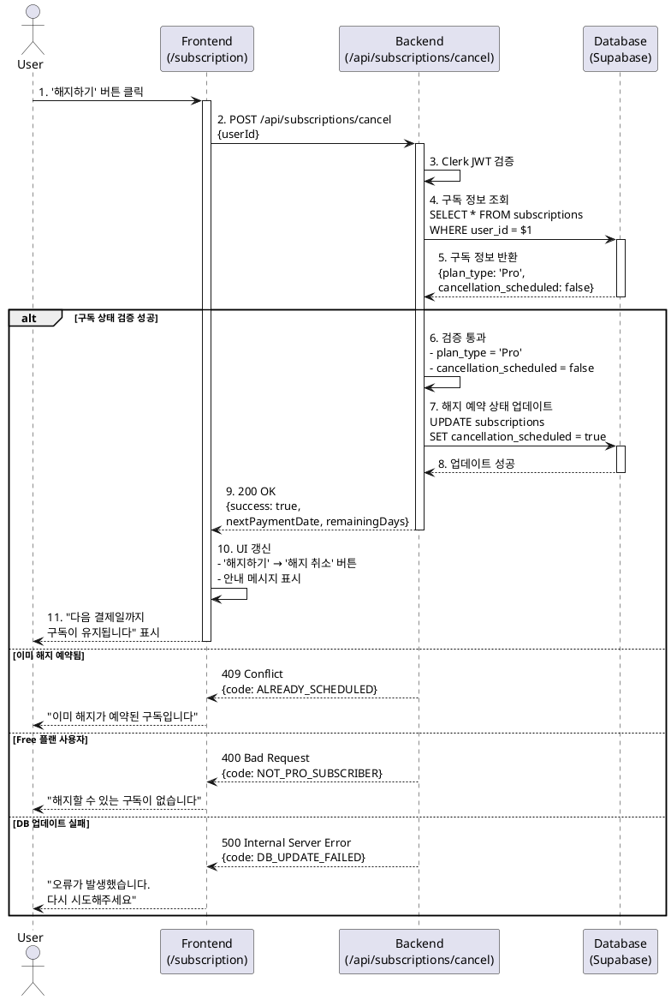

# UC-007: Pro 구독 해지 신청 (해지 예약)

## Primary Actor
Pro 요금제 구독 중인 사용자

## Precondition
- 사용자가 Clerk를 통해 인증된 상태
- 사용자의 구독 상태가 'Pro'
- 해지 예약 상태가 아님 (`cancellation_scheduled = false`)
- 유효한 빌링키가 존재함

## Trigger
사용자가 `/subscription` 페이지에서 '해지하기' 버튼을 클릭

## Main Scenario

### 1. 사용자가 구독 관리 페이지 접근
- 사용자가 `/subscription` 페이지로 이동
- 현재 구독 정보가 표시됨 (요금제, 다음 결제일, 남은 분석 횟수)
- '해지하기' 버튼이 노출됨

### 2. 해지 신청 요청
- 사용자가 '해지하기' 버튼 클릭
- 프론트엔드가 `POST /api/subscriptions/cancel` 엔드포인트로 요청 전송
  - Request Body: `{ userId: string }`

### 3. 백엔드 검증 및 처리
- 백엔드가 Clerk JWT를 통해 사용자 인증 검증
- `subscriptions` 테이블에서 해당 사용자의 구독 정보 조회
- 구독 상태 검증:
  - `plan_type = 'Pro'` 확인
  - `cancellation_scheduled = false` 확인
- **중요**: 토스페이먼츠 빌링키 삭제 API 호출하지 않음 (해지 예약 단계이므로)
- `subscriptions` 테이블 업데이트:
  - `cancellation_scheduled = true`
  - `updated_at = now()`

### 4. 응답 및 UI 갱신
- 백엔드가 성공 응답 반환:
  ```json
  {
    "success": true,
    "message": "구독 해지가 예약되었습니다.",
    "nextPaymentDate": "2025-11-25",
    "remainingDays": 30
  }
  ```
- 프론트엔드 UI 갱신:
  - '해지하기' 버튼이 '해지 취소' 버튼으로 변경
  - 안내 메시지 표시: "다음 결제일(YYYY-MM-DD)까지 구독이 유지됩니다."
  - 현재 Pro 혜택(모델 선택, 남은 횟수)은 유지됨

### 5. 해지 예약 기간 중 서비스 이용
- 사용자는 다음 결제일까지 Pro 혜택을 정상적으로 이용 가능
- 남은 분석 횟수 내에서 분석 요청 가능
- Gemini Pro 모델 선택 가능

## Edge Cases

### E1. 이미 해지 예약된 구독
**조건**: `cancellation_scheduled = true`인 상태에서 다시 해지 요청
**처리**:
- HTTP 409 Conflict 응답
- Error Code: `ALREADY_SCHEDULED_FOR_CANCELLATION`
- 메시지: "이미 해지가 예약된 구독입니다."

### E2. Free 플랜 사용자의 해지 요청
**조건**: `plan_type = 'Free'`인 사용자가 해지 요청
**처리**:
- HTTP 400 Bad Request 응답
- Error Code: `NOT_PRO_SUBSCRIBER`
- 메시지: "해지할 수 있는 구독이 없습니다."

### E3. 데이터베이스 업데이트 실패
**조건**: DB 트랜잭션 실패 (네트워크 오류, 제약 조건 위반 등)
**처리**:
- HTTP 500 Internal Server Error 응답
- Error Code: `DB_UPDATE_FAILED`
- 에러 로깅 (Sentry, CloudWatch 등)
- 사용자에게 재시도 안내

### E4. 인증되지 않은 요청
**조건**: 유효하지 않은 Clerk JWT 또는 토큰 없음
**처리**:
- HTTP 401 Unauthorized 응답
- Error Code: `UNAUTHORIZED`
- 로그인 페이지로 리디렉션

### E5. 구독 정보가 존재하지 않음
**조건**: `subscriptions` 테이블에 해당 사용자의 레코드 없음
**처리**:
- HTTP 404 Not Found 응답
- Error Code: `SUBSCRIPTION_NOT_FOUND`
- 에러 로깅 (데이터 정합성 문제 가능성)

## Business Rules

### BR1. 해지 예약 정책
- 해지 신청 시 즉시 해지되지 않고, 다음 결제일까지 구독 유지
- 해지 예약 기간 동안 Pro 혜택 모두 유지
- 다음 결제일 02:00에 자동 해지 처리 (Cron Job)

### BR2. 빌링키 보존
- 해지 예약 단계에서는 빌링키를 삭제하지 않음
- 사용자가 해지 취소할 수 있도록 빌링키 유지
- 실제 해지 시점(결제일)에만 빌링키 삭제

### BR3. 해지 취소 가능 기간
- 다음 결제일 전까지 언제든 해지 취소 가능
- 해지 취소 시 `cancellation_scheduled = false`로 변경
- 다음 결제일에 정상적으로 정기 결제 진행

### BR4. 잔여 횟수 처리
- 해지 예약 기간 동안 잔여 횟수는 정상적으로 차감
- 실제 해지 시 잔여 횟수는 소멸 (`remaining_tries = 0`)

### BR5. 재구독 정책
- 해지 완료 후 재구독 시 결제수단 재등록 필요
- 빌링키가 삭제되었으므로 토스페이먼츠 SDK를 통한 새로운 빌링키 발급 필요

### BR6. External Service Integration
- **토스페이먼츠**: 해지 예약 단계에서는 API 호출 없음
- 실제 해지 처리 시점(Cron Job)에 `DELETE /v1/billing/authorizations/{billingKey}` 호출하여 빌링키 삭제

## API Specification

### Endpoint
```
POST /api/subscriptions/cancel
```

### Request Headers
```
Authorization: Bearer <Clerk JWT>
Content-Type: application/json
```

### Request Body
```json
{
  "userId": "user_2a1b3c4d5e6f"
}
```

### Success Response (200 OK)
```json
{
  "success": true,
  "message": "구독 해지가 예약되었습니다.",
  "data": {
    "planType": "Pro",
    "cancellationScheduled": true,
    "nextPaymentDate": "2025-11-25",
    "remainingDays": 30,
    "remainingTries": 7
  }
}
```

### Error Responses

#### 400 Bad Request - Free 플랜 사용자
```json
{
  "success": false,
  "error": {
    "code": "NOT_PRO_SUBSCRIBER",
    "message": "해지할 수 있는 구독이 없습니다."
  }
}
```

#### 401 Unauthorized - 인증 실패
```json
{
  "success": false,
  "error": {
    "code": "UNAUTHORIZED",
    "message": "인증이 필요합니다."
  }
}
```

#### 404 Not Found - 구독 정보 없음
```json
{
  "success": false,
  "error": {
    "code": "SUBSCRIPTION_NOT_FOUND",
    "message": "구독 정보를 찾을 수 없습니다."
  }
}
```

#### 409 Conflict - 이미 해지 예약됨
```json
{
  "success": false,
  "error": {
    "code": "ALREADY_SCHEDULED_FOR_CANCELLATION",
    "message": "이미 해지가 예약된 구독입니다."
  }
}
```

#### 500 Internal Server Error - DB 오류
```json
{
  "success": false,
  "error": {
    "code": "DB_UPDATE_FAILED",
    "message": "서버 오류가 발생했습니다. 잠시 후 다시 시도해주세요."
  }
}
```

## Database Changes

### subscriptions 테이블 업데이트
```sql
UPDATE subscriptions
SET
  cancellation_scheduled = true,
  updated_at = now()
WHERE
  user_id = $1
  AND plan_type = 'Pro'
  AND cancellation_scheduled = false;
```

## Sequence Diagram



## Related Use Cases
- **UC-008**: 구독 해지 취소 - 해지 예약 상태에서 취소 요청
- **UC-010**: 예약된 구독 해지 자동 처리 (Cron Job) - 결제일 도래 시 실제 해지 처리
- **UC-004**: 신규 Pro 플랜 구독 신청 - 해지 후 재구독 시나리오

## Notes
- 해지 예약은 "소프트 삭제(Soft Delete)" 개념과 유사하게 동작
- 실제 해지 처리는 Cron Job(UC-010)에서 담당
- 사용자 경험 개선을 위해 즉시 해지가 아닌 유예 기간 제공
- 빌링키는 해지 취소 가능성을 위해 예약 단계에서는 유지
