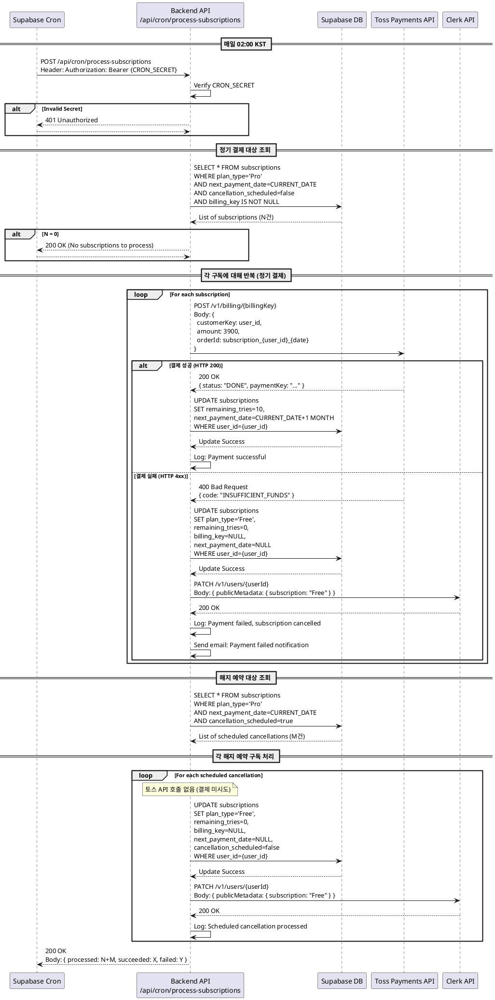

# UC-009: 정기 결제 및 구독 갱신 (Cron Job)

## 1. Overview

### Primary Actor
- 시스템 (Supabase Cron Scheduler)

### Scope
정기 결제일이 도래한 Pro 구독자에 대해 자동으로 정기 결제를 처리하고, 결제 성공 시 구독을 갱신하며, 실패 시 구독을 해지하는 자동화된 백그라운드 작업

### Level
System Task

## 2. Precondition

- Supabase Cron이 매일 02:00 KST에 정상적으로 동작해야 함
- Cron Job 엔드포인트 `/api/cron/process-subscriptions`가 구현되어 있어야 함
- 환경 변수에 `CRON_SECRET`이 설정되어 있어야 함
- 토스페이먼츠 API 키가 유효해야 함
- `subscriptions` 테이블에 `next_payment_date`가 정확하게 설정되어 있어야 함

## 3. Trigger

- 시간 기반 트리거: 매일 02:00 KST (Supabase Cron)

## 4. Main Scenario

### 4.1 정기 결제 대상 조회 및 처리

**Step 1: Cron Job 호출**
- Supabase Cron이 매일 02:00 KST에 `/api/cron/process-subscriptions` 엔드포인트를 호출
- HTTP Header에 `Authorization: Bearer {CRON_SECRET}` 포함

**Step 2: 요청 인증**
- 백엔드 API가 요청 헤더의 `Authorization` 값을 검증
- `CRON_SECRET`과 일치하지 않으면 401 Unauthorized 응답 반환 및 처리 중단

**Step 3: 결제 대상 조회**
- 다음 조건을 모두 만족하는 구독 레코드를 `subscriptions` 테이블에서 조회:
  - `plan_type` = 'Pro'
  - `next_payment_date` = 현재 날짜 (KST 기준)
  - `cancellation_scheduled` = false (해지 예약 안 함)
  - `billing_key` IS NOT NULL

**Step 4: 대상자 수 확인**
- 조회된 레코드가 0건인 경우:
  - 로그 기록: "No subscriptions to process for today"
  - 200 OK 응답 반환 및 종료

**Step 5: 각 구독에 대해 정기 결제 시도**
- 조회된 각 구독 레코드에 대해 순차적으로 처리:

**5-1. 결제 요청**
- 저장된 `billing_key`로 토스페이먼츠 API 호출:
  - Endpoint: `POST https://api.tosspayments.com/v1/billing/{billingKey}`
  - Headers: `Authorization: Basic {Base64(TOSS_SECRET_KEY:)}`
  - Body:
    ```json
    {
      "customerKey": "{user_id}",
      "amount": 3900,
      "orderId": "subscription_{user_id}_{timestamp}",
      "orderName": "사주풀이 Pro 월 구독",
      "customerEmail": "{user_email}",
      "customerName": "{user_name}"
    }
    ```

**5-2. 결제 성공 시 (HTTP 200)**
- `subscriptions` 테이블 업데이트:
  - `remaining_tries` = 10 (횟수 갱신)
  - `next_payment_date` = 현재 날짜 + 1개월
  - `updated_at` = 현재 시각
- 로그 기록: "Payment successful for user_id: {user_id}, amount: 3900"
- 성공 알림 이메일 발송 (선택적)

**5-3. 결제 실패 시 (HTTP 4xx/5xx)**
- 실패 사유 파싱:
  - 잔액 부족, 카드 한도 초과, 정지된 카드, 카드 분실 신고 등
- `subscriptions` 테이블 즉시 해지 처리:
  - `plan_type` = 'Free'
  - `remaining_tries` = 0
  - `billing_key` = null (빌링키 삭제)
  - `next_payment_date` = null
  - `cancellation_scheduled` = false
  - `updated_at` = 현재 시각
- Clerk 사용자 메타데이터 업데이트:
  - `publicMetadata.subscription` = 'Free'
- 로그 기록: "Payment failed for user_id: {user_id}, reason: {error_message}"
- 결제 실패 알림 이메일 발송 (필수)

**Step 6: 처리 완료**
- 모든 구독에 대한 처리 완료 후 200 OK 응답 반환
- 처리 결과 요약 로그:
  - "Processed {total} subscriptions: {success} succeeded, {failed} failed"

### 4.2 해지 예약된 구독 자동 처리

**Step 1~4: 동일 (Cron Job 호출 및 인증)**

**Step 5: 해지 예약 대상 조회**
- 다음 조건을 모두 만족하는 구독 레코드 조회:
  - `plan_type` = 'Pro'
  - `next_payment_date` = 현재 날짜
  - `cancellation_scheduled` = true (해지 예약됨)

**Step 6: 각 구독에 대해 자동 해지 처리**
- 토스페이먼츠 API 호출 없음 (결제 미시도)
- `subscriptions` 테이블 업데이트:
  - `plan_type` = 'Free'
  - `remaining_tries` = 0
  - `billing_key` = null (빌링키 삭제)
  - `next_payment_date` = null
  - `cancellation_scheduled` = false
  - `updated_at` = 현재 시각
- Clerk 사용자 메타데이터 업데이트:
  - `publicMetadata.subscription` = 'Free'
- 로그 기록: "Scheduled cancellation processed for user_id: {user_id}"
- 해지 완료 안내 이메일 발송 (선택적)

**Step 7: 처리 완료**
- 200 OK 응답 반환
- 처리 결과 요약 로그

## 5. Edge Cases

### 5.1 보안 관련

**EC-001: 잘못된 Cron Secret**
- 상황: 요청 헤더의 `Authorization` 값이 `CRON_SECRET`과 불일치
- 처리: 401 Unauthorized 응답 반환, 처리 즉시 중단, 보안 로그 기록

**EC-002: Authorization 헤더 누락**
- 상황: 요청에 `Authorization` 헤더가 없음
- 처리: 401 Unauthorized 응답 반환, 처리 즉시 중단

### 5.2 결제 API 관련

**EC-003: 토스페이먼츠 API 응답 지연 (Timeout)**
- 상황: 토스페이먼츠 API가 30초 이내 응답하지 않음
- 처리:
  - Timeout 에러 로그 기록
  - 해당 구독은 처리 보류 (상태 유지)
  - 다음 날 Cron Job에서 재시도
  - 관리자 알림 발송

**EC-004: 토스페이먼츠 API 500 Server Error**
- 상황: 토스페이먼츠 서버 장애
- 처리:
  - 에러 로그 기록
  - 해당 구독은 처리 보류 (상태 유지)
  - 다음 날 Cron Job에서 재시도
  - 관리자 알림 발송

**EC-005: 빌링키가 이미 삭제됨 (토스 측)**
- 상황: 저장된 `billing_key`가 토스페이먼츠에서 이미 삭제된 상태
- 처리:
  - 404 Not Found 응답 수신
  - 즉시 구독 해지 처리 (Main Scenario 5-3과 동일)
  - 사용자에게 결제 수단 재등록 안내 이메일 발송

### 5.3 데이터베이스 관련

**EC-006: 결제 성공 후 DB 업데이트 실패**
- 상황: 토스페이먼츠 결제는 성공했으나 Supabase 업데이트 실패
- 처리:
  - Critical Error 로그 기록 (관리자 즉시 확인 필요)
  - 결제 성공 정보(paymentKey, orderId) 별도 저장
  - 사용자에게 500 Server Error는 반환하지 않음 (결제는 완료됨)
  - 관리자가 수동으로 DB 상태 복구

**EC-007: 결제 실패 후 DB 해지 처리 실패**
- 상황: 결제 실패 후 구독 해지 업데이트 실패
- 처리:
  - Error 로그 기록
  - 다음 날 Cron Job에서 동일한 구독에 대해 재결제 시도 가능
  - 관리자 알림 (상태 불일치 위험)

**EC-008: Clerk 메타데이터 업데이트 실패**
- 상황: Supabase 업데이트는 성공했으나 Clerk API 호출 실패
- 처리:
  - Warning 로그 기록
  - Supabase 상태를 "Source of Truth"로 유지
  - 사용자 다음 로그인 시 Middleware에서 Clerk 메타데이터를 Supabase 기준으로 재동기화

### 5.4 비즈니스 로직 관련

**EC-009: next_payment_date가 과거 날짜**
- 상황: 구독의 `next_payment_date`가 오늘보다 과거 날짜 (시스템 장애로 Cron 미실행)
- 처리:
  - 해당 구독도 오늘 날짜와 동일하게 처리 대상에 포함
  - 로그에 "Overdue payment" 표시
  - 한 번만 결제 시도 (누적 결제 시도 없음)

**EC-010: 동일한 구독에 대해 중복 처리**
- 상황: Cron Job이 2회 이상 동시 실행되어 같은 구독을 중복 처리 시도
- 처리:
  - 데이터베이스 Unique 제약으로 방지
  - 또는 Redis Lock 사용하여 동일 user_id는 동시 처리 불가
  - 중복 결제 시도 감지 시 두 번째 요청은 즉시 스�ip

**EC-011: 결제 대상이 1000건 이상**
- 상황: 처리해야 할 구독이 대량으로 존재
- 처리:
  - Batch 단위로 나누어 처리 (예: 100건씩)
  - 각 Batch 사이에 1초 delay 추가 (API Rate Limit 방지)
  - 전체 처리 시간이 Cron Timeout(10분)을 초과하지 않도록 모니터링

## 6. Business Rules

### BR-001: 정기 결제 금액
- Pro 월 구독료는 고정 금액 3,900원

### BR-002: 횟수 갱신 정책
- 결제 성공 시 `remaining_tries`는 무조건 10으로 리셋 (이전 잔여 횟수 무관)

### BR-003: 결제 실패 즉시 해지 정책
- 정기 결제 실패 시 재시도 없이 즉시 구독 해지 (Free 전환)
- 잔여 Pro 혜택 제공 없음 (관대한 정책 없음)

### BR-004: 해지 예약 우선순위
- 동일한 날짜에 `cancellation_scheduled = true`인 구독은 정기 결제를 시도하지 않음
- 해지 예약이 정기 결제보다 높은 우선순위

### BR-005: 빌링키 삭제 시점
- 정기 결제 실패 또는 해지 예약 처리 시 Supabase에서 즉시 삭제
- 토스페이먼츠에 별도 빌링키 삭제 API 호출 없음 (토스는 자동 만료)

### BR-006: 다음 결제일 계산
- 현재 날짜 기준 + 1개월 (동일한 일자)
- 예: 2025-01-15 → 2025-02-15
- 말일 처리: 2025-01-31 → 2025-02-28 (해당 월의 마지막 날)

### BR-007: 타임존 정책
- 모든 날짜 비교는 KST (Asia/Seoul) 기준
- Supabase의 `DATE` 타입은 UTC 저장, 조회 시 KST로 변환

### BR-008: External Service Integration

#### 토스페이먼츠 연동

**빌링키 기반 정기 결제**
- API Endpoint: `POST https://api.tosspayments.com/v1/billing/{billingKey}`
- 인증: Basic Auth (Secret Key)
- 요청 Body:
  ```json
  {
    "customerKey": "사용자 고유 ID",
    "amount": 3900,
    "orderId": "구독 주문 ID (고유값)",
    "orderName": "사주풀이 Pro 월 구독",
    "customerEmail": "사용자 이메일",
    "customerName": "사용자 이름"
  }
  ```
- 성공 응답 (HTTP 200):
  ```json
  {
    "paymentKey": "결제 고유 키",
    "orderId": "주문 ID",
    "status": "DONE",
    "totalAmount": 3900
  }
  ```
- 실패 응답 (HTTP 400):
  ```json
  {
    "code": "INSUFFICIENT_FUNDS",
    "message": "잔액이 부족합니다."
  }
  ```

**주요 에러 코드**
- `INSUFFICIENT_FUNDS`: 잔액 부족
- `EXCEED_MAX_CARD_LIMIT`: 카드 한도 초과
- `INVALID_CARD`: 정지된 카드
- `CARD_LOST_OR_STOLEN`: 분실/도난 신고된 카드
- `EXPIRED_CARD`: 만료된 카드

**결제 검증 (Source of Truth)**
- 결제 성공 후 즉시 결제 조회 API로 재확인:
  - `GET https://api.tosspayments.com/v1/payments/{paymentKey}`
- 조회 결과의 `status`가 "DONE"인지 확인 후 DB 업데이트

**Rate Limiting**
- 초당 최대 10건의 결제 요청 (토스페이먼츠 제한)
- Cron Job에서 100건씩 Batch 처리 시 각 Batch 간 1초 delay

#### Clerk 메타데이터 동기화
- 결제 성공/실패 시 Clerk의 `publicMetadata.subscription` 업데이트
- API: `PATCH https://api.clerk.com/v1/users/{userId}`
- 실패 시 Supabase를 "Source of Truth"로 유지

### BR-009: 이메일 알림 정책
- 결제 성공: 선택적 (영수증 이메일)
- 결제 실패: 필수 (구독 해지 안내 + 재구독 링크)
- 해지 완료: 선택적 (감사 메시지)

### BR-010: 로깅 정책
- 모든 결제 시도는 별도 로그 테이블 또는 파일에 기록
- 로그 항목:
  - `user_id`, `billing_key`, `amount`, `orderId`
  - `status` (success/failed/timeout)
  - `error_code`, `error_message`
  - `processed_at` (처리 시각)

### BR-011: 멱등성 보장
- 동일한 `next_payment_date`에 대해 중복 결제 방지
- `orderId` 생성 규칙: `subscription_{user_id}_{next_payment_date}`
- 토스페이먼츠는 동일 `orderId`로 중복 결제 요청 시 거부

## 7. Sequence Diagram



## 8. API Specification

### Endpoint
`POST /api/cron/process-subscriptions`

### Authentication
- Type: Bearer Token
- Header: `Authorization: Bearer {CRON_SECRET}`
- Secret 위치: 환경 변수 `CRON_SECRET`

### Request

**Headers**
```
Authorization: Bearer {CRON_SECRET}
Content-Type: application/json
```

**Body**
없음 (Cron Job은 파라미터 없이 호출)

### Response

**Success (200 OK)**
```json
{
  "success": true,
  "message": "Subscription processing completed",
  "result": {
    "total_processed": 15,
    "regular_payments": {
      "attempted": 10,
      "succeeded": 8,
      "failed": 2
    },
    "scheduled_cancellations": {
      "processed": 5
    },
    "errors": []
  },
  "processed_at": "2025-10-25T02:00:15.234Z"
}
```

**Unauthorized (401)**
```json
{
  "success": false,
  "error": {
    "code": "UNAUTHORIZED",
    "message": "Invalid or missing CRON_SECRET"
  }
}
```

**Partial Success (200 OK with errors)**
```json
{
  "success": true,
  "message": "Subscription processing completed with errors",
  "result": {
    "total_processed": 15,
    "regular_payments": {
      "attempted": 10,
      "succeeded": 7,
      "failed": 3
    },
    "scheduled_cancellations": {
      "processed": 5
    },
    "errors": [
      {
        "user_id": "user_abc123",
        "type": "payment_failure",
        "reason": "INSUFFICIENT_FUNDS",
        "action_taken": "subscription_cancelled"
      },
      {
        "user_id": "user_xyz789",
        "type": "database_error",
        "reason": "Failed to update subscription status",
        "action_taken": "logged_for_manual_review"
      }
    ]
  },
  "processed_at": "2025-10-25T02:00:45.678Z"
}
```

### Internal Logic Flow

```typescript
// Pseudo-code

async function processSubscriptions() {
  // 1. 인증 검증
  if (!validateCronSecret(request.headers.authorization)) {
    return 401;
  }

  const results = {
    regular_payments: { attempted: 0, succeeded: 0, failed: 0 },
    scheduled_cancellations: { processed: 0 },
    errors: []
  };

  // 2. 정기 결제 대상 조회 및 처리
  const dueSubscriptions = await db.subscriptions.findMany({
    where: {
      plan_type: 'Pro',
      next_payment_date: getCurrentDate(),
      cancellation_scheduled: false,
      billing_key: { not: null }
    }
  });

  for (const sub of dueSubscriptions) {
    results.regular_payments.attempted++;

    try {
      const payment = await tossApi.chargeBilling({
        billingKey: sub.billing_key,
        customerKey: sub.user_id,
        amount: 3900,
        orderId: `subscription_${sub.user_id}_${getCurrentDate()}`
      });

      if (payment.status === 'DONE') {
        await db.subscriptions.update({
          where: { user_id: sub.user_id },
          data: {
            remaining_tries: 10,
            next_payment_date: addMonths(getCurrentDate(), 1)
          }
        });
        results.regular_payments.succeeded++;
      }
    } catch (error) {
      // 결제 실패 시 즉시 해지
      await db.subscriptions.update({
        where: { user_id: sub.user_id },
        data: {
          plan_type: 'Free',
          remaining_tries: 0,
          billing_key: null,
          next_payment_date: null
        }
      });
      await clerkApi.updateMetadata(sub.user_id, { subscription: 'Free' });
      results.regular_payments.failed++;
      results.errors.push({
        user_id: sub.user_id,
        type: 'payment_failure',
        reason: error.code
      });
    }
  }

  // 3. 해지 예약 대상 조회 및 처리
  const cancelledSubscriptions = await db.subscriptions.findMany({
    where: {
      plan_type: 'Pro',
      next_payment_date: getCurrentDate(),
      cancellation_scheduled: true
    }
  });

  for (const sub of cancelledSubscriptions) {
    await db.subscriptions.update({
      where: { user_id: sub.user_id },
      data: {
        plan_type: 'Free',
        remaining_tries: 0,
        billing_key: null,
        next_payment_date: null,
        cancellation_scheduled: false
      }
    });
    await clerkApi.updateMetadata(sub.user_id, { subscription: 'Free' });
    results.scheduled_cancellations.processed++;
  }

  return {
    success: true,
    result: results
  };
}
```

## 9. Testing Scenarios

### 9.1 정상 시나리오 테스트

**T-001: 정기 결제 성공**
- Given: Pro 구독자의 `next_payment_date`가 오늘
- When: Cron Job 실행
- Then:
  - 토스페이먼츠 결제 성공
  - `remaining_tries` = 10
  - `next_payment_date` = 오늘 + 1개월

**T-002: 해지 예약 자동 처리**
- Given: `cancellation_scheduled = true`이고 `next_payment_date`가 오늘
- When: Cron Job 실행
- Then:
  - 토스 API 호출 없음
  - `plan_type` = 'Free'
  - `billing_key` = null

### 9.2 엣지 케이스 테스트

**T-003: 잘못된 Cron Secret**
- Given: Authorization 헤더에 잘못된 값
- When: Cron Job 실행
- Then: 401 응답, 처리 중단

**T-004: 결제 실패 후 즉시 해지**
- Given: 잔액 부족인 사용자
- When: Cron Job 실행
- Then:
  - 토스 API 400 응답
  - 구독 즉시 Free 전환
  - 결제 실패 이메일 발송

**T-005: DB 업데이트 실패**
- Given: 결제는 성공, DB 연결 장애
- When: Cron Job 실행
- Then:
  - Critical Error 로그 기록
  - 관리자 알림 발송
  - 다음 Cron에서 중복 방지 필요

## 10. Monitoring & Alerts

### 모니터링 지표
- 처리된 구독 수 (일별)
- 성공률 (succeeded / attempted)
- 평균 처리 시간
- 에러 발생 건수 (타입별)

### 알림 조건
- Critical: DB 업데이트 실패
- Warning: 토스 API Timeout 3건 이상
- Info: 처리 완료 (일일 요약)

## 11. Related Use Cases

- UC-004: 신규 Pro 플랜 구독 신청 (빌링키 최초 발급)
- UC-007: Pro 구독 해지 신청 (해지 예약 설정)
- UC-008: 구독 해지 취소 (해지 예약 해제)

## 12. References

- PRD: `/docs/prd.md` - Section 7 (백엔드 정기 결제 정책)
- Userflow: `/docs/userflow.md` - Flow 9 (정기 결제 및 구독 갱신)
- Database: `/docs/database.md` - Section 2.6 (정기 결제 플로우)
- Toss Integration: `/docs/external/toss.md` - Section 4.2 (빌링키 기반 정기 결제)
