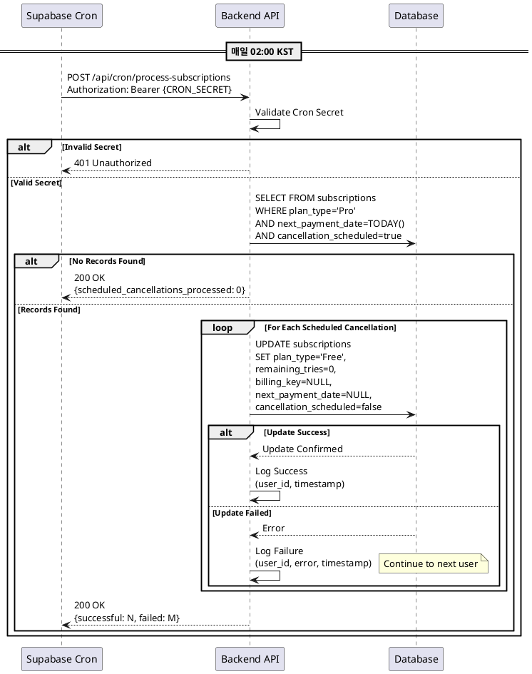

# UseCase 010: 예약된 구독 해지 자동 처리 (Cron Job)

## 개요
사용자가 해지를 예약한 Pro 구독에 대해, 다음 결제 예정일에 자동으로 구독을 Free 플랜으로 전환하고 빌링키를 안전하게 삭제하는 시스템 자동화 프로세스입니다.

## Primary Actor
- **시스템** (Supabase Cron Scheduler + Backend API)

## Precondition
- 하나 이상의 사용자가 Pro 구독 해지를 예약한 상태입니다 (`cancellation_scheduled = true`)
- 해당 사용자들의 `next_payment_date`가 오늘 날짜입니다
- Supabase Cron Job이 정상 작동 중입니다 (매일 02:00 KST)
- Backend API `/api/cron/process-subscriptions` 엔드포인트가 정상 작동합니다

## Trigger
- **시간 기반 트리거**: 매일 02:00 KST에 Supabase Cron Scheduler가 자동으로 실행됩니다

## Main Scenario

### 1. Cron Job 실행
- Supabase Cron Scheduler가 매일 02:00 KST에 트리거됩니다
- `/api/cron/process-subscriptions` 엔드포인트를 HTTP 요청으로 호출합니다

### 2. 인증 및 보안 검증
- Backend API가 요청 헤더의 `Authorization` 값을 검증합니다
- Cron Secret이 환경 변수 값과 일치하는지 확인합니다

### 3. 해지 예약 대상자 조회
- `subscriptions` 테이블에서 다음 조건을 **모두** 만족하는 레코드를 조회합니다:
  - `plan_type = 'Pro'`
  - `next_payment_date = TODAY()`
  - `cancellation_scheduled = true`
  - `billing_key IS NOT NULL`

### 4. 해지 처리 루프
각 대상자에 대해 순차적으로 다음을 수행합니다:

#### 4.1 구독 상태 전환
- `subscriptions` 테이블의 해당 레코드를 업데이트합니다:
  - `plan_type`: 'Free'
  - `remaining_tries`: 0 (Pro 혜택 소멸)
  - `billing_key`: null (**빌링키 삭제**)
  - `next_payment_date`: null
  - `cancellation_scheduled`: false (상태 초기화)

#### 4.2 결과 로깅
- 처리 성공/실패 여부를 시스템 로그에 기록합니다
- 처리 완료 건수를 집계합니다

### 5. 응답 반환
- Supabase Cron에 200 OK 응답을 반환합니다
- 응답 본문에 처리 결과 요약을 포함합니다:
  - 총 처리 대상 건수
  - 성공 건수
  - 실패 건수

## Edge Cases

### 1. Cron Secret 검증 실패
- **상황**: 요청 헤더의 Authorization 값이 환경 변수와 불일치
- **처리**: 401 Unauthorized 응답 반환 및 즉시 종료
- **로그**: 인증 실패 시도 기록 (보안 모니터링용)

### 2. 해지 대상자 없음
- **상황**: 조회 결과가 0건
- **처리**: 200 OK 응답 반환 및 정상 종료
- **로그**: "No scheduled cancellations to process" 기록

### 3. DB 업데이트 실패
- **상황**: 특정 사용자의 구독 레코드 업데이트 중 DB 오류 발생
- **처리**:
  - 해당 사용자는 건너뛰고 다음 사용자로 진행 (부분 성공 허용)
  - 오류 발생한 레코드는 로그에 기록
  - 다음 날 Cron Job에서 재처리 대상이 됨
- **로그**: user_id, 오류 메시지, timestamp 기록

### 4. DB 연결 실패
- **상황**: Supabase DB 연결 자체가 불가능한 경우
- **처리**:
  - 500 Internal Server Error 응답 반환
  - 전체 처리 중단
- **로그**: Critical 레벨로 DB 연결 실패 기록
- **알림**: 관리자에게 즉시 알림 (선택사항)

### 5. 타임아웃
- **상황**: 처리 대상자가 너무 많아 응답 시간 초과
- **처리**:
  - 처리된 건수까지만 커밋
  - 미처리 건은 다음 날 재시도
- **로그**: 타임아웃 발생 시각 및 처리 진행률 기록

### 6. 중복 실행 방지
- **상황**: Cron Job이 중복으로 실행되는 경우 (네트워크 지연 등)
- **처리**:
  - `next_payment_date` 조건으로 자연스럽게 필터링
  - 이미 처리된 레코드는 조회되지 않음 (멱등성 보장)

## Business Rules

### 1. 해지 예약 정책
- 사용자가 해지를 예약하면 다음 결제일까지 Pro 혜택이 유지됩니다
- 결제일 당일 02:00에 자동으로 해지가 처리됩니다
- **결제는 시도되지 않습니다** (정기결제 로직과 분리)

### 2. 데이터 처리 원칙
- **빌링키 즉시 삭제**: 토스페이먼츠에서 추가 과금이 발생하지 않도록 보장
- **횟수 초기화**: Pro 혜택(월 10회)은 소멸되며, Free 플랜 기본 횟수(3회)도 부여되지 않음
- **상태 초기화**: `cancellation_scheduled` 플래그를 false로 리셋

### 3. 정기결제와의 관계
- 동일한 Cron Job 내에서 처리되지만, 로직은 완전히 분리됩니다
- **우선순위**: 해지 예약 처리가 정기결제보다 먼저 실행됩니다
- **조건 구분**: `cancellation_scheduled` 플래그로 명확히 구분

### 4. 재구독 정책
- Free로 전환된 사용자는 언제든 다시 Pro 구독 신청 가능합니다
- 재구독 시 **빌링키를 새로 등록**해야 합니다 (이전 빌링키는 삭제됨)
- 토스페이먼츠 SDK를 통해 새로운 결제수단 등록 프로세스를 거칩니다

### 5. 멱등성 보장
- 동일한 날짜에 여러 번 실행되어도 결과는 동일합니다
- `next_payment_date = TODAY()` 조건으로 이미 처리된 레코드는 제외됩니다
- DB 업데이트 실패 시 다음 실행 시 재처리됩니다

### 6. 감사 추적 (Audit Trail)
- 모든 해지 처리는 시스템 로그에 기록됩니다
- 로그 항목:
  - 처리 시각 (timestamp)
  - 사용자 ID (user_id)
  - 처리 결과 (success/failure)
  - 오류 메시지 (실패 시)

## API Specification

### Endpoint
```
POST /api/cron/process-subscriptions
```

### Headers
```
Authorization: Bearer {CRON_SECRET}
Content-Type: application/json
```

### Request Body
```json
{
  "job_type": "scheduled_cancellation"
}
```
※ 실제 구현에서는 정기결제와 해지 예약을 하나의 엔드포인트에서 처리하므로, 내부 로직에서 두 가지 작업을 순차적으로 수행합니다.

### Response (Success)
```json
{
  "success": true,
  "data": {
    "scheduled_cancellations_processed": 3,
    "successful": 3,
    "failed": 0,
    "timestamp": "2025-10-25T02:00:15Z"
  }
}
```

### Response (Partial Success)
```json
{
  "success": true,
  "data": {
    "scheduled_cancellations_processed": 5,
    "successful": 4,
    "failed": 1,
    "failed_users": ["user_abc123"],
    "timestamp": "2025-10-25T02:00:20Z"
  },
  "warnings": [
    "Some cancellations failed to process. Will retry tomorrow."
  ]
}
```

### Response (Authentication Failure)
```json
{
  "success": false,
  "error": {
    "code": "UNAUTHORIZED",
    "message": "Invalid cron secret"
  }
}
```

### Response (Server Error)
```json
{
  "success": false,
  "error": {
    "code": "INTERNAL_SERVER_ERROR",
    "message": "Database connection failed",
    "timestamp": "2025-10-25T02:00:05Z"
  }
}
```

## Database Operations

### Query 1: 해지 예약 대상자 조회
```sql
SELECT
  id,
  user_id,
  billing_key,
  next_payment_date
FROM subscriptions
WHERE
  plan_type = 'Pro'
  AND next_payment_date = CURRENT_DATE
  AND cancellation_scheduled = true
  AND billing_key IS NOT NULL
ORDER BY user_id;
```

### Query 2: 구독 해지 처리
```sql
UPDATE subscriptions
SET
  plan_type = 'Free',
  remaining_tries = 0,
  billing_key = NULL,
  next_payment_date = NULL,
  cancellation_scheduled = false,
  updated_at = NOW()
WHERE id = $1;
```

## Sequence Diagram



## Related UseCases
- **UseCase 007**: 구독 해지 예약 (사용자가 해지를 신청하는 프로세스)
- **UseCase 008**: 구독 해지 취소 (해지 예약을 철회하는 프로세스)
- **UseCase 009**: 정기 결제 및 구독 갱신 (동일 Cron Job에서 처리되는 다른 로직)

## Implementation Notes

### 1. Cron Job 설정 (Supabase)
```sql
-- supabase/migrations/YYYYMMDDHHMMSS_setup_cron_job.sql
SELECT cron.schedule(
  'process-daily-subscriptions',
  '0 2 * * *', -- 매일 02:00 KST
  $$
  SELECT
    net.http_post(
      url:='https://your-domain.com/api/cron/process-subscriptions',
      headers:='{"Content-Type": "application/json", "Authorization": "Bearer YOUR_CRON_SECRET"}'::jsonb,
      body:='{}'::jsonb
    ) as request_id;
  $$
);
```

### 2. Backend 구현 가이드
- **트랜잭션 처리**: 각 사용자별로 별도 트랜잭션 사용 (부분 성공 허용)
- **에러 핸들링**: try-catch로 각 사용자 처리를 감싸고, 실패 시 로그 후 계속 진행
- **로깅 레벨**:
  - INFO: 정상 처리 완료
  - WARN: 일부 실패
  - ERROR: DB 연결 실패 등 치명적 오류
- **성능 최적화**: 대량 처리 시 배치 업데이트 고려

### 3. 모니터링 및 알림
- Cron Job 실패 시 즉시 알림 (Slack, Email 등)
- 처리 건수를 메트릭으로 수집 (시계열 분석용)
- 연속 실패 시 자동 에스컬레이션

### 4. 테스트 시나리오
- **시나리오 1**: 해지 예약 대상자 0명
- **시나리오 2**: 해지 예약 대상자 1명 (정상 처리)
- **시나리오 3**: 해지 예약 대상자 복수 (부분 실패)
- **시나리오 4**: Cron Secret 불일치
- **시나리오 5**: DB 연결 실패
- **시나리오 6**: 중복 실행 (멱등성 검증)

## Success Criteria
1. 매일 02:00에 정확히 실행됩니다
2. 해지 예약된 모든 사용자가 Free로 전환됩니다
3. 빌링키가 안전하게 삭제됩니다
4. 처리 결과가 로그에 기록됩니다
5. 부분 실패 시에도 처리 가능한 건은 완료됩니다
6. 동일 날짜 중복 실행 시 중복 처리되지 않습니다 (멱등성)
