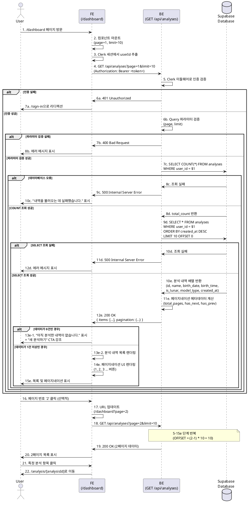

# Usecase 011: 분석 내역 조회 (대시보드 / 페이지네이션 적용)

## Primary Actor
- 인증된 사용자 (Free User / Pro User)

## Precondition
- 사용자가 Clerk를 통해 인증되어 로그인된 상태입니다.
- 사용자가 `/dashboard` 페이지에 접근할 수 있습니다.
- Supabase `analyses` 테이블이 존재하며, 사용자의 분석 내역이 저장되어 있습니다.

## Trigger
- 사용자가 `/dashboard` 페이지로 이동(방문)합니다.
- 사용자가 페이지 하단의 페이지 번호(예: '2') 또는 '다음', '이전' 버튼을 클릭합니다.

## Main Scenario

### 1. 대시보드 페이지 진입
1. 사용자가 `/dashboard` 페이지로 이동합니다.
2. 프론트엔드 컴포넌트가 마운트되고, 기본적으로 1페이지를 요청합니다.

### 2. 분석 내역 조회 요청
1. 프론트엔드가 인증된 사용자의 `userId`를 Clerk 세션에서 가져옵니다.
2. 프론트엔드가 백엔드 API (`GET /api/analyses`)에 분석 내역 조회 요청을 전송합니다.
   - Query Parameters:
     - `page`: 요청할 페이지 번호 (기본값: 1)
     - `limit`: 페이지당 항목 수 (기본값: 10, 고정)
3. 백엔드 API가 요청을 수신하고, Clerk 미들웨어를 통해 인증 상태를 확인합니다.

### 3. 데이터베이스 조회
1. 백엔드가 Supabase `analyses` 테이블에서 해당 사용자의 분석 내역을 조회합니다.
   - 조건: `user_id` = 현재 사용자 ID
   - 정렬: `created_at DESC` (최신순)
   - 페이지네이션:
     - `LIMIT 10`
     - `OFFSET (page - 1) * 10`
2. 별도로 동일한 `user_id`의 전체 분석 내역 개수(`total_count`)를 조회합니다.

### 4. 응답 데이터 반환
1. 백엔드가 조회된 데이터를 가공합니다.
   - 각 분석 항목은 다음 정보를 포함:
     - `id`: 분석 고유 ID
     - `name`: 분석 대상 이름
     - `birth_date`: 생년월일
     - `model_type`: 사용된 모델 ('flash' 또는 'pro')
     - `created_at`: 분석 수행 시각
2. 페이지네이션 메타데이터를 계산합니다.
   - `total_count`: 전체 분석 개수
   - `total_pages`: 전체 페이지 수 (`Math.ceil(total_count / 10)`)
   - `current_page`: 현재 페이지 번호
   - `has_next`: 다음 페이지 존재 여부
   - `has_prev`: 이전 페이지 존재 여부
3. 백엔드가 프론트엔드에 200 OK 응답을 반환합니다.

### 5. UI 렌더링
1. 프론트엔드가 응답 데이터를 수신하고 상태를 업데이트합니다.
2. 조회된 분석 내역 목록을 카드 또는 리스트 형태로 표시합니다.
   - 각 항목에는 이름, 분석 일자, 사용된 모델 정보가 표시됩니다.
   - 각 항목은 클릭 가능하며, 클릭 시 `/analysis/[analysisId]` 페이지로 이동합니다.
3. 페이지네이션 UI를 표시합니다.
   - 페이지 번호 버튼 (1, 2, 3, ...)
   - '이전', '다음' 버튼 (해당하는 경우만 활성화)
4. '새 분석하기', '구독 관리' 페이지로 이동하는 CTA 버튼을 표시합니다.

### 6. 페이지 이동 (선택적)
1. 사용자가 특정 페이지 번호 또는 '다음', '이전' 버튼을 클릭합니다.
2. 프론트엔드가 URL 쿼리 파라미터를 업데이트합니다. (예: `/dashboard?page=2`)
3. 2-5 단계를 반복하여 새로운 페이지의 데이터를 로드하고 표시합니다.

## Edge Cases

### 1. 분석 내역이 0건인 경우
- **발생 조건**: 사용자가 아직 사주 분석을 한 번도 수행하지 않은 경우
- **처리**:
  - 백엔드는 빈 배열과 `total_count: 0`을 반환합니다.
  - 프론트엔드는 "아직 분석한 내역이 없습니다." 안내 문구를 표시합니다.
  - '새 분석하기' CTA 버튼을 강조하여 사용자 행동을 유도합니다.

### 2. 존재하지 않는 페이지 번호 요청
- **발생 조건**: 사용자가 URL을 직접 수정하여 존재하지 않는 페이지 번호(예: `page=999`)를 요청하는 경우
- **처리**:
  - 백엔드는 빈 배열과 정상적인 페이지네이션 메타데이터를 반환합니다.
  - 프론트엔드는 "해당 페이지에 내역이 없습니다." 메시지를 표시하고, 1페이지로 리디렉션합니다.

### 3. 잘못된 페이지 파라미터 (음수, 문자열 등)
- **발생 조건**: `page` 파라미터가 양의 정수가 아닌 경우 (예: `page=-1`, `page=abc`)
- **처리**:
  - 백엔드는 입력 검증 단계에서 이를 감지하고, 기본값 `page=1`로 처리합니다.
  - 또는 400 Bad Request 응답을 반환합니다.

### 4. 데이터베이스 조회 실패
- **발생 조건**: Supabase 연결 오류, 쿼리 실행 실패 등 데이터베이스 관련 오류가 발생하는 경우
- **처리**:
  - 백엔드는 오류를 로깅하고 500 Internal Server Error 응답을 반환합니다.
  - 프론트엔드는 "내역을 불러오는 데 실패했습니다. 잠시 후 다시 시도해주세요." 에러 메시지를 표시합니다.
  - 재시도 버튼을 제공하여 사용자가 다시 시도할 수 있도록 합니다.

### 5. 인증 만료
- **발생 조건**: 페이지 접근 시 사용자의 Clerk 세션이 만료된 경우
- **처리**:
  - Clerk 미들웨어가 자동으로 로그인 페이지(`/sign-in`)로 리디렉션합니다.
  - 로그인 후 원래 요청했던 페이지(`/dashboard?page=N`)로 복귀합니다.

### 6. 느린 네트워크 / 로딩 상태
- **발생 조건**: 네트워크 지연으로 인해 API 응답이 늦어지는 경우
- **처리**:
  - 프론트엔드는 로딩 스피너 또는 스켈레톤 UI를 표시하여 사용자에게 데이터 로딩 중임을 알립니다.
  - React Query의 `isLoading` 상태를 활용합니다.

## Business Rules

### BR-011-001: 페이지네이션 설정
- 한 페이지당 최대 10개의 분석 내역을 표시합니다.
- 페이지 번호는 1부터 시작합니다.
- 11개 이상의 분석 내역이 있는 경우에만 페이지네이션 UI가 표시됩니다.

### BR-011-002: 정렬 순서
- 분석 내역은 항상 최신순(`created_at DESC`)으로 정렬됩니다.
- 사용자는 정렬 순서를 변경할 수 없습니다.

### BR-011-003: 데이터 접근 권한
- 사용자는 자신이 생성한 분석 내역만 조회할 수 있습니다.
- 백엔드는 항상 `user_id` 필터를 적용하여 타인의 데이터 접근을 방지합니다.

### BR-011-004: 민감 정보 보호
- 분석 내역 목록에는 요약 정보(`summary`)나 상세 내용(`detail`)을 포함하지 않습니다.
- 상세 내용은 별도의 상세보기 페이지(`/analysis/[analysisId]`)에서만 제공됩니다.
- 이는 데이터 전송량을 줄이고, 불필요한 정보 노출을 방지합니다.

### BR-011-005: 캐싱 전략
- React Query를 사용하여 클라이언트 사이드에서 조회 결과를 캐싱합니다.
- 캐시 유효 시간: 5분 (`staleTime: 5 * 60 * 1000`)
- 캐시가 유효한 경우 동일한 페이지 재요청 시 백엔드 호출을 생략합니다.

## API Specification

### 1. GET /api/analyses

사용자의 사주 분석 내역 목록을 페이지네이션 방식으로 조회합니다.

**Request Headers:**
```
Authorization: Bearer <clerk-session-token>
```

**Query Parameters:**
| 파라미터 | 타입 | 필수 | 기본값 | 설명 |
|---------|------|------|--------|------|
| page | integer | No | 1 | 조회할 페이지 번호 (1부터 시작) |
| limit | integer | No | 10 | 페이지당 항목 수 (현재는 10으로 고정) |

**Request Example:**
```
GET /api/analyses?page=2&limit=10
```

**Success Response (200 OK):**
```json
{
  "success": true,
  "data": {
    "items": [
      {
        "id": "550e8400-e29b-41d4-a716-446655440000",
        "name": "김철수",
        "birth_date": "1990-05-15",
        "birth_time": "14:30",
        "is_lunar": false,
        "model_type": "flash",
        "created_at": "2025-10-24T15:30:00Z"
      },
      {
        "id": "550e8400-e29b-41d4-a716-446655440001",
        "name": "이영희",
        "birth_date": "1985-03-20",
        "birth_time": null,
        "is_lunar": true,
        "model_type": "pro",
        "created_at": "2025-10-23T10:20:00Z"
      }
    ],
    "pagination": {
      "total_count": 25,
      "total_pages": 3,
      "current_page": 2,
      "per_page": 10,
      "has_next": true,
      "has_prev": true
    }
  }
}
```

**Success Response - No Data (200 OK):**
```json
{
  "success": true,
  "data": {
    "items": [],
    "pagination": {
      "total_count": 0,
      "total_pages": 0,
      "current_page": 1,
      "per_page": 10,
      "has_next": false,
      "has_prev": false
    }
  }
}
```

**Error Responses:**

**400 Bad Request** (Invalid Query Parameters):
```json
{
  "success": false,
  "error": {
    "code": "INVALID_QUERY_PARAMS",
    "message": "페이지 번호는 양의 정수여야 합니다.",
    "details": {
      "field": "page",
      "value": "abc",
      "expected": "positive integer"
    }
  }
}
```

**401 Unauthorized** (Missing or Invalid Token):
```json
{
  "success": false,
  "error": {
    "code": "UNAUTHORIZED",
    "message": "인증이 필요합니다."
  }
}
```

**500 Internal Server Error** (Database Error):
```json
{
  "success": false,
  "error": {
    "code": "DATABASE_ERROR",
    "message": "분석 내역을 조회하는 중 오류가 발생했습니다."
  }
}
```

**Implementation Notes:**
- Hono 라우터를 사용하여 `src/features/analyses/backend/route.ts`에 엔드포인트를 정의합니다.
- `src/features/analyses/backend/service.ts`에서 Supabase 쿼리 로직을 구현합니다.
- `src/features/analyses/backend/schema.ts`에서 Zod를 사용한 요청/응답 검증 스키마를 정의합니다.
- Clerk 미들웨어(`withClerkAuth`)를 적용하여 인증된 사용자만 접근 가능하도록 설정합니다.
- 쿼리 성능 최적화를 위해 `(user_id, created_at DESC)` 복합 인덱스를 활용합니다.
- `COUNT(*)`와 `SELECT` 쿼리를 별도로 실행하여 페이지네이션 메타데이터를 생성합니다.

## Sequence Diagram



## Related Features
- **UC-002**: Free 사용자의 사주 분석 (성공) - 분석 내역 생성
- **UC-005**: Pro 사용자의 사주 분석 (성공) - 분석 내역 생성
- **UC-012**: 분석 상세보기 및 MD 파일 다운로드 - 목록에서 상세로 이동

## Notes
- 현재 버전에서는 `limit` 파라미터를 10으로 고정하지만, 향후 사용자 설정에 따라 변경 가능하도록 확장할 수 있습니다.
- 페이지네이션 UI는 라이브러리(예: `react-paginate`)를 사용하거나 shadcn-ui의 Pagination 컴포넌트를 커스터마이징하여 구현합니다.
- 프론트엔드에서는 React Query의 `useQuery` 훅을 사용하여 데이터 페칭 및 캐싱을 관리합니다.
- URL 쿼리 파라미터를 사용하여 페이지 상태를 관리하므로, 사용자는 URL을 공유하거나 북마크할 수 있습니다.
- 무한 스크롤(Infinite Scroll) 방식은 현재 요구사항에 포함되지 않으며, 전통적인 페이지네이션을 사용합니다.
