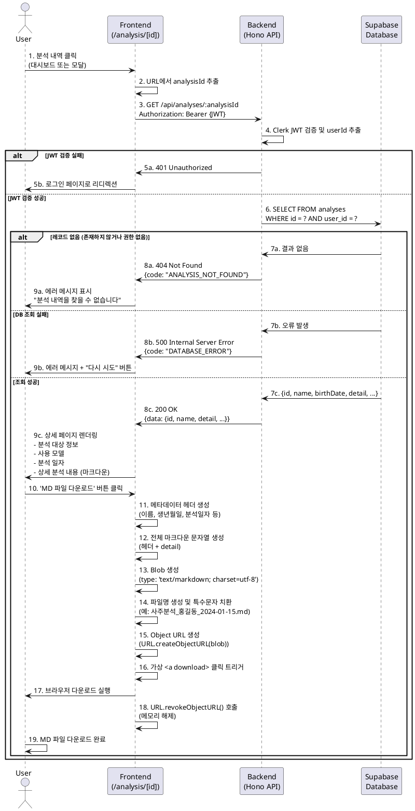

# Usecase 012: 분석 상세보기 및 MD 파일 다운로드

## Overview
사용자가 과거 분석 내역의 상세 결과를 조회하고, 해당 내용을 Markdown(.md) 파일로 다운로드하는 기능입니다. 사용자는 대시보드에서 특정 분석 항목을 선택하거나, 새 분석 완료 후 '상세보기' 버튼을 통해 이 페이지에 접근할 수 있습니다.

## Primary Actor
- **Authenticated User**: Clerk를 통해 인증된 모든 사용자 (Free 또는 Pro)

## Precondition
- 사용자가 Clerk를 통해 인증된 상태여야 함
- 사용자가 조회하려는 분석 레코드(`analysisId`)가 `analyses` 테이블에 존재해야 함
- 조회하려는 분석 레코드의 `user_id`가 현재 사용자의 `userId`와 일치해야 함 (보안)

## Trigger
- 사용자가 `/dashboard`에서 특정 분석 내역 항목을 클릭하거나
- 사용자가 `/new-analysis`에서 분석 완료 후 모달의 '상세보기' 버튼을 클릭하여 `/analysis/[analysisId]` 페이지로 이동

## Main Scenario

### 1. 페이지 접근 및 데이터 로딩
1. 사용자가 `/analysis/[analysisId]` 페이지로 이동 (예: `/analysis/abc123-def456`)
2. 프론트엔드 컴포넌트가 마운트되고 URL 파라미터에서 `analysisId` 추출
3. 프론트엔드가 Clerk JWT 토큰과 함께 백엔드 API(`GET /api/analyses/:analysisId`) 호출
4. 백엔드가 Clerk JWT를 검증하고 `userId` 추출

### 2. 데이터 조회 및 검증
1. 백엔드가 Supabase `analyses` 테이블에서 다음 조건으로 조회:
   - `id = analysisId`
   - `user_id = userId` (현재 인증된 사용자)
2. 조회 결과 검증:
   - 레코드가 존재하지 않는 경우 → Edge Case EC1 처리
   - `user_id` 불일치 (타인의 분석 접근 시도) → Edge Case EC1 처리
3. 조회 성공 시 분석 데이터 반환:
   - `id`, `name`, `birth_date`, `birth_time`, `is_lunar`
   - `model_type`, `summary`, `detail`
   - `created_at`

### 3. 상세 내용 표시
1. 백엔드가 200 OK 응답으로 분석 데이터 반환
2. 프론트엔드가 페이지에 다음 정보 렌더링:
   - 분석 대상 정보:
     - 이름: `name`
     - 생년월일: `birth_date` (양/음력 표시 포함)
     - 태어난 시간: `birth_time` (입력한 경우) 또는 "시간 정보 없음"
   - 분석 정보:
     - 분석 일시: `created_at` (예: "2024년 1월 15일 오후 3:25")
     - 사용 모델: `model_type` (Flash 또는 Pro)
   - 분석 결과:
     - **상세 분석 내용 전체 표시** (`detail` 필드, 마크다운 렌더링)
3. 페이지 상단에 'MD 파일 다운로드' 버튼 표시

### 4. MD 파일 다운로드
1. 사용자가 'MD 파일 다운로드' 버튼 클릭
2. 프론트엔드가 클라이언트 사이드에서 다음 처리 수행:
   - 이미 로드된 `detail` 텍스트 데이터를 가져옴
   - 파일 헤더 생성 (예: 분석 대상 이름, 생년월일, 분석일자 메타데이터 포함)
   - 전체 마크다운 문자열 생성 (헤더 + `detail`)
   - JavaScript `Blob` 객체 생성 (MIME type: `text/markdown; charset=utf-8`)
   - 다운로드 파일명 생성 (예: `사주분석_홍길동_2024-01-15.md`)
   - 임시 `Object URL` 생성 및 가상 `<a>` 태그로 다운로드 트리거
   - 다운로드 완료 후 `Object URL` 메모리 해제 (`URL.revokeObjectURL()`)
3. 브라우저가 파일 다운로드 대화상자를 띄우거나 즉시 다운로드 실행

## Edge Cases

### EC1: 분석 레코드 없음 또는 접근 권한 없음
- **조건**: `analysisId`가 존재하지 않거나, `user_id`가 현재 사용자와 불일치
- **처리**:
  1. 백엔드가 404 Not Found 응답 반환 (`errorCode: "ANALYSIS_NOT_FOUND"`)
  2. 프론트엔드가 에러 페이지 또는 메시지 표시: "분석 내역을 찾을 수 없습니다."
  3. "대시보드로 돌아가기" 버튼 제공

### EC2: 인증 실패
- **조건**: Clerk JWT가 유효하지 않거나 만료됨
- **처리**:
  1. 백엔드가 401 Unauthorized 응답 반환
  2. 프론트엔드가 로그인 페이지로 리디렉션

### EC3: 데이터베이스 조회 실패
- **조건**: Supabase 연결 오류, 쿼리 실행 실패 등
- **처리**:
  1. 백엔드가 500 Internal Server Error 응답 반환 (`errorCode: "DATABASE_ERROR"`)
  2. 프론트엔드가 에러 메시지 표시: "일시적인 오류가 발생했습니다. 잠시 후 다시 시도해주세요."
  3. "다시 시도" 버튼 제공 (페이지 새로고침)

### EC4: 마크다운 렌더링 오류
- **조건**: `detail` 필드에 잘못된 형식의 마크다운이 저장된 경우
- **처리**:
  1. 프론트엔드 마크다운 라이브러리가 최대한 렌더링 시도 (에러 무시 옵션 활성화)
  2. 렌더링 실패 시 원본 텍스트를 `<pre>` 태그로 표시

### EC5: 다운로드 파일명 특수문자 처리
- **조건**: `name` 필드에 파일명에 사용할 수 없는 특수문자 포함 (예: `/`, `\`, `:`, `*`, `?`)
- **처리**:
  1. 프론트엔드가 파일명 생성 시 특수문자를 언더스코어(`_`)로 치환
  2. 예: `홍/길*동` → `홍_길_동`

## Business Rules

### BR1: 데이터 소유권 보안
- 사용자는 **본인이 생성한 분석 결과만** 조회 가능
- 백엔드에서 반드시 `user_id` 일치 여부를 검증하여 타인의 데이터 접근 차단
- SQL 쿼리에 `WHERE user_id = ?` 조건 필수 포함

### BR2: 분석 결과 영구 보존
- 모든 분석 결과는 사용자가 명시적으로 삭제하지 않는 한 영구 보존
- Free 사용자가 3회 분석을 모두 소진한 후에도 과거 분석 결과는 계속 조회 가능
- Pro 구독 해지 후에도 기존 분석 결과는 유지

### BR3: 마크다운 형식 보장
- Gemini API로부터 받은 `detail` 데이터는 마크다운 형식으로 저장됨
- 프론트엔드는 마크다운 렌더링 라이브러리 사용 (예: `react-markdown`, `marked`)
- 다운로드 파일도 `.md` 확장자 및 UTF-8 인코딩 사용

### BR4: 클라이언트 사이드 다운로드
- MD 파일 다운로드는 **서버 없이 클라이언트 사이드에서 처리**
- 이유:
  1. 서버 트래픽 및 저장 공간 절약
  2. 즉각적인 다운로드 응답 (서버 왕복 불필요)
  3. 분석 데이터가 이미 프론트엔드에 로드되어 있음
- 기술: JavaScript `Blob` + `URL.createObjectURL()` + `<a download>`

### BR5: 메타데이터 포함 정책
- 다운로드되는 MD 파일은 다음 메타데이터를 헤더로 포함:
  ```markdown
  ---
  분석 대상: 홍길동
  생년월일: 1990-03-15 (음력)
  태어난 시간: 14:30
  분석 일자: 2024-01-15 15:25
  사용 모델: Gemini 2.5 Pro
  ---

  [이하 detail 내용]
  ```
- 사용자가 파일을 다운로드한 후에도 분석 정보를 쉽게 확인 가능

## API Specification

### Endpoint
```
GET /api/analyses/:analysisId
```

### Request Headers
```
Authorization: Bearer {clerkJWT}
```

### Path Parameters
| Parameter | Type | Description |
|-----------|------|-------------|
| analysisId | string | 조회할 분석 레코드의 UUID |

### Response (Success: 200 OK)
```typescript
{
  success: true;
  data: {
    id: string;              // UUID
    name: string;            // 분석 대상 이름
    birthDate: string;       // 생년월일 (YYYY-MM-DD)
    birthTime: string | null; // 태어난 시간 (HH:MM)
    isLunar: boolean;        // 음력 여부
    modelType: 'flash' | 'pro'; // 사용 모델
    summary: string;         // 요약 (모달 표시용, 선택적으로 포함 가능)
    detail: string;          // 상세 분석 (마크다운)
    createdAt: string;       // ISO 8601 형식 (예: "2024-01-15T15:25:30.000Z")
  }
}
```

### Response (Error: 404 Not Found - 분석 없음)
```typescript
{
  success: false;
  error: {
    code: "ANALYSIS_NOT_FOUND";
    message: "분석 내역을 찾을 수 없습니다.";
  }
}
```

### Response (Error: 401 Unauthorized - 인증 실패)
```typescript
{
  success: false;
  error: {
    code: "UNAUTHORIZED";
    message: "인증이 필요합니다.";
  }
}
```

### Response (Error: 500 Internal Server Error - DB 오류)
```typescript
{
  success: false;
  error: {
    code: "DATABASE_ERROR";
    message: "일시적인 오류가 발생했습니다. 잠시 후 다시 시도해주세요.";
  }
}
```

### Implementation Notes
- Hono 라우터에서 `:analysisId` 파라미터 추출: `c.req.param('analysisId')`
- Clerk 미들웨어를 통한 JWT 검증 및 `userId` 추출
- SQL 쿼리 예시:
  ```sql
  SELECT
    id, user_id, name, birth_date, birth_time, is_lunar,
    model_type, summary, detail, created_at
  FROM analyses
  WHERE id = ? AND user_id = ?
  LIMIT 1;
  ```
- 조회 결과가 없으면 404 반환
- `camelCase` 변환: DB의 `snake_case` 컬럼명을 응답 JSON에서는 `camelCase`로 변환

## Sequence Diagram



## Data Flow

### Input Data
| Source | Data | Description |
|--------|------|-------------|
| URL Path | `analysisId` | 조회할 분석 레코드의 UUID |
| Clerk JWT | `userId` | 현재 인증된 사용자 ID |

### Database Query
```sql
SELECT
  id,
  user_id,
  name,
  birth_date,
  birth_time,
  is_lunar,
  model_type,
  summary,
  detail,
  created_at
FROM analyses
WHERE
  id = :analysisId
  AND user_id = :userId
LIMIT 1;
```

### Output Data (Frontend)
- **페이지 렌더링**: 분석 대상 정보, 분석 일시, 모델 타입, 상세 분석 내용 (마크다운 렌더링)
- **다운로드 파일**: UTF-8 인코딩 마크다운 파일 (메타데이터 헤더 포함)

### 다운로드 파일 예시
```markdown
---
분석 대상: 홍길동
생년월일: 1990-03-15 (음력)
태어난 시간: 14:30
분석 일자: 2024년 1월 15일 오후 3:25
사용 모델: Gemini 2.5 Pro
---

# 사주 분석 결과

## 성격 분석
[Gemini가 생성한 상세 내용...]

## 재물운
[...]

## 직업운
[...]

## 애정운
[...]
```

## Related Usecases
- **UC-002**: Free 사용자의 사주 분석 (분석 결과 생성)
- **UC-005**: Pro 사용자의 사주 분석 (분석 결과 생성)
- **UC-011**: 분석 내역 조회 (대시보드 → 상세보기 진입점)

## Notes
- 프론트엔드 마크다운 렌더링 라이브러리는 `react-markdown` 권장 (Next.js와 호환성 우수)
- 다운로드 파일명에 한글이 포함되므로 UTF-8 인코딩 필수
- `URL.createObjectURL()` 사용 시 메모리 누수 방지를 위해 반드시 `revokeObjectURL()` 호출
- 분석 결과 데이터는 민감한 개인정보이므로 반드시 백엔드에서 `user_id` 검증 수행
- 페이지 로딩 시 분석 데이터를 한 번만 불러오고, 다운로드는 클라이언트 사이드에서 처리하여 서버 부하 최소화
- 다운로드 버튼은 데이터 로딩 완료 후에만 활성화 (로딩 중에는 disabled 상태)
